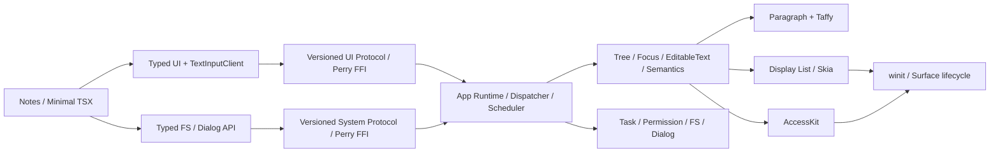

# Desktop Notes MVP

- 状态：Desktop Notes MVP 直接产品门禁已完成（PR run `31902303937` 在 macOS/Windows 通过 UIA/NSAccessibility、真实 OS picker、FS/Clipboard 与 fresh clean-runner 启动）；MVP-02 的 clean-tag schema-v5 N-10/N-11 晋级仍待执行
- 决策：[`ADR-010`](./decisions/ADR-010-desktop-notes-mvp-scope.md)
- 详细架构：[`PROJECT-DESIGN.md`](./PROJECT-DESIGN.md)
- 路线图：[`ROADMAP.md`](./ROADMAP.md)
- 执行清单：[`../TODO.md`](../TODO.md)
- 参考应用：[`REFERENCE-APP.md`](./REFERENCE-APP.md)

## 1. 目标

交付一个可演示、可自动验证的单窗口 Notes 应用，证明 TypeScript/Minimal TSX 经 Perry AOT 后，可以在不依赖 Node、V8、WebView 或 Chromium 的原生进程中完成真实桌面工作流。

MVP 成功不是“又一个 Counter”，而是同一应用中的四条链路同时成立：

1. 多语言编辑与中文 IME；
2. Semantic Tree 与 AccessKit 操作；
3. 可取消的文件打开/保存与结构化错误；
4. suspend/resume/close 的状态和资源生命周期。

## 2. 用户与平台

- 主要用户：评估 Nexa UI 可行性的 TypeScript 桌面开发者和 Runtime 维护者。
- 主应用路径：Minimal TSX。
- 平台：macOS、Windows。
- 窗口模型：单进程、单 UI 线程、单窗口。
- 渲染：Skia CPU raster + softbuffer。
- 文件模型：单个本地 UTF-8 文本文档。

## 3. 范围

### 必须交付

| 能力        | MVP 行为                                                | 自动证据                                    |
| ----------- | ------------------------------------------------------- | ------------------------------------------- |
| Text        | Latin/CJK/Arabic/RTL/Emoji shaping、换行和 hit map      | fixed golden + property tests               |
| Editing     | 标题/正文、selection、caret、键盘编辑、IME composition  | Rust contract + Perry/native E2E            |
| Focus/Event | Tab chain、capture/target/bubble、Button default action | deterministic dispatch tests                |
| A11y        | Button/Text/Input/TextArea 可读、可聚焦、可操作         | deterministic harness + native client smoke |
| System      | open/save、cancel、permission denied、typed error       | injected backend + app E2E                  |
| Lifecycle   | suspend/resume 保留业务状态；close 取消并失效资源       | injected surface/close-race tests           |
| Delivery    | clean macOS/Windows runner 生成 unsigned 可运行产物     | package matrix                              |

### 明确不做

- 富文本、云同步、协作、数据库、历史版本、最近文件列表；
- 多窗口、路由、菜单、托盘、通知、网络图片；
- 完整框架 Notes parity、公开包发布、签名、公证、SBOM；
- 完整主题系统、动画、GPU backend、移动端。

## 4. 架构与依赖



依赖顺序：G2 退出门禁 -> 事件与文本单位合同 -> 编辑模型 -> IME/多行 -> Semantic Tree/Task 基础 -> AccessKit/FS/Dialog -> Notes 集成 -> 双平台产物。

## 5. 稳定合同

### 5.1 文本索引

- TypeScript 与 FFI 的 `TextRange` / `TextSelection` 使用 **UTF-16 code unit**，与 JS String 和平台 IME 边界一致。
- Rust `nui-text` 的 paragraph/shaping API 使用带类型的 `Utf8Offset` / `Utf8Range`。
- `TextIndexMap` 是两侧唯一转换入口；所有外部 offset 必须先验证范围、字符边界与 grapheme 边界。
- 协议和类型名必须携带单位或在字段文档中固定单位；禁止裸 `usize`/无注释 `number` 穿越边界。

### 5.2 事件与提交

- Platform 只产生 normalized event 并进入 Dispatcher。
- Framework callback 只在 tick 的 Framework 阶段运行。
- mutation 只在 Host Commit 生效；一个 tick 最多 present 一次。
- capture/target/bubble 与 default action 的顺序固定并可测试。

### 5.3 Task 与错误

- 所有阻塞文件/对话框工作在 worker 执行；completion 只通过 Dispatcher settle。
- Task、Callback、Resource 使用 generation handle 和 owner scope。
- cancel/close 幂等；迟到 completion 不进入已关闭框架。
- cancelled、permission denied、not found、invalid data、platform failure 使用不同的稳定错误码。

### 5.4 Surface 与资源

- Suspend 立即释放 Surface 和 backend cache，保留 CPU resource 与应用状态。
- Resume 使用新 `SurfaceGeneration` 重建 backend resource，并在首次成功 present 前保持 full repaint pending。
- Close 收尾 pending frame metrics、取消 owner task、失效 callback/resource，再退出窗口循环。

## 6. 实施阶段

| 阶段               | 内容                                           | 退出条件                                      |
| ------------------ | ---------------------------------------------- | --------------------------------------------- |
| M0 G2 hardening    | G2B-09、metrics/surface 生命周期、当前全量门禁 | G2 Checkpoint C 有当前 commit 证据            |
| M1 Editing core    | G3A-01..05、07                                 | grapheme-safe selection 与键盘编辑通过        |
| M2 IME + multiline | G3A-06、08..11                                 | CJK/Emoji 单行和多行 E2E 通过                 |
| M3 A11y + Task     | G3B 与 G4-01..04                               | 语义 action、cancel/error/permission 合同通过 |
| M4 Files + Notes   | G4-05..08、G5-01..04                           | open/edit/save/close 主流程通过               |
| M5 Package         | MVP 最小 packager 与双平台 smoke               | clean runner 产物可启动                       |

G3B 和 G4 在协议合同冻结后可以并行；G5 应用集成必须按垂直旅程推进，不能先堆完整控件库或 CLI。

G3B-05 的 deterministic harness 使用 `examples/semantic-e2e/scenario.json` 贯通无坐标 role/name 查询、AccessKit converter 与 Bridge Dispatcher。`semantic-accessibility-smoke` 通过 production `accesskit_winit::Adapter`、winit user event 和 `Dispatcher<AccessibilityActionRequest>` 落地 action。run `31902303937` 的 macOS/Windows native jobs `95054897228` / `95054897192` 均完成真实平台 accessibility client smoke，因此 G3B-05/G3B 已完成；macOS 当前层仍不覆盖跨进程 `AXUIElement`/TCC 兼容矩阵。

G4-01 已完成：System Runtime 使用统一 kind-aware `HandleIdentityRegistry` 分配 Task/NativeResource/后续 Subscription identity，保留 runtime tombstone 与 owner terminal fence，并以硬预算约束累计 identity/owner。close/cancel 与内部 finish-close 分离，late completion 按原因计数；3,125 条 state-model 操作序列、kind 数值碰撞、owner/cancel 顺序、generation reuse/retirement 均通过。

G4-02 已完成：固定大小 bounded worker pool 保证阻塞工作不进入 UI 线程，worker result 只经 Dispatcher `System` queue 并在 `SystemCompletion` phase settle。cancel control event 不等待 worker，owner invalidation/runtime drop 会协作取消；completion/cancel 两种竞态顺序、cancel 后 panic 诊断、并发 sequence/FIFO、queue saturation 与 late drop 均有回归覆盖，失败提交不会泄漏 identity/owner budget。Runtime `49/49`、Rustfmt 与严格 Clippy 通过。

G4-03 已完成：System Core 与 Host 使用 manifest-backed `CommandResult/NexaError`，denied/cancelled/not-found/invalid/platform/internal 保持不同 numeric code，并保留 platform code、permission source、owner/task context 与 nested cause。Rust FFI codec 和 TS decoder 对 envelope、primitive context、uint32、known metadata、sentinel 与 panic fallback 均有 contract test；Rust core `9/9`、Host `6/6`、TS `4/4` 通过。Clipboard 的实际 Task/Error 迁移随后在 G4-07 完成。

G4-04 已完成：严格 app manifest v1、双加载入口、deny-all PermissionSet、穷尽 command permission mapping 和 Rust-only one-shot Host install 均已落地；未安装或重复安装不能扩大能力。

G4-05 已完成：`@nexa/fs` 提供 typed `Task<T>`、UTF-8 read/write、atomic replace、cancel 和结构化错误映射。worker completion 通过 winit wakeup 进入 `SystemCompletion`，Promise resolve 后由 `FrameworkMicrotasks/perry_poll()` 执行 continuation；owner close/reset 建立 terminal fence 并丢弃迟到结果。System Core `9/9`、System Host `15/15`、Application Runtime `51/51`、winit `39/39`、Bridge `128/128` 与 FS/System TS `12/12` 通过。G5 trusted launcher 的真实 FS Promise smoke 也已用内嵌 manifest 启动 Perry 进程，完成多语种 UTF-8 磁盘 round-trip、SystemCompletion、continuation 与 bytes 复核。Dialog 的 deterministic 自动证据由同一真实 Perry/native Task/Promise 链和构建期注入 backend 提供。当前 `rfd` native backend 只能返回 selected path 或 `None` cancel，没有真实 `PLATFORM_FAILURE` 返回分支；Dialog worker 不使用 cancellation token，Task cancel/owner invalidation 只终止结果交付并丢弃迟到 completion，不能主动关闭已经显示的系统 picker。

G4-07 已完成：`@nexa/clipboard` 迁移到 typed `Task<T>`，读取/写入均走 bounded worker、`SystemCompletion` 和 `nexa_result_json_v1`；失败不再折叠为空字符串或布尔值。注入式 backend 测试覆盖 UTF-8 round-trip、平台错误、幂等 cancel 和迟到 owner fence，旧 sentinel 仅保留兼容 ABI。Core `2/2`、System Host `22/22`（20 unit + 2 integration）与 Clipboard TS `4/4` 通过。G5 trusted launcher 的 read/write/read Promise fixture 由 runner `7/7` 校验 round-trip/restore proof，并在 run `31902303937` 的 macOS/Windows package jobs 通过真实 hosted runtime 执行。

G5/MVP 当前证据（2026-08-16 hosted 补充）：Notes controller 15/15 与实际 TSX E2E 4/4 覆盖编辑、五个稳定语义节点的 Focus/SetValue/Invoke、保存 busy 状态、typed `PERMISSION_DENIED`、suspend/resume、pending write 时 CloseRequested 和迟到 completion。真实 FS 与构建期注入 Dialog 的确定性合同保持通过。PR head `e56bb9e2c531e9cd3d97837465eca92d5e2c31dd` 触发的 run `31902303937` 在 Actions merge execution revision `991b28142783833c14be659125c4564d14219cc5` 上完成 Windows UIA、macOS/Windows 无 fixture picker save/open/cancel、FS/Clipboard、package 完整性和 fresh clean-runner 启动。package jobs 为 `95054897243` / `95054897272`，launch jobs 为 `95059000291` / `95059000304`；picker binary SHA-256 为 `f7cfab51cbaf4163bc82ae74854b07d5fcd8eb98219050fcb84e18e59c372172` / `e82079f1ee6b6afff7418b94a6299bb72835178f778918b036e80df8659e343a`。该 run 关闭 G5-03/G5-04/G5-09 与 MVP-01 的直接平台验收，但因 proof 上传跳过而不是 N-10/N-11 schema-v5 promotion。

G5-05 当前证据（2026-08-08）：基础 Window-scoped Theme、typed semantic token、numeric `Style`/`TextStyle` 与 Button/Input/TextArea Host trace 已完成；显式组件 style 最终覆盖，交互态继续复用统一 native resolver，不存在 CSS parser。UI 8/8、Theme trace 2/2 与真实 Notes Perry AOT/startup 通过。

本地收口门禁（2026-08-10）中的九包 native tarball consumer、Tier-1 `@nexa/adapter-solid` 核心 E2E/AOT 与 Clipboard runner 仍是确定性合同证据，它们单独不构成平台成功证据；相应 hosted 缺口已由 run `31902303937` 的直接 jobs 关闭。Solid 路径属于 Technical Preview，不改变 Minimal TSX 是 Desktop Notes MVP 唯一必需产品路径。

## 7. 验证命令

当前门禁：

```bash
pnpm format:check
pnpm lint
pnpm typecheck
pnpm test
pnpm build
pnpm test:perry
pnpm --filter @nexa/cli smoke:build
pnpm --filter @nexa/cli smoke:package
pnpm --filter @nexa/example-reference-notes smoke:fs
pnpm --filter @nexa/example-reference-notes smoke:clipboard
pnpm --filter @nexa/example-reference-notes smoke:dialog
pnpm --filter @nexa/example-reference-notes package
node --test tools/solid-notes-e2e.test.mjs
node --test tools/release-packages.test.mjs

cargo fmt --all -- --check
cargo clippy --workspace --all-targets -- -D warnings
cargo test --workspace
cargo check --manifest-path packages/nui-host/Cargo.toml --locked
cargo check --manifest-path packages/system-host/Cargo.toml --locked
```

需要可用图形会话以及 macOS Accessibility 或 Windows desktop automation 的平台门禁：

```bash
pnpm --filter @nexa/example-reference-notes smoke:picker
```

该命令在自动化权限缺失时必须非零退出；只有完成 save/open/cancel 全旅程才是成功证据。

新增 MVP E2E/package 命令只能在脚本实际存在后写入“当前门禁”；计划名称记录在 Roadmap/Todo，不把不存在的命令伪装为可执行命令。

## 8. MVP Definition of Done

- [x] G2 退出门禁修复并在 source revision `e56bb9e2c531e9cd3d97837465eca92d5e2c31dd` 的 required CI 重跑全部相关验证。
- [x] Notes 的编辑、A11y、open/save、cancel、suspend/resume、close 旅程全部有 deterministic 和双平台 hosted 自动证据。
- [x] deterministic 测试使用注入 backend；real-picker probe 只使用 runner 自建临时目录，不修改开发者文件或剪贴板。
- [x] macOS/Windows unsigned artifact 在 clean runner 启动。
- [x] 公开合同、ADR、Roadmap、Todo、已知限制与实现一致。
- [x] 所有新增错误路径、清理路径和迟到事件均有回归测试。
- [x] 不需要 Node、Rust、仓库源码或全局 Perry 才能运行产物。

此 Definition of Done 记录直接产品验收。`release/mvp-evidence.json` 的 N-10/N-11 只能在 clean `refs/tags/v*` 上由 `mvp-evidence.yml` 消费已上传的双平台 proof 晋级；run `31902303937` 设置 `collect_mvp_proof=false`，所以 MVP-02 仍保持未完成。

## 9. 开放决策

以下事项必须在对应阶段前确认：

- AccessKit 最低平台版本与真实辅助技术兼容矩阵；依赖版本已固定为 `accesskit 0.24.1` / `accesskit_winit 0.33.2`；
- Notes 文本文件是否保存标题元数据，MVP 默认不保存，标题由文件名派生；
- MVP Notes 专用 `tools/reference-notes-package.mjs` 保持独立；生成项目使用已交付的通用 `packages/cli/src/package.mjs`，两者不共享应用名称、权限或专用 helper。
- Solid 是 Technical Preview 唯一 Tier-1 Adapter；其 Notes 核心切片不扩大本 MVP 的 Minimal TSX 唯一路径或双平台 hosted 退出条件。
