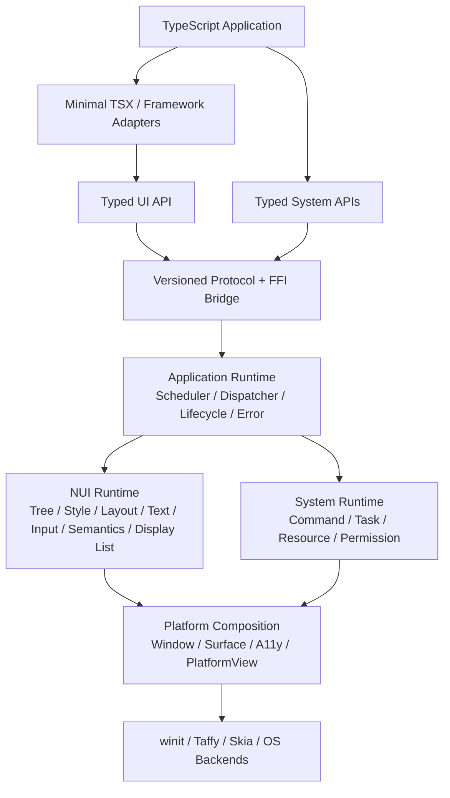
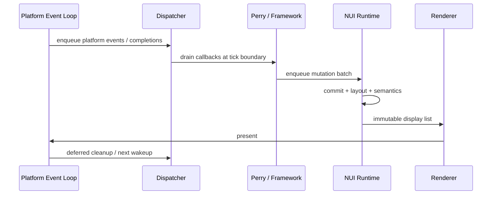

# Nexa UI 项目详细设计

- 状态：Draft，待项目负责人评审
- 基线：`mvp@f3afbeb`
- 日期：2026-08-04
- 关联决策：ADR-004、ADR-005、ADR-006
- 配套计划：[`ROADMAP.md`](./ROADMAP.md)、[`../TODO.md`](../TODO.md)

> 本文是组合现有 ADR 的提案，不自动把新的协议格式、文本依赖、产品定位或公开 API 变成 Accepted 决策。标为候选或待确认的事项必须先通过对应 ADR/产品评审。

## 1. 假设与决策边界

本设计基于以下假设继续推进，任一假设变化都应先更新本文档和 ADR，再调整实现：

1. 近期产品定位是 **Desktop Technical Preview**，不是生产稳定版 SDK。
2. 首发平台为 macOS 与 Windows；Linux 保持可编译目标，但暂不作为发布阻断项。
3. Minimal TSX 是参考实现和文档主路径；Solid、Vue、React、Svelte 是独立兼容层。
4. Perry 继续负责 TypeScript AOT 与 nativeLibrary FFI，不承载 Nexa UI 的运行时语义。
5. 本阶段坚持 Skia CPU raster + softbuffer；先补齐 Surface 生命周期，再评估 GPU 后端。
6. 不实现 DOM、CSSOM、WebView 兼容层或完整 npm 浏览器生态。
7. 暂以一个文件型 Notes 应用作为贯穿式参考应用；最终产品题材仍需负责人确认。
8. 路线图按依赖和退出条件排序，不承诺未经团队容量评估的日历日期。

## 2. 目标

### 2.1 产品目标

让 TypeScript 开发者使用 TSX 或受支持的框架编写原生桌面应用，经 Perry AOT 编译为不依赖 Node.js、V8、WebView 或 Chromium 的独立程序，并由统一的 Rust Native UI Runtime 完成布局、文本、输入、无障碍、绘制和系统能力调用。

### 2.2 首要用户

- 愿意接受 Perry、Node/pnpm 与 Rust 工具链的 TypeScript 桌面应用开发者。
- 维护 Nexa UI Runtime、Host ABI 与平台后端的核心工程师。
- 维护 Solid、Vue、React、Svelte 兼容层的适配器作者。

### 2.3 Technical Preview 成功形态

一个新用户可以从空目录创建、开发、测试、打包并运行一个 macOS/Windows Notes 应用。该应用至少覆盖：

- 多语言段落、单行与多行编辑、中文 IME 预编辑、选择与剪贴板；
- Button、Input、Scroll、Image 的焦点、禁用和辅助技术语义；
- 文件打开、保存、取消和结构化错误；
- 窗口挂起/恢复、任务取消和关闭清理；
- Minimal TSX 主路径，以及至少一个外部框架的同等核心流程。

## 3. 当前基线

### 3.1 已验证能力

| 领域        | 当前实现                                              | 证据                                             |
| ----------- | ----------------------------------------------------- | ------------------------------------------------ |
| Native Core | generation `NodeId`、Arena、树增删、命中测试          | `crates/nui-core`                                |
| Layout      | Taffy Flexbox 子集、逻辑像素布局                      | `crates/nui-layout-taffy`                        |
| Render      | Skia CPU raster、矩形/文本/本地图片、Scroll clip      | `crates/nui-render-skia`                         |
| Platform    | winit 单窗口、缩放、鼠标、滚轮、基础键盘/IME commit   | `crates/nui-platform-winit`                      |
| Host        | Perry FFI、节点操作、回调 root scanner、直接 mutation | `packages/nui-host`                              |
| UI          | Minimal TSX、signal/effect、基础原语和复合控件        | `packages/ui`                                    |
| Adapters    | Solid/Vue/React Counter、Svelte Counter 子集          | `packages/adapter-*`、`packages/compiler-svelte` |
| System      | 桌面剪贴板与简单权限门禁                              | `crates/nui-system-core`、`packages/clipboard`   |
| Examples    | Counter、Todo、Layout、Image、Clipboard               | `examples`                                       |

本地基线结果：`cargo test --workspace` 通过 22 个 Rust 测试，`pnpm test` 通过 2 个 TypeScript 测试，`pnpm typecheck` 与 Rust offscreen smoke 通过。

### 3.2 尚未闭环的事实

| 缺口         | 当前事实                                                                                | 设计影响                                     |
| ------------ | --------------------------------------------------------------------------------------- | -------------------------------------------- |
| 交付门禁     | Prettier 失败 26 个文件；`cargo fmt`、`cargo clippy -D warnings` 失败                   | 第一里程碑先恢复可信基线                     |
| TS 覆盖      | `pnpm lint` 实际运行 0 个 lint；多个包/示例没有 `typecheck` 脚本                        | 不能把聚合命令通过视为完整验证               |
| FFI CI       | 两个 Rust nativeLibrary 被根 Cargo workspace 排除，`packages/**` 只触发 TS job          | Host/System FFI 改动可能完全未编译           |
| Protocol     | Rust 与多个 TS 文件重复声明枚举；没有 NUI 协议握手                                      | 先建立唯一协议源和兼容策略                   |
| Handle       | TS 暴露 `bigint`，实际调用转为 JS `number`；忽略产物出现 native `u64` safe-integer 错误 | 在扩展 handle 前必须确定传输表示             |
| Commit       | `js_nui_commit()` 是空操作，mutation 立即生效                                           | 无法落实批处理、阶段约束和统一重绘           |
| Callback     | Native 事件同步回调 Perry/框架，React 依赖 `flushSync`                                  | 与 ADR-006 Scheduler 硬规则冲突              |
| Text         | `nui-text` 为占位；布局用字符数估算，绘制用 `draw_str`                                  | 段落、BiDi、fallback、Emoji 均未成立         |
| Input        | 仅尾部 caret、字符插入、Backspace、Enter、IME commit                                    | 需统一索引、选择、预编辑和候选框定位         |
| A11y         | Rust/TS 有语义类型，但没有 Host mutation、语义树或 AccessKit                            | 自绘界面对辅助技术仍只是像素                 |
| Render       | `nui-core::paint` 为空；Skia 直接遍历 Arena；无 Display List/dirty region               | Backend 与 Tree 强耦合，Surface 恢复不可验证 |
| System       | 错误被压成空字符串/布尔值；Clipboard 同步执行                                           | FS/Dialog 前必须有 Task、取消和结构化错误    |
| Distribution | 所有 npm 包均 `private`；CLI/packager/inspector 为空                                    | 尚无外部安装、建项目和打包路径               |

### 3.3 产品范围判断

现有代码已经证明“Perry + Rust Host + Skia 自绘 + 多框架 Adapter”可行。下一阶段的目标不是继续增加 Demo 或框架，而是把技术验证收敛成一个可版本化、可测试、可发布的桌面 SDK。

## 4. 架构原则

1. **协议稳定优先**：框架、Perry ABI、渲染后端只通过版本化协议连接。
2. **单一语义所有者**：每个概念只能有一个权威模块；Adapter 不复制 Runtime 语义。
3. **单 UI 线程**：UI Tree、框架状态、窗口和 Skia 只在 UI 线程访问。
4. **事件排队，不同步回调**：Native 事件和 worker completion 进入 Dispatcher，由 Tick 消费。
5. **显式资源生命周期**：Node、Callback、Task、Subscription、Resource 都使用 generation handle。
6. **文本先于高级控件**：所有文本测量、绘制和编辑共享 `nui-text`，禁止继续扩散 `draw_str`。
7. **语义与视觉分离**：Visual Tree 派生 Semantic Tree，辅助技术不读取绘制细节。
8. **CPU/GPU 资源分离**：业务和 Adapter 不持有 Surface、纹理或 Skia 对象。
9. **垂直切片验收**：每个阶段都以可运行参考应用验收，不做长期悬空的水平层。
10. **Minimal TSX 先行**：它是 Host 行为的规范消费者；框架适配器复用同一合同测试。

## 5. 目标架构



### 5.1 模块所有权

| 模块                        | 唯一职责                                              | 明确不负责               |
| --------------------------- | ----------------------------------------------------- | ------------------------ |
| `packages/ui`               | Minimal TSX、类型化组件与响应式绑定                   | FFI 细节、平台事件、Skia |
| `packages/adapter-*`        | 框架生命周期到统一 Host mutation 的映射               | 自定义原语语义、系统 API |
| `protocol/`（新增）         | 命令、枚举、错误码、版本与 feature bits 的唯一源      | 运行时实现               |
| `packages/nui-host`         | Perry ABI 编解码、callback GC root、协议客户端        | Tree/Layout/Paint 语义   |
| `crates/nui-app-runtime`    | Tick、队列、任务、生命周期和错误监督                  | 绘制、OS API 具体实现    |
| `crates/nui-core`           | Node、mutation、dirty、事件、语义和 Display List 模型 | Perry、winit、Skia 类型  |
| `crates/nui-text`           | 字体、shaping、BiDi、断行、段落、选择和编辑           | 窗口事件循环             |
| `crates/nui-layout-taffy`   | `nui-core` 布局输入到 Taffy 的适配                    | 文本 shaping             |
| `crates/nui-render-skia`    | Display List 到 Skia Surface 的执行                   | 直接遍历可变 Node Tree   |
| `crates/nui-system-core`    | 类型化 Command、Task/Resource、权限与平台能力抽象     | UI Tree mutation         |
| `crates/nui-platform-winit` | 窗口、原始输入、Surface 生命周期和 wakeup             | 框架回调和业务组件       |

## 6. 核心合同

### 6.1 协议版本与唯一来源

新增机器可读的 `protocol/nui-host.json` 和 `protocol/system-host.json`。生成器输出 Rust 与 TypeScript 定义，生成物带 `@generated` 标记并由 CI 校验无漂移。

协议握手最少返回：

```text
ProtocolVersion { major, minor, patch }
RuntimeVersion
AbiVersion
FeatureBits
TargetTriple
```

- `major` 不同：启动失败并给出结构化不兼容错误。
- `major` 相同、runtime minor 较高：客户端只使用双方 feature 交集。
- 枚举数值永不复用；废弃项保留编号。
- Adapter 不再从 `packages/ui/src/host.ts` 复制协议定义。

### 6.2 Handle 表示与生命周期

Rust 内部继续使用 `(slot: u32, generation: u32)`，但在确认 Perry 可无损传输 `u64` 前，不允许通过 JS `number` 传递打包后的 64 位值。

推荐 FFI 表示：

```text
HandleRef { slot: u32, generation: u32 }
```

TS 表面可以封装成 opaque object；不得允许业务代码算术操作。统一状态机：

```text
Created -> Active -> Closing -> Closed
                       \-> Invalidated
```

所有操作验证 kind、generation、owner window/app 与状态。重复 close/cancel 为幂等；过期 handle 返回 `STALE_HANDLE`，不得静默忽略或 panic。

### 6.3 Mutation 事务

Adapter 只追加 mutation，不直接改变活动帧中的 Tree：

```text
beginBatch(batchId)
  CreateNode
  Insert / Move / Remove
  SetProperty / SetText / SetSemantics
  AddListener / RemoveListener
commitBatch(batchId)
```

提交时执行：

1. 完整验证 handle、父子关系、属性类型和 batch 顺序。
2. 在 shadow mutation list 上保证原子性；任一命令失败则整批拒绝。
3. 应用到 Tree 并传播 `TREE_DIRTY`、`LAYOUT_DIRTY`、`SEMANTICS_DIRTY`、`PAINT_DIRTY`。
4. 合并一次 redraw 请求。
5. 返回 commit sequence 与结构化错误。

第一版可使用内存命令数组，不要求立即实现二进制 command buffer。

### 6.4 Node 与派生状态

目标 Node 数据模型：

```rust
pub struct Node {
    pub kind: NodeKind,
    pub parent: Option<NodeId>,
    pub children: Vec<NodeId>,
    pub style: Style,
    pub content: NodeContent,
    pub listeners: EventMask,
    pub semantics: Semantics,
    pub layout: LayoutRect,
    pub dirty: DirtyFlags,
}
```

- `NodeContent` 用 enum 区分 Text/Image/PlatformView，避免继续扩张平行 HashMap。
- Layout、Semantic Tree、Display List 都是 Visual Tree 的派生物。
- 删除子树必须同时清理 listener、focus、task/resource 引用和语义节点。
- `For` 和框架列表必须支持新增、删除、移动与稳定 key，而不只支持追加。

### 6.5 Application Tick 与线程模型



固定阶段：Platform Events -> System Completion -> Framework Microtasks -> State Effects -> Host Commit -> Layout -> Semantics -> Paint -> Present -> Deferred Cleanup。

硬约束：

- Layout/Paint 阶段拒绝状态和 Tree mutation。
- Native 不同步回调 TS；回调只由 Dispatcher 在允许阶段执行。
- 后台线程只能发送 completion，不得访问 Framework、Window、Tree 或 Skia。
- Tick 内最多 present 一次；事件风暴通过 wakeup 合并。
- 窗口关闭先进入 `Closing`，取消所属 Task，再作废资源，最后退出事件循环。

### 6.6 输入、焦点与事件

平台层先归一化，再进行 hit test 与派发：

```text
RawInput -> NormalizedEvent -> HitTest -> PointerCapture -> FocusManager
         -> Capture -> Target -> Bubble -> DefaultAction
```

P0 事件族：Pointer、Wheel、Keyboard、TextInput、Composition、Focus。事件包含 window、target、timestamp、modifiers 和 propagation state。

Button 行为由 default action 定义：按下建立 pressed/capture，指针在同一目标释放时才 Invoke；支持 hover、focus、disabled 与键盘 Space/Enter。

FocusManager 维护单窗口 focus chain、Tab/Shift+Tab 顺序与焦点恢复。Input 不再通过 `clickable` 特例获得焦点。

### 6.7 文本与编辑

统一管线：

```text
UTF-8 Source -> Font Match/Fallback -> Script/BiDi -> Shaping
             -> Line Break/Paragraph -> Glyph Runs -> Layout/Display List
```

关键索引决策：FFI 和 TypeScript API 使用 **UTF-16 code unit offset**，与 JS String 语义一致；Rust 内部允许使用 UTF-8 byte、Unicode scalar 和 grapheme index，但必须由 `TextIndexMap` 显式转换。任何 caret/selection API 都不得裸用 `usize` 表示不明单位。

段落输出至少包含：size、baselines、line metrics、glyph runs、cluster map、hit-test map。Taffy 的 text measure callback 调用段落缓存，不再使用字符数乘字号。

EditableText 维护：value、selection、composition range 与 revision。单行和多行控件共享编辑模型；多行控件另外处理可见行、上下方向移动、换行和内部滚动。IME 生命周期为 Start -> Update(preedit) -> Commit/Cancel，并向平台返回当前 caret/composition bounds。

P0 验收集：英文、中文、阿拉伯文、RTL/英文混排、Emoji ZWJ、肤色修饰、组合字符、窄宽度换行和字体缺失 fallback。

### 6.8 Semantic Tree 与 AccessKit

Visual Tree 在 Semantics 阶段派生独立快照：

```text
SemanticNode { id, parent, role, name, value, state, bounds, actions }
```

- 默认语义由组件生成，显式属性可覆盖 name/description。
- Button 导出 Invoke，Input 导出 Focus/SetValue，Text 导出静态文本。
- 每个 Tick 仅提交语义增量；首帧和恢复后提交完整树。
- AccessKit action 进入同一 Dispatcher，不直接调用组件。
- UI 自动化优先基于 Semantic Tree，避免依赖像素坐标。

### 6.9 Display List、资源与 Surface

`nui-core` 生成不可变 Display List，Skia backend 只执行命令：

```text
Save / Restore / ClipRect / Transform
DrawRect / DrawRRect / DrawGlyphRun / DrawImage
```

图片、字体源、段落与 Display List 属于 CPU Resource；Surface、纹理和 glyph atlas 属于 backend resource。资源通过 `ResourceId` 引用，业务 Tree 不持有 Skia 类型。

Surface 状态：`Absent -> Ready -> Suspended -> Recreating -> Ready | Failed`。Suspend 释放 backend resource，Resume 重建并执行 full repaint；失败进入 ErrorSupervisor，可重试或显示诊断，而不是只写 stderr。

P0 保留全量布局/绘制实现，但建立 dirty flags 和可观测计数；增量布局与 dirty region 优化必须由 profile 数据触发。

### 6.10 System Host、Task 与权限

公开 API 始终类型化，例如 `@nexa/fs`、`@nexa/dialog`，不公开字符串 `invoke`。

统一结果：

```ts
export type NexaError = {
  code: string;
  message: string;
  operation: string;
  retryable: boolean;
  platformCode?: string;
};

export type Task<T> = {
  readonly id: TaskId;
  readonly result: Promise<T>;
  cancel(): void;
};
```

- worker 完成后只向 Dispatcher 发送 `(taskId, result)`。
- cancel 是幂等的；窗口关闭使所属 Task/Subscription/Resource 失效。
- 权限来自应用 manifest，不由 API 包自行默认放行敏感能力。
- Permission denied、cancelled、not found、invalid data 与 platform failure 保留不同错误码。
- Clipboard 在 Task 基础设施落地后迁移到同一 Promise/错误语义。

### 6.11 错误监督与诊断

错误分为四级：ProtocolViolation、RecoverableOperation、FrameFailure、FatalRuntime。边界要求：

- FFI 函数不 panic 穿越边界。
- 不再用空字符串、`false` 或 `-1` 丢失错误原因。
- 每个错误包含 operation、code、context、source chain 和 runtime version。
- 开发模式输出结构化日志；发布模式允许应用注册顶层 error handler。
- Frame/Task/Protocol 指标可由未来 Inspector 消费，但 P0 不实现完整 DevTools。

### 6.12 公共组件与样式 API

公共 API 表达应用语义，Adapter 再把它归一化成协议 ID。业务代码不直接传 `PropertyId`、packed color 或 `0/1/2` 对齐值。

Technical Preview 的候选组件面：

```text
Native primitive: Window / View / Text / Image / Scroll
Layout composite: Column / Row / Stack / Spacer / Card
Interactive composite: Button / Input / TextArea
Control flow: For
```

`Button`、`Input`、`TextArea` 仍是复合组件，不进入 Native `NodeType`。`TextArea` 与 `Input` 共享 EditableText，前者启用多行段落、行导航和内部滚动。

候选类型风格：

```ts
export type Align = "start" | "center" | "end" | "stretch";
export type Justify = "start" | "center" | "end" | "space-between";
export type Color = string | { r: number; g: number; b: number; a?: number };

export type BoxStyle = {
  width?: number;
  height?: number;
  padding?: number;
  gap?: number;
  alignItems?: Align;
  justifyContent?: Justify;
  backgroundColor?: Color;
  borderRadius?: number;
};
```

- 所有交互组件支持 `disabled`、focus 语义和键盘默认动作。
- hover/pressed/focused/disabled 通过稳定 state token 进入样式解析，不让框架 Adapter 各自定义行为。
- public prop removal 必须生成 clear/unset mutation，不能跳过 `null` 后遗留旧值。
- 组件默认值和语义只在共享 Host/UI kit 定义一次。
- 完整主题和设计系统属于 P1；P0 只提供类型化基础 token 与可访问的状态反馈。

## 7. 关键流程

### 7.1 启动

1. CLI/二进制读取 app manifest，校验协议、权限与资源。
2. Platform Composition 创建 event loop 与 App Runtime。
3. Host 完成 ABI/feature handshake。
4. Framework 建立初始树并提交 batch。
5. Runtime 执行首次完整 Layout、Semantics、Paint、Present。

### 7.2 UI 更新

1. Signal/Framework state 变化只产生 Host mutation。
2. mutation 在当前 tick 的 Host Commit 阶段原子提交。
3. dirty flags 决定 Layout/Semantics/Paint 工作。
4. Renderer 获取不可变 Display List 并 present。

### 7.3 异步系统操作

1. TS 创建 Task，Runtime 注册 owner 与 cancellation token。
2. Worker 执行 FS/Dialog 等平台操作。
3. Completion 进入 Dispatcher，下一 tick settle Promise。
4. cancel/close 先更新 handle 状态，迟到 completion 被丢弃并记录。

### 7.4 关闭与恢复

- Suspend：停止 present、释放 Surface/backend resource，保留 CPU 状态。
- Resume：重建 Surface、重上传资源、完整重绘、完整语义同步。
- Close：阻止新任务、取消已有任务、清理 callback roots、销毁窗口资源、退出。

## 8. 目标目录结构

```text
protocol/                         协议唯一源、版本与生成器
crates/
  nui-core/                       Tree/Mutation/Event/Semantics/Display List
  nui-text/                       Paragraph/EditableText
  nui-app-runtime/                Tick/Dispatcher/Task/Lifecycle/Error
  nui-system-core/                Command/Permission/Resource
  nui-layout-taffy/               Layout backend
  nui-render-skia/                Render backend
  nui-platform-winit/             Desktop composition backend
  nui-perry-bridge/               Runtime-facing bridge
packages/
  nui-host/                       Perry ABI client
  ui/                             Minimal TSX reference API
  adapter-*/                      Optional framework adapters
  fs/ dialog/ clipboard/          Typed system modules
examples/
  reference-notes/                North-star acceptance app
  framework-parity/               Contract compatibility matrix
tests/
  protocol/                       Generated contract drift tests
  fixtures/                       Text/input/semantics fixtures
  e2e/                            Perry/native smoke scenarios
tools/
  cli/ packager/ inspector/       Developer tooling
docs/
  PROJECT-DESIGN.md ROADMAP.md decisions/
```

## 9. 技术栈

| 层        | 技术                                     | 当前/目标约束                      |
| --------- | ---------------------------------------- | ---------------------------------- |
| Language  | Rust 2021、TypeScript 5.9+               | Rust MSRV 1.85；Node >=22          |
| AOT/FFI   | Perry nativeLibrary ABI 0.5              | 必须增加 NUI 自有协议版本          |
| Window    | winit 0.30                               | 单 UI 线程，macOS/Windows P0       |
| Layout    | Taffy 0.12 Flexbox                       | 只开放类型化子集                   |
| Render    | skia-safe 0.99 + softbuffer              | CPU raster P0                      |
| Text      | 待 ADR 选择 shaping/BiDi/line-break 依赖 | 不在本文静默锁定新依赖             |
| A11y      | AccessKit（拟定）                        | 先做桌面 Button/Input/Text         |
| Workspace | Cargo workspace + pnpm workspace         | nativeLibrary 需进入独立 CI matrix |

## 10. 命令

### 10.1 当前可执行命令

```bash
pnpm install --frozen-lockfile
pnpm typecheck
pnpm test
pnpm format:check
pnpm lint

cargo fmt --all -- --check
cargo clippy --workspace --all-targets -- -D warnings
cargo test --workspace
cargo run -p rust-counter -- --smoke

pnpm --filter @nexa/example-counter build
pnpm --filter @nexa/example-solid-counter build
pnpm --filter @nexa/example-vue-counter build
pnpm --filter @nexa/example-react-counter build
pnpm --filter @nexa/example-svelte-counter build
```

注意：截至本文基线，format、rustfmt 与 clippy 尚未通过；`pnpm lint` 没有实际 lint 子任务。

### 10.2 计划新增的聚合命令

```bash
pnpm verify              # format + lint + typecheck + unit + protocol drift
pnpm test:contracts      # TS mock Host + Rust protocol fixtures
pnpm test:perry          # clean Perry compile + headless/native scenarios
pnpm package:smoke       # 生成并验证独立 app bundle
```

在命令真正落地前，文档不得把它们写成可用命令。

## 11. 代码风格

- TypeScript 使用 strict、`noUncheckedIndexedAccess`、`exactOptionalPropertyTypes`。
- 公开 TS API 使用可判别联合与 opaque handle，不使用 `any` 或无类型字符串 command。
- Rust 公共 API 返回具体错误类型；FFI 边界捕获 panic/错误并编码为协议结果。
- 协议枚举显式赋值；值只追加，不重排。
- Rust 4 空格，其他文件 2 空格；TypeScript/Markdown 由 Prettier 管理。

推荐边界风格：

```rust
pub fn commit_batch(
    runtime: &mut Runtime,
    batch: MutationBatch,
) -> Result<CommitReceipt, ProtocolError> {
    let validated = batch.validate(&runtime.tree)?;
    runtime.apply(validated)
}
```

```ts
export type HostResult<T> = { ok: true; value: T } | { ok: false; error: NexaError };
```

## 12. 测试策略

| 层级          | 负责内容                                                | 门禁                                      |
| ------------- | ------------------------------------------------------- | ----------------------------------------- |
| Rust unit     | Arena、handle、mutation、dirty、text index、task state  | 每个核心状态转换与错误分支                |
| Property/fuzz | 树 mutation、UTF 索引转换、协议 decode                  | 无 panic、无悬空父子关系、round-trip 成立 |
| TS unit       | signal、组件 props、Adapter 生命周期、错误映射          | 使用 Mock Host，不依赖原生窗口            |
| Contract      | JSON protocol -> Rust/TS 生成物、fixture 编解码         | 枚举/版本/错误码零漂移                    |
| Integration   | Taffy + Text measure、Tree -> Display List、System Task | 不经过 Perry 也能验证 Runtime             |
| Perry AOT     | clean build、ABI handshake、callback/task round-trip    | macOS/Windows 至少各一条 required smoke   |
| Native E2E    | Notes 核心流程、IME、A11y、Suspend/Resume               | 使用语义树和平台自动化                    |
| Visual        | 多语言、DPI、clip/image 的小型 golden 集                | 按平台容差；不以整窗脆弱截图为主          |
| Performance   | cold start、idle memory、mutation/layout/paint timing   | 先记录基线，再设置 release budget         |

测试规则：

- 修复 bug 必须先有能复现的回归测试。
- 每个 Adapter 运行相同 Host mutation contract suite。
- headless clipboard 测试不得改写用户剪贴板；使用可注入 backend。
- CI 使用 clean checkout 和 clean Perry build，不能复用开发机忽略产物。
- 文档中的 framework parity 只有在自动化证据通过后才能勾选。

## 13. 交付和版本策略

- `mvp` 合入主线前，先建立可重复的 CI 证据；25 个未验证提交不直接视为 release candidate。
- 所有发布包共享一份兼容矩阵：Nexa UI、Protocol、Perry、Rust MSRV、框架版本、平台。
- Technical Preview 可使用 `0.x`，但 protocol major 与 npm/crate semver 分开管理。
- package/CLI 必须记录 build metadata，错误报告能够输出完整版本组合。
- 发布前必须提供 app manifest、资源打包、原生库选择、签名/公证入口和回滚说明。

## 14. 性能与可观测性

当前不虚构数值目标。第一阶段增加以下计数和 trace span，参考应用跑出基线后再锁预算：

- startup 到 first present；
- 每 tick 的 mutation 数、layout 节点数、semantic diff 数、display command 数；
- layout、text shaping、paint、present 耗时；
- Node/Task/Resource 活跃与泄漏计数；
- image/paragraph cache hit ratio；
- idle memory、二进制体积和冷启动时间。

Technical Preview 发布门禁必须有可复现的 macOS/Windows 基线与回归阈值。

## 15. 边界

### Always

- 修改协议先改 manifest/ADR，再生成代码和合同测试。
- 每个行为变化同时补充 Rust/TS 或 E2E 证据。
- 对跨 FFI 资源使用 generation handle 和显式 close/cancel。
- 提交前运行与改动路径对应的完整门禁。

### Ask first

- 新增 shaping、BiDi、AccessKit、async executor 等核心依赖。
- 改变公开 API、协议 major、Perry ABI 或框架支持等级。
- 引入多线程 Tree/Layout/Render、GPU backend、多窗口或移动端。
- 发布 npm/crate、签名应用或修改 branch protection。

### Never

- 让 Adapter 或业务代码直接访问 Skia/winit/OS handle。
- 在 Layout/Paint 中修改状态，或从 worker 直接回调框架。
- 使用空字符串、布尔值或 panic 代替跨边界结构化错误。
- 依赖 TS GC 自动释放 Task/Subscription/Resource。
- 为兼容框架引入 DOM/CSSOM 或把框架内部类型放进 NUI Core。

## 16. 可测试成功标准

Technical Preview 只有同时满足以下条件才算完成：

1. 所有 format、lint、typecheck、unit、contract、Perry 和 native required checks 通过。
2. Protocol 生成物无漂移，ABI 不兼容会在启动时明确失败。
3. mutation 在 commit 边界原子应用，单 tick 最多 present 一次。
4. Native 事件不再同步回调 TS，窗口关闭会作废所有所属 handle。
5. 文本验收集正确 shaping、fallback、BiDi、换行并参与真实布局。
6. 单行/多行编辑中的中文 IME preedit/commit、Emoji caret、选择、换行、Backspace/Delete 与候选框定位通过 E2E。
7. Button、Input、Text 可通过 AccessKit 被读取和操作。
8. Surface suspend/resume 后可完整重建并重绘，无业务状态丢失。
9. FS/Dialog 使用可取消 Task，错误与权限拒绝不会丢失原因。
10. Notes 参考应用可在 clean macOS/Windows runner 打包为独立程序。
11. Minimal TSX 文档主路径可从空目录复现；至少一个外部 Adapter 通过同等合同测试。
12. 安装、开发、测试、打包、兼容矩阵和已知限制文档完整。

## 17. 待确认问题

评审本设计时需要明确回答：

1. Technical Preview 是否是正确定位，还是只维护内部技术验证？
2. Minimal TSX 是否确定为首要公共 API？第一个 Tier-1 外部框架选哪一个？
3. 首发是否严格限定 macOS + Windows？Linux 的支持等级是什么？
4. 参考应用是否采用本地 Notes/File Utility，还是已有真实业务场景？
5. 文本实现选择 SkParagraph、cosmic-text 组合还是自组 HarfBuzz/Unicode 依赖？
6. Perry 对 `u64`/BigInt 的稳定 ABI 能力是什么？是否接受双 `u32` handle 表示？
7. 官方 UI 是无样式原语、基础主题，还是完整设计系统？
8. 冷启动、包体、内存、帧耗时的产品目标分别是多少？
9. npm/crate 发布、应用签名、公证和自动更新由谁负责？
10. 路由、多窗口、菜单和应用生命周期最终归属 `@nexa/app` 还是外部框架？

在这些问题确认前，路线图中的相应项保持“候选决策”，不得视为已批准架构。
