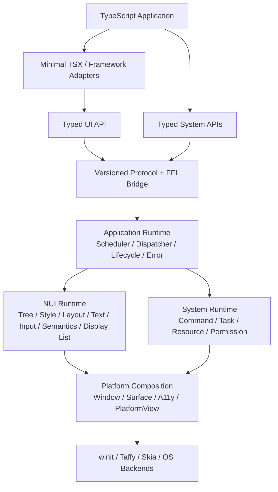
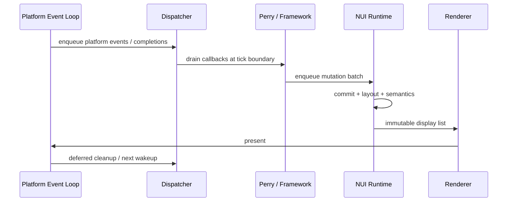

# Nexa UI 项目详细设计

- 状态：Desktop Notes MVP 直接平台验收已完成（PR run `31902303937` 通过 UIA/NSAccessibility、双平台真实 picker/clean-runner 与供应链门禁；run `31991801398` 已激活 v3 三副本性能 baseline，等待 active required 复核）；Technical Preview 仍等待 clean-tag promotion、registry clean-user、真实签名/公证、发布演练与独立审批
- 规划输入：`mvp@f3afbeb`
- 最新证据：[`BASELINE.md`](./BASELINE.md)
- 日期：2026-08-17
- 关联决策：ADR-004、ADR-005、ADR-006、ADR-007、ADR-008、ADR-009、ADR-010、ADR-011、ADR-012、ADR-013、ADR-014、ADR-015
- 当前目标：[`MVP.md`](./MVP.md)
- 配套计划：[`ROADMAP.md`](./ROADMAP.md)、[`../TODO.md`](../TODO.md)、[`REFERENCE-APP.md`](./REFERENCE-APP.md)

> 本文是组合现有 ADR 的提案，不自动把新的协议格式、文本依赖、产品定位或公开 API 变成 Accepted 决策。标为候选或待确认的事项必须先通过对应 ADR/产品评审。

## 1. 假设与决策边界

本设计基于以下假设继续推进，任一假设变化都应先更新本文档和 ADR，再调整实现：

1. 当前产品里程碑是 **Desktop Notes MVP**；后续目标是 Desktop Technical Preview，而不是生产稳定版 SDK。
2. 首发平台为 macOS 与 Windows；Linux 保持可编译目标，但暂不作为发布阻断项。
3. Minimal TSX 是参考实现和文档主路径；Solid 是唯一 Tier-1 公开 Adapter，Vue、React、Svelte 保持 private compatibility candidates。
4. Perry 继续负责 TypeScript AOT 与 nativeLibrary FFI，不承载 Nexa UI 的运行时语义；后端选择与复议门禁见 ADR-008。
5. 本阶段坚持 Skia CPU raster + softbuffer；先补齐 Surface 生命周期，再评估 GPU 后端。
6. 不实现 DOM、CSSOM、WebView 兼容层或完整 npm 浏览器生态。
7. 以一个文件型 Notes 应用作为 MVP 的贯穿式参考应用；范围由 ADR-010 固定。
8. 路线图按依赖和退出条件排序，不承诺未经团队容量评估的日历日期。

## 2. 目标

### 2.1 产品目标

让 TypeScript 开发者使用 TSX 或受支持的框架编写原生桌面应用，经 Perry AOT 编译为不依赖 Node.js、V8、WebView 或 Chromium 的独立程序，并由统一的 Rust Native UI Runtime 完成布局、文本、输入、无障碍、绘制和系统能力调用。

### 2.2 首要用户

- 愿意接受 Perry、Node/pnpm 与 Rust 工具链的 TypeScript 桌面应用开发者。
- 维护 Nexa UI Runtime、Host ABI 与平台后端的核心工程师。
- 维护 Solid、Vue、React、Svelte 兼容层的适配器作者。

### 2.3 Desktop Notes MVP 成功形态

一个评估者可以运行 macOS/Windows 的 unsigned Notes 产物，并完成多语言编辑、中文 IME、语义操作、文件打开/保存、suspend/resume 与 close cancellation。MVP 只要求 Minimal TSX 主路径，完整范围与退出门禁见 [`MVP.md`](./MVP.md)。

### 2.4 Technical Preview 成功形态

一个新用户可以从空目录创建、开发、测试、打包并运行一个 macOS/Windows Notes 应用。该应用至少覆盖：

- 多语言段落、单行与多行编辑、中文 IME 预编辑、选择与剪贴板；
- Button、Input/TextArea 的焦点和禁用状态、Text 的静态语义，以及 Image/Scroll 的显式语义；
- 文件打开、保存、取消和结构化错误；
- 窗口挂起/恢复、任务取消和关闭清理；
- Minimal TSX 主路径，以及至少一个外部框架的同等核心流程。

## 3. 当前基线

### 3.1 已验证能力

| 领域        | 当前实现                                                                   | 证据                                                                               |
| ----------- | -------------------------------------------------------------------------- | ---------------------------------------------------------------------------------- |
| Native Core | generation `NodeId`、Arena、树增删、命中测试                               | `crates/nui-core`                                                                  |
| Layout      | Taffy Flexbox 子集、逻辑像素布局                                           | `crates/nui-layout-taffy`                                                          |
| Render      | Skia CPU raster、矩形/文本/本地图片、Scroll clip                           | `crates/nui-render-skia`                                                           |
| Platform    | winit 单窗口、完整输入/IME、Surface 恢复、AccessKit adapter                | `crates/nui-platform-winit`                                                        |
| Host        | Perry FFI、版本化握手、queued mutation、回调 root scanner、ErrorSupervisor | `packages/nui-host`                                                                |
| UI          | Minimal TSX、signal/effect、基础原语和复合控件                             | `packages/ui`                                                                      |
| Adapters    | Solid Notes 核心切片与 Counter；Vue/React Counter、Svelte Counter 子集     | `packages/adapter-*`、`packages/compiler-svelte`                                   |
| System      | 桌面剪贴板、manifest 权限门禁、异步 UTF-8 文件/对话框 Task 与结构化错误    | `crates/nui-system-core`、`packages/system-host`、`packages/fs`、`packages/dialog` |
| Tooling     | CLI `new`/`dev`/`build`/`package`/`doctor`、安全模板、可信 AOT/打包与诊断  | `packages/cli`、`tools/cli-*.test.mjs`                                             |
| Examples    | Counter、Todo、Layout、Image、Clipboard、Input/Semantic harness            | `examples`                                                                         |

G0 验证结果见[`BASELINE.md`](./BASELINE.md)：Rust workspace 通过 23 个单元测试，TypeScript workspace 通过 29 个测试；完整 format、lint、typecheck、build、两个 FFI crate、Minimal TSX smoke、8 路框架 AOT 与两平台 offscreen native smoke 均通过。

### 3.2 已闭环实现与剩余发布边界

| 缺口         | 当前事实                                                                                                                         | 设计影响                                                                     |
| ------------ | -------------------------------------------------------------------------------------------------------------------------------- | ---------------------------------------------------------------------------- |
| Protocol     | Protocol v1 manifest、generated types、handshake 与错误码已落地                                                                  | 后续命令只能按 manifest/ADR 追加                                             |
| Handle       | 稳定 v1 使用双 `u32`/string envelope；packed u64 只保留 legacy compatibility                                                     | 新 API 禁止把 packed handle 传为 JS number                                   |
| Commit       | Host mutation 进入 pending batch，在 commit 边界原子应用并返回 receipt                                                           | Scheduler/Dispatcher 继续消费统一 receipt                                    |
| Callback     | Native 事件入 Dispatcher；owner/generation registry 负责 replacement、stale、reset                                               | React 已迁移到统一 microtask/tick 调度                                       |
| Text         | 索引、font/fallback、shaping、paragraph、系统字体、Host/Taffy measure 与 GlyphRun/Skia 执行已落地                                | G2B-09 完成多语言 visual golden/fuzz 集                                      |
| Input        | G3A 已完成共享编辑模型、选择、键盘、IME composition、候选框与多行滚动                                                            | G5 Notes 直接复用已冻结输入合同                                              |
| A11y         | G3B-01..05 的共享 harness、macOS NSAccessibility 与 Windows UI Automation 已在 hosted runner 通过                                | 跨进程 macOS `AXUIElement`/TCC 矩阵作为后续兼容风险跟踪                      |
| Render       | Display List、资源分层、Surface 恢复与 frame metrics 已落地；dirty region 仍未完成                                               | 增量绘制只在 profile 证据支持后推进                                          |
| System       | FS、Dialog 与 Clipboard 已接入 Task/Promise/权限合同；真实 FS/Clipboard 与双平台无 fixture picker 已在 hosted runner 通过        | `rfd` 仍无可观察的真实 `PLATFORM_FAILURE` 返回分支，cancel 不主动关闭 picker |
| Distribution | 9 个 npm 候选包、Solid Tier-1、双平台 unsigned package/fresh launch、G6-05 完整性与 active 性能预算已通过；尚未 registry publish | 仍需 clean-tag proof 晋级、外部 clean-user、签名/公证和最终发布              |

### 3.3 产品范围判断

现有代码已经证明“Perry + Rust Host + Skia 自绘 + 多框架 Adapter”可行。下一阶段的目标不是继续增加 Demo 或框架，而是把技术验证收敛成一个可版本化、可测试、可发布的桌面 SDK。

## 4. 架构原则

1. **协议稳定优先**：框架、Perry ABI、渲染后端只通过版本化协议连接。
2. **单一语义所有者**：每个概念只能有一个权威模块；Adapter 不复制 Runtime 语义。
3. **单 UI 线程**：UI Tree、框架状态、窗口和 Skia 只在 UI 线程访问。
4. **事件排队，不同步回调**：Native 事件和 worker completion 进入 Dispatcher，由 Tick 消费。
5. **显式资源生命周期**：Node、Callback、Task、Subscription、Resource 都使用 generation handle。
6. **文本先于高级控件**：所有文本测量、绘制和编辑共享 `nui-text`，禁止继续扩散 `draw_str`。
7. **语义与视觉分离**：Visual Tree 派生 Semantic Tree，辅助技术不读取绘制细节。
8. **CPU/GPU 资源分离**：业务和 Adapter 不持有 Surface、纹理或 Skia 对象。
9. **垂直切片验收**：每个阶段都以可运行参考应用验收，不做长期悬空的水平层。
10. **Minimal TSX 先行**：它是 Host 行为的规范消费者；框架适配器复用同一合同测试。

## 5. 目标架构



### 5.1 模块所有权

| 模块                        | 唯一职责                                                      | 明确不负责                 |
| --------------------------- | ------------------------------------------------------------- | -------------------------- |
| `packages/ui`               | Minimal TSX、类型化组件与响应式绑定                           | FFI 细节、平台事件、Skia   |
| `packages/adapter-*`        | 框架生命周期到统一 Host mutation 的映射                       | 自定义原语语义、系统 API   |
| `packages/cli`              | 项目生成、manifest-aware AOT/dev runner、通用打包、工具链诊断 | 运行时握手、Notes 专用打包 |
| `protocol/`（新增）         | 命令、枚举、错误码、版本与 feature bits 的唯一源              | 运行时实现                 |
| `packages/nui-host`         | Perry ABI 编解码、callback GC root、协议客户端                | Tree/Layout/Paint 语义     |
| `crates/nui-app-runtime`    | Tick、队列、任务、生命周期和错误监督                          | 绘制、OS API 具体实现      |
| `crates/nui-core`           | Node、mutation、dirty、事件、语义和 Display List 模型         | Perry、winit、Skia 类型    |
| `crates/nui-text`           | 字体、shaping、BiDi、断行、段落、选择和编辑                   | 窗口事件循环               |
| `crates/nui-layout-taffy`   | `nui-core` 布局输入到 Taffy 的适配                            | 文本 shaping               |
| `crates/nui-render-skia`    | Display List 到 Skia Surface 的执行                           | 直接遍历可变 Node Tree     |
| `crates/nui-system-core`    | 类型化 Command、Task/Resource、权限与平台能力抽象             | UI Tree mutation           |
| `crates/nui-platform-winit` | 窗口、原始输入、Surface 生命周期和 wakeup                     | 框架回调和业务组件         |

## 6. 核心合同

### 6.1 协议版本与唯一来源

新增机器可读的 `protocol/common.json`、`protocol/nui-host.json` 和 `protocol/system-host.json`。common manifest 唯一定义 bootstrap、版本、transport feature、Handle kind 和 protocol error；namespace manifest 定义各自命令与数据合同。生成器输出 Rust、TypeScript 与 Perry 定义，生成物带 `@generated` 标记并由 CI 校验无漂移。

协议握手最少返回：

```text
ProtocolVersion { major, minor, patch }
ClientRuntimeVersion / HostRuntimeVersion
AbiVersion
Transport / UI / System FeatureBits
ClientTargetTriple / HostTargetTriple
```

- `major` 不同：启动失败并给出结构化不兼容错误。
- `major` 相同、runtime minor 较高：客户端只使用双方 feature 交集。
- 枚举数值永不复用；废弃项保留编号。
- Adapter 不再从 `packages/ui/src/host.ts` 复制协议定义。

### 6.2 Handle 表示与生命周期

Rust 内部继续使用 `(slot: u32, generation: u32)`，但在确认 Perry 可无损传输 `u64` 前，不允许通过 JS `number` 传递打包后的 64 位值。

推荐 FFI 表示：

```text
HandleRef { slot: u32, generation: u32 }
```

TS 表面可以封装成 opaque object；不得允许业务代码算术操作。统一状态机：

```text
Created -> Active -> Closing -> Closed
                       \-> Invalidated
```

Perry FFI 入参将每个 HandleRef 展开为两个 `u32`；创建结果通过 guarded string ABI 返回，HandleRef success value 使用规范 `h1/<slot-8hex>/<generation-8hex>` token，TS 校验后封装为 opaque object。当前 Perry revision 没有安全的任意 object shape introspection，因此 native 不接收或返回 HandleRef `jsvalue`。可选句柄在 TS 表面为 `null`，FFI 使用显式 presence/slot/generation 三元组。

所有操作验证 kind、generation、owner window/app 与状态。重复 close/cancel 为幂等；过期 handle 返回 `STALE_HANDLE`，不得静默忽略或 panic。

### 6.3 Mutation 事务

Adapter 只追加 mutation，不直接改变活动帧中的 Tree：

```text
beginBatch(batchId)
  CreateNode
  Insert / Move / Remove
  SetProperty / SetText / SetSemantics
  AddListener / RemoveListener
commitBatch(batchId)
```

提交时执行：

1. 完整验证 handle、父子关系、属性类型和 batch 顺序。
2. 在 shadow mutation list 上保证原子性；任一命令失败则整批拒绝。
3. 应用到 Tree 并传播 `TREE_DIRTY`、`LAYOUT_DIRTY`、`SEMANTICS_DIRTY`、`PAINT_DIRTY`。
4. 合并一次 redraw 请求。
5. 返回 commit sequence 与结构化错误。

第一版可使用内存命令数组，不要求立即实现二进制 command buffer。

### 6.4 Node 与派生状态

目标 Node 数据模型：

```rust
pub struct Node {
    pub kind: NodeKind,
    pub parent: Option<NodeId>,
    pub children: Vec<NodeId>,
    pub style: Style,
    pub content: NodeContent,
    pub listeners: EventMask,
    pub semantics: Semantics,
    pub layout: LayoutRect,
    pub dirty: DirtyFlags,
}
```

- `NodeContent` 用 enum 区分 Text/Image/PlatformView，避免继续扩张平行 HashMap。
- Layout、Semantic Tree、Display List 都是 Visual Tree 的派生物。
- 删除子树必须同时清理 listener、focus、task/resource 引用和语义节点。
- `For` 和框架列表必须支持新增、删除、移动与稳定 key，而不只支持追加。

Minimal TSX 的 `Window` 必须物化为 `NodeType.Root`，而不是普通 View。Host 在每次 layout 前用当前 logical viewport 覆盖 Root 尺寸，window resize 因而直接驱动根布局；普通未指定尺寸的后代仍按 flex 规则计算。`width="stretch"` 在 materialize 边界清除 Input/TextArea 的固定 Host width。Notes shell 使用 `Column flexGrow=1` 与标题/正文 stretch，已移除窗口级固定内容矩形；实际 TSX trace 与 `window_root_tracks_each_viewport_resize` 分别覆盖 materialize 和 resize。

### 6.5 Application Tick 与线程模型



固定阶段：Platform Events -> System Completion -> Framework Microtasks -> State Effects -> Host Commit -> Layout -> Semantics -> Paint -> Present -> Deferred Cleanup。

硬约束：

- Layout/Paint 阶段拒绝状态和 Tree mutation。
- Native 不同步回调 TS；回调只由 Dispatcher 在允许阶段执行。
- 后台线程只能发送 completion，不得访问 Framework、Window、Tree 或 Skia。
- Tick 内最多 present 一次；事件风暴通过 wakeup 合并。
- 窗口关闭先进入 `Closing`，取消所属 Task，再作废资源，最后退出事件循环。

### 6.6 输入、焦点与事件

平台层先归一化，再进行 hit test 与派发：

```text
RawInput -> NormalizedEvent -> HitTest -> PointerCapture -> FocusManager
         -> Capture -> Target -> Bubble -> DefaultAction
```

P0 事件族：Pointer、Wheel、Keyboard、TextInput、Composition、Focus。事件包含 window、target、timestamp、modifiers 和 propagation state。

Button 行为由 default action 定义：按下建立 pressed/capture，指针在同一目标释放时才 Invoke；支持 hover、focus、disabled 与键盘 Space/Enter。

FocusManager 维护单窗口 focus chain、Tab/Shift+Tab 顺序与焦点恢复。Input 不再通过 `clickable` 特例获得焦点。

#### 6.6.1 G1 listener 生命周期闭环

G1-11 先完成当前同步事件路径的资源所有权，不提前实现 G2A Dispatcher。稳定合同如下：

```text
AddEventListener(node, event, callback)
  -> Result<CallbackHandle>

RemoveEventListener(callbackHandle)
  -> Result<void>
```

- Native session registry 是 Callback 身份与活动状态的唯一来源；Callback wire identity 不得与 Node identity 混淆。
- 同一 `(node, event)` 最多有一个活动注册。再次 add 会关闭旧注册、释放旧 Perry GC root，再返回新 generation handle。
- 已被替换、已移除或随节点失效的 Callback Handle 保留 session tombstone；重复 remove 成功 no-op，旧 handle 不得移除 replacement。
- Click、Change、Submit 独立持有 listener；移除 Click 时，若节点仍有其他 listener 或 Input 行为，节点继续参与 hit test。
- `NuiNode` mirror 按 `EventId` 保存 Callback Handle。prop 更新先释放旧 handle 再注册新 callback；`null` 或非函数 prop 只执行释放。
- Perry manifest 的 `ptr` guard 只证明值有 pointer payload，不能证明它是 closure。公开 TS wrapper 必须在调用私有 raw symbol 前执行 `typeof callback === "function"`，native 对 null pointer、非法 event 和 stale node 继续原子失败。
- Submit 缺少专用 listener 时回退到 Change 是现阶段兼容行为；G2A 迁移事件队列前由合同测试固定，改变它需要显式迁移说明。

G1-11 的最小证据包括：Bridge replacement/stale/idempotency 测试、FFI GC root 计数测试、TS callback 负向类型测试，以及真实 Perry smoke 中的 add/replace/remove。owner scope、关闭状态和迟到事件诊断仍由 G2A-07 完成。

#### 6.6.2 G2A-07 owner-scoped callback registry

G2A-07 将 callback 生命周期从单一 `(node, event)` map 提升为 session owner-scoped registry：

- 注册记录保存 `owner + slot/generation + ListenerKey + Perry token`；同一 owner 的同一 target 只能有一个活动 generation。
- 活动记录进入 `Closed` 或 `Invalidated` 后保留 tombstone，即使 slot 被新 generation 复用，旧 handle 仍只能得到幂等结果，不能操作 replacement。
- 带 owner 的 remove/invalidate 在 native registry 完成校验；跨 owner handle 返回 `WRONG_OWNER`，未知 generation 返回 `STALE_HANDLE`，关闭/失效 handle 的重复 close 不触发副作用。
- Platform event 入队时携带 callback generation snapshot。Framework 阶段只执行 registry 中仍匹配该 snapshot 的 token，因此 replacement 或 owner close 后的迟到事件会被丢弃。
- legacy click/change/submit FFI 与 v1 listener API 共用同一 registry 和 GC root scanner，不再存在绕过 owner/state 的 closure map。
- `nui-app-runtime::OwnerScope` 提供 `Created -> Active -> Closing -> Closed/Invalidated` 与 FIFO deferred cleanup 基础；资源释放在 DeferredCleanup 边界执行，window reset 集成由 G2A-08 完成。

验收证据：callback registry 的 owner/stale/tombstone/invalidation 单测、FFI replacement/late-event/legacy-unification 单测、Runtime owner scope 单测，以及 workspace 全量门禁。

#### 6.6.3 G2A-08 app/window lifecycle 与 session reset

G2A-08 将 app mount、window close 与下一次 mount 连接为可重复的 owner 生命周期。`NuiHost` 保留共享 `Arc`，因此 event loop 或测试持有的旧 clone 在 reset 后只能看到新 session，不能继续访问旧 Tree。

关闭顺序固定为：

```text
Closing
  -> abort pending Node/Callback state and absorb allocator high-water marks
  -> invalidate current-owner callbacks
  -> drop platform window/surface
  -> reset Host state and drain deferred cleanup
  -> Closed
  -> create and activate the next owner scope
```

- Reset 不得用新的 `Arena::default()` 或 `CallbackRegistry::default()` 替换 allocator。Committed handle 和 rejected/aborted batch 已返回的 provisional handle 都是已暴露 identity；active 与 pending preview 的 generation high-water mark 必须合并，`u32::MAX` slot 永久退休。否则旧 wire handle 会在 slot/generation 重新从 1 开始后 ABA 命中新 session 资源。
- Host reset 清空 root、focus、input、image、legacy/v1 listener、pending mutation、removed caches 与 active revision；sequence 回到初始边界，因此新 session 第一批成功 commit 的 sequence 为 1。
- Callback registry 跨 reset 存续，但当前 owner 的 active callback 全部进入 `Invalidated` tombstone，Perry GC scanner 不再保活其 token。迟到 platform event 携带的旧 callback generation 在 Framework 阶段无法 resolve 到新 callback。
- winit `CloseRequested` 先调用 lifecycle hook，再退出可复用的 event loop；只有 `run_app_on_demand` 返回且 window/surface 已释放后，Host 才完成 deferred cleanup、Closed 与新 owner 激活。异常返回也走同一 reset primitive。
- `ResetSession` 作为 v1 result-envelope ABI 暴露给 TypeScript；公共 `resetSession()` 同时清理 TS node/effect ownership、native owner 和 window title。Minimal、React、Vue、Solid、Svelte 的默认顶层入口必须在创建首个 Host node 前调用它；显式传入外部 Host container 的入口保持 caller-owned，不擅自 reset。

验收证据：Arena/Callback generation 与 retirement 单测、Host/OwnerScope close-reset 集成测试、TS lifecycle 与五套框架入口合同测试、真实 Perry ResetSession smoke，以及全部框架 AOT 编译矩阵。

#### 6.6.4 G3A-01 normalized event schema

Normalized event 是 Platform Composition 到 Core 的唯一输入合同。现有 `Click`/`Change`/`Submit` listener ID 保持兼容；G3A-01 新增稳定 ID `Pointer=4`、`Wheel=5`、`Keyboard=6`、`TextInput=7`、`Composition=8`、`Focus=9`。六类事件都携带同一 `EventContext`：`windowId`、可空的 Node `target`、十进制字符串 `timestamp`、`EventModifiers` 和 `PropagationState`。传播状态统一包含 `Capture | Target | Bubble | DefaultAction` 阶段及 `defaultPrevented`、`propagationStopped`、`immediatePropagationStopped` 三个标志。

事件专属字段如下：Pointer 使用 kind/pointerId/x/y/buttons/pressure；Wheel 使用 deltaX/deltaY/x/y；Keyboard 使用 kind/key/code/repeat；TextInput 使用 text；Composition 使用 Start/Update/Commit/Cancel、text 和 UTF-16 code-unit 的 selectionStart/selectionEnd；Focus 使用 Gained/Lost 和可空 relatedTarget。时间戳不使用 `u64` 或 JS `number`，以避免超过 `2^53` 后静默失真。协议层只冻结 shape 和编解码；pointer capture、三阶段 dispatch 和 IME 状态机由 G3A-03..06 实现，G3A-02 已落地 FocusManager，但这些运行时行为都不属于 G3A-01 的协议切片。

生成 Rust 类型默认启用 serde（可通过 `serde` feature 关闭），并以 camelCase JSON 字段与 TypeScript interfaces 对齐；`nui-core::event` 只 re-export 这些生成类型，后续 Runtime 不复制第二套事件模型。Rust/TypeScript round-trip fixtures 覆盖 Unicode 文本、可空 target、传播状态和超过 JS safe integer 的 timestamp；命令和结果 envelope 未因本切片改变。

G3A-02 实现固定 `FocusManager` 为单窗口焦点状态的唯一实现：注册项携带 `tab_index` 与 enabled 状态，正值先于零值，负值只允许显式 focus；树遍历使用 root 下的文档顺序。树 mutation 在 active arena 和 pending shadow 各保留一份 manager，commit 时原子替换；删除/禁用通过上一条 chain 快照恢复 next/previous focus。winit 的 `ModifiersChanged` 状态只用于识别 Tab 与 Shift+Tab，仍由 Host 在窗口事件路径内更新焦点，不同步回调框架。

G3A-03 将事件路径和 pointer capture 固定在 Core：`event_path` 返回 live root→target ancestor path，`EventDispatcher` 依次运行 capture、target、bubble，并在未 `preventDefault` 时运行 target default action。`stopPropagation` 只截断后续路径，`stopImmediatePropagation` 还阻止当前事件继续传播；capture map 只保存 generation-bearing `NodeId`，Arena 删除或 owner 变化后自动回退到新的 hit target。Bridge 的 left-button 按下只建立 capture，释放阶段才通过该 dispatcher 产生 Click。

#### 6.6.5 G2A-10 React 统一调度

React Host config 使用 concurrent root、`DiscreteEventPriority` 与 `supportsMicrotasks`。Host event props 不再由 adapter 包装为事件内 `flushSync`；state update 在 React microtask boundary 执行，并保持 `event -> microtask -> timer` 顺序。Perry 0.5.1220 不导出裸 `queueMicrotask` symbol，因此 bridge 使用 `Promise.resolve().then(...)`，它由 Perry stdlib 的 promise continuation 实现。根首次 render/unmount 的 `flushSync` 仅用于显式 root API 边界，不属于 Native event workaround。

验收证据：React lifecycle/conformance、事件异步顺序 source contract、adapter typecheck，以及 `PERRY_NO_CACHE=1` 的 React Counter clean AOT/link；准确命令和本地结果见 `TODO.md` 的 G2A-10 evidence。

### 6.7 文本与编辑

统一管线：

```text
UTF-8 Source -> Font Match/Fallback -> Script/BiDi -> Shaping
             -> Line Break/Paragraph -> Glyph Runs -> Layout/Display List
```

关键索引决策：FFI 和 TypeScript API 使用 **UTF-16 code unit offset**，与 JS String 和平台 IME 边界一致；Rust `nui-text` 的公开 paragraph/shaping API 使用带类型的 `Utf8Offset` / `Utf8Range`。ADR-009 中“公开 offset/range 使用 Utf8”限定于 Rust 文本模块，不适用于 TS/FFI。两侧必须由 `TextIndexMap` 显式转换，任何 caret/selection API 都不得让无单位的裸 `usize`/`number` 穿越边界。

G2B-04 已按 ADR-009 锁定直接 Rust 文本栈：`unicode-segmentation` 负责 extended grapheme，`unicode-script` 负责 script itemization，`unicode-bidi` 执行 UAX #9，`rustybuzz` 从共享 `FontSource { bytes, face_index }` shaping。fallback 的最小单位是完整 grapheme；glyph cluster 是原文绝对 UTF-8 byte offset；所有 glyph advance/offset 在边界转换为有限 logical pixel，溢出返回结构化错误。

`Utf8Range` 校验 byte range、UTF-8 boundary 与 source byte length，但不声称编码字符串身份；同长度异源只能由拥有文本的上层识别。`ParagraphSnapshot` 已自持 source、`TextIndexMap` 与 FontDatabase revision，后续 selection/hit-test 不接收脱离 snapshot 的裸 range。

段落输出包含 size、baselines、font-derived line metrics、positioned glyph runs、cluster bounds 与 affinity-aware caret stops。每行 ascent/descent/leading 分别取实际参与字体的最大值，空行使用 primary font metrics；cluster/caret map 是后续 hit-test 的数据基础，point-to-offset 与 selection rect API 仍属于 G3A-07。Taffy 的 text measure callback 由 `nui-layout-taffy::layout_tree_with_cache` 调用 revision-aware `ParagraphCache`，不再使用字符数乘字号。缓存 key 包含 source、font request、node font style、font size、`Definite/MinContent/MaxContent` width、default direction 与 `FontDatabaseRevision`；默认容量为 256，满容量时清理上一代 snapshot。

`nui-text::system_font_database` 复用 rustybuzz 的 `ttf-parser`，有界发现 macOS/Windows/Linux 的 TTF/OTF/TTC，并把不可变 bytes 与 face index 注册为生产 `FontSource`。Perry `HostSession` 默认使用该数据库；Rust 嵌入方也可通过 `NuiHost::with_fonts` 注入经过 primary face/source 校验的数据库。FontDatabase 属于 process runtime，window/app `reset()` 只清 paragraph snapshot，不重建 font identity 或 revision。

Host layout、window paint、pointer 与 wheel 的 `LayoutError` 在释放 Host 锁后统一转换为 `frame_nexa_error("layout", ...)` 并进入 `ErrorSupervisor`；paint 遇错丢弃当前帧，pointer/wheel 不使用失败后的几何。无字体注入的 `layout_tree` 仍是 legacy/non-production best-effort wrapper，会丢弃 typed error；生产路径只使用返回 `Result` 的 `layout_tree_with_cache`。

G2B-07/08 将同一 cache 延伸到 paint：Core 的 `DisplayGlyph/GlyphRun/TextBox` 不引用 `nui-text` 或 Skia，`nui-layout-taffy::display_list_with_cache` 从 `ParagraphSnapshot::PositionedRun` 生成绝对 logical-pixel glyph commands；Host 把 source-backed FontId/bytes/face index 作为只读 `FontPaint` resource 交给 renderer。Skia 只缩放字号和 glyph positions，再调用 `draw_glyphs_at`，不重新 fallback、shape 或以 `draw_str` 绘制 production TextNode 内容。legacy Text smoke 与 focused placeholder overlay 暂保留兼容，后者会在 G3A caret/selection paint 接入 paragraph hit map 时移除近似测量。

G2B-05 以 UAX #14 候选执行 grapheme-safe 贪心断行；不可断内容保留整行并显式标记 overflow。换行后每个 non-empty `content_range` 都调用 `BidiInfo::visual_runs` 独立执行 UAX #9 L1/L2，不复用整段 `ShapedParagraph.runs` 的 visual 顺序。空文本、显式硬换行与尾随换行由 paragraph 从原文合成 line，不依赖 shaped run 是否包含 glyph。

EditableText 维护：value、selection、composition range 与 revision。单行和多行控件共享编辑模型；多行控件另外处理可见行、上下方向移动、换行和内部滚动。IME 生命周期为 Start -> Update(preedit) -> Commit/Cancel，并向平台返回当前 caret/composition bounds。

P0 验收集：英文、中文、阿拉伯文、RTL/英文混排、Emoji ZWJ、肤色修饰、组合字符、窄宽度换行和字体缺失 fallback。

### 6.8 Semantic Tree 与 AccessKit

Visual Tree 在 Semantics 阶段派生独立快照：

```text
SemanticNode { id, parent, role, name, value, state, bounds, actions }
```

- 默认语义由组件生成；显式 SetSemantics 替换整个 semantic node，ClearSemantics 后恢复组件默认。
- Button 导出 Invoke，Input/TextArea 导出 Focus/SetValue，Text 导出静态文本；Image/Scroll 只在显式设置 semantics 时导出对应角色。
- 每个 Tick 仅提交语义增量；首帧和恢复后提交完整树。
- AccessKit action 进入同一 Dispatcher，不直接调用组件。
- UI 自动化优先基于 Semantic Tree，避免依赖像素坐标。

G3B-01 已冻结显式语义写入合同：`SemanticRole` / `SemanticAction` 使用稳定字符串 enum，`Semantics` 的 role/label/value/description/disabled/checked/actions 均为 optional；`SetSemantics=14` / ABI 27 保持兼容，`ClearSemantics=19` / ABI 32 仅追加。Set 表示存在显式语义覆盖，Clear 删除覆盖并恢复后续组件默认派生；两者进入与 Tree mutation 相同的 shadow validation/atomic commit，成功只置 `SEMANTICS` dirty，非法 JSON、未知 enum/字段或 stale handle 会拒绝整批而不泄漏预览状态。

G3B-02..04 以及 G3B-05 的 deterministic harness 已固定以下平台组合边界：

- `accesskit 0.24.1` 与 `accesskit_winit 0.33.2` 仅启用 `rwh_06`，由 `nui-platform-winit` 独占 OS adapter；Core 和 Bridge 不依赖平台类型。
- converter 使用固定的合成 Window root；visual `NodeId` 的 slot/generation 原样编码为 AccessKit identity。节点映射 role、name/value/description、disabled/checked、logical bounds、children、actions 和 focus；Window root 持有 viewport bounds 与 scale transform。
- adapter 在隐藏窗口创建后初始化。`InitialTreeRequested` 提交完整树，成功 present 后只发布增量；deactivate、suspend、surface loss 与 window recreate 会丢弃 adapter snapshot，下一次激活重新发送完整树。
- winit 先把 WindowEvent 交给 AccessKit，再进入普通输入分派。只接受根 tree 上非合成 root 的 Click、Focus、SetValue；无效 payload、未知 action 或错误 tree 被 normalization 层拒绝。
- 合法 action 进入独立 `Dispatcher<AccessibilityActionRequest>`，仅在下一 Tick 的 PlatformEvents 阶段消费。Invoke、Focus、SetValue 分别复用现有 Click、FocusManager、EditableText/Change 路径；stale、disabled 或未声明 action 的目标稳定 no-op。
- `examples/semantic-e2e/scenario.json` 是 Node 合同与 Bridge harness 的共享数据源，以 role/name 查询 Title、Body、Save；macOS/Windows native-smoke matrix 运行无屏幕坐标的 converter/Dispatcher deterministic harness。
- `semantic-accessibility-smoke` 复用同一 scenario，在小型原生 fixture 中通过 production `accesskit_winit::Adapter`、winit user event 与 `Dispatcher<AccessibilityActionRequest>` 落地 action。它与 Minimal TSX/Bridge harness 组成分层证据，不宣称一次运行覆盖 Perry callback、`HostWindowApp` 与 TSX 组件路径。
- macOS 本机已由进程内 NSAccessibility 对象 client 以 role/name 查询并执行 Focus、SetValue、Invoke，同时回读焦点、value 与 Status；该层验证 provider/action 路径，不覆盖跨进程 `AXUIElement`/TCC 兼容矩阵。
- Windows UI Automation COM client 已实现 control-type/name 查询、SetFocus、ValuePattern、InvokePattern 与焦点/value/status 回读；run `31902303937` 的 job `95054897192` 在 GitHub Windows runner 实际执行成功，关闭 G3B-05。

### 6.9 Display List、资源与 Surface

`nui-core` 生成不可变 Display List，Skia backend 只执行命令：

```text
Save / Restore / ClipRect / Transform
DrawRect / DrawRRect / DrawGlyphRun / DrawImage
```

图片、字体源、段落与 Display List 属于 CPU Resource；Surface、纹理和 glyph atlas 属于 backend resource。资源通过 `ResourceId` 引用，业务 Tree 不持有 Skia 类型。

Surface 状态：`Absent -> Ready -> Suspended -> Recreating -> Ready | Failed`。Suspend 释放 backend resource，Resume 重建并执行 full repaint；失败进入 ErrorSupervisor，可重试或显示诊断，而不是只写 stderr。

G2C-03..06 已完成 CPU/backend resource 分层与恢复闭环。Core `ResourceStore<T>` 为 Image、Font、Paragraph 提供 generation-bearing `ResourceId`、stale rejection、reset high-water mark 与 generation retirement；Tree 只持有 CPU resource identity。图片 path 只 decode 一次并以 `Arc<[u32]>` 共享，Skia 通过 no-copy `Data` 保活 pixels，Image/Typeface 按 `SurfaceGeneration` 缓存。`SurfaceLifecycle` 仅在 recreate 成功后递增 generation；resize/acquire/present loss 释放 surface/context/window，`about_to_wait` 自动重建，Bridge 收到 `surface_ready` 后切换 cache generation，恢复帧执行完整 clear/layout/display/paint/present，首个成功 present 清除 full-repaint pending，应用 Tree 与业务状态不重置。

G2C-07 已完成真实 frame observability。`FrameMetricsRecorder` 由可注入单调时钟驱动，并跨 tick、paint 与 platform present 回调保留同一条记录；只在操作实际开始时累计 event、commit、layout、display、paint、present，尚未执行的 Semantics 不产生虚假 attempt。记录以 tick/frame/surface generation 关联，明确区分 Presented、Dropped、Coalesced 与 NoPresentRequested；有界 history、独立 lifetime totals 和锁外 panic-contained sink 为后续 Inspector 与 G6 性能基线提供稳定接口。

G2C-08/09 将生命周期边界纳入同一合同：pending redraw 只有一个槽位，新 tick 会 coalesce 旧 tick；session identity 由 owner 区分，run 前 mount commit 不归入首个 idle tick，close/Drop 会恰好发布 pending/active recorder。Suspend、acquire loss 和 present loss 都立即释放 Image/Typeface backend cache，保留 CPU resource、业务 Tree 与 upload lifetime counters；Resume 在新 `SurfaceGeneration` 下按需重新上传并等待 full repaint present。

P0 保留全量布局/绘制实现，但建立 dirty flags 和可观测计数；增量布局与 dirty region 优化必须由 profile 数据触发。

### 6.10 System Host、Task 与权限

G4-01 已建立 System Runtime domain 的 `HandleIdentityRegistry`：Task、NativeResource 和后续 Subscription 共用一个 slot/generation allocator，记录 kind/owner/state/tombstone；TaskRegistry 仅保留任务语义 facade。identity 与 owner fence 有硬预算，创建时预留未来 tombstone，容量用尽结构化失败。NUI Host 的 Node/Callback registry 属于独立 nativeLibrary/domain，不能跨 domain 传递 HandleRef；跨 kind 的 System command 必须先经同一 System ledger 校验。

G4-02 已建立 Application Runtime worker boundary：MVP 的文件、对话框与剪贴板均属于阻塞 OS 调用，因此先使用无额外 async runtime 依赖的固定大小标准线程池和 bounded queue；UI 线程只做 non-blocking submit。worker 不持有 Framework、Window、Tree、Skia 或 registry 引用，只能把 move-only result 投递到 Dispatcher `System` queue；UI runtime 仅在 `SystemCompletion` phase 验证 owner/generation/state 后 settle。取消先写 Closing 状态并投递 control event，保证被阻塞 worker 不延迟 `Cancelled`；worker 后续结果依据 Closed/Invalidated tombstone 丢弃。失败提交会撤销未公开 identity 而不占用 lifetime budget，runtime drop 只设置 cooperative token，不等待 OS 工作退出。

G4-03 将统一结果合同落到 System Host 边界：Rust producer 使用 `CommandResult<T>` 和 manifest-backed constructors，错误 code/name/severity/retryable 不由 message 推导；Task registry 与 worker outcome 在 Host 边界转换为对应 System code。`nexa_result_json_v1` codec 严格输出 `{ ok, value }` 或 `{ ok, error }`，手工编码 primitive context、`platformCode` 与递归 `cause`，并将 panic/不可编码数据转换为 `INTERNAL_FAILURE`。TS wrapper 在暴露结果前验证 exact keys、uint32、known metadata、context value 与 cause depth，失败由 `NexaSystemError` 保留。Legacy sentinel symbols 只在迁移适配层存在，不进入新的 System API；Clipboard 的实际 Task/Error 迁移由 G4-07 完成。

G4-04（ADR-011）把 app manifest 定义为唯一的应用能力声明。manifest 是严格 JSON v1，包含 `$schema`、`schemaVersion`、reverse-DNS `id`、SemVer `version`、兼容的 `requiredProtocol` 与 active System permission names；顶层/嵌套未知字段、重复/未知权限、非法 identity/version、协议不兼容和超过 64 KiB 的输入均 fail closed。JSON integer 以值语义接受 `1`/`1.0`/`1e0`、拒绝小数与 `u32` 溢出；name 对齐 JavaScript whitespace 并拒绝 control、BOM-only 和未配对 surrogate；SemVer core 每段最多 18 位。共享 raw JSON fixture 同时验证 Ajv 与 Rust 接受集合。development 文件入口和 release 内嵌字节入口共享同一个有界 parser/validator，不读取隐式默认路径，也不因开发模式自动授权。

`PermissionSet::default()` 为 deny-all；只有已验证 `AppManifest` 能构造授权集，公开授权入口仅有穷尽 `require_command`，底层 permission/command 组合检查保持私有。active Permission ID/name 由单一 canonical table 驱动。System Host 的 Rust-only `SystemHostPermissions` 以 `OnceLock` 安装一次，未安装拒绝、二次安装不能扩大权限，TypeScript 不获得 grant/reload/path 入口。schema enum、canonical permission table、command permission mapping 与 System manifest 均有 exact-set drift tests；OS 权限拒绝仍与 manifest 拒绝使用不同 `PermissionSource`。

G5 的 trusted production composition 将 manifest path 限定在构建边界：`tools/reference-notes-build.mjs` 设置 `NEXA_APP_MANIFEST_PATH`，System Host `build.rs` 读取后把 bytes 写入 `OUT_DIR` 并通过 `include_bytes!` 链入 native library。Notes 运行时的 owner bootstrap 只调用 release-bytes validator，并把结果缓存为 one-shot；它不读取环境变量或文件路径。未提供 build-time manifest 时嵌入值为 `None`，权限继续 deny-all。包装器还在 link 后检查 app id 和 FS/Dialog permission marker，避免链接到未携带可信 manifest 的 System Host。

G4-05（ADR-012）已把首条 FS 垂直链路落地：`ReadTextFile`/`WriteTextFile` start FFI 只做权限校验和 non-blocking submit，返回严格双 `u32` `HandleRef`；worker 仅投递 System completion，`AwaitTask` 只登记一次 `promise<string>`，并由 winit `RuntimeWaker` 唤醒空闲窗口。Promise 只在 `SystemCompletion` phase 通过 live `Scheduler` drain 后 resolve，后续 Perry continuation 在 `FrameworkMicrotasks` 的 `perry_poll()` 执行。文件读写只接受 UTF-8；写入使用同目录唯一临时文件、flush/sync、rename 前 `try_begin_commit` 的取消/提交线性化，错误映射保留 `CANCELLED`、`NOT_FOUND`、`INVALID_DATA`、`PLATFORM_FAILURE` 与 `PERMISSION_DENIED`。owner close/reset 建立 terminal fence，清理 awaiter 与记录，迟到 completion 丢弃。`@nexa/fs` 只暴露 typed `Task<T>`、`readTextFile`、`writeTextFile`，结果 Promise 和 cancel 均保持单次语义。

G4-05 证据（2026-08-07，2026-08-08 集成补充）：System Core 文件系统 contract `9/9`；System Host Rust `15/15`（13 unit + 2 manifest/permission integration）；Application Runtime `51/51`；winit `39/39`；Perry Bridge `128/128`；FS + System TypeScript contract `12/12`，两包 typecheck 通过；严格 Clippy、protocol/workspace route checks、`pnpm install --frozen-lockfile --offline` 和双 native-library Perry AOT link 通过。除 `/tmp/nexa-g4-05-native-link-smoke` 外，`reference-notes` 的真实 FS runtime smoke 现已用受信内嵌 manifest 启动 Perry 进程，在临时目录完成 UTF-8 写入/读回、native worker、SystemCompletion、Promise continuation 与磁盘 bytes 复核。该证据关闭真实 FS transport 缺口；Dialog 的 MVP 自动证据由构建期注入 backend 的真实 Perry/native Task/Promise 应用旅程提供。

G4-06 证据（2026-08-07）：ADR-013 冻结 `OpenFileDialog`/`SaveFileDialog` 的 typed Task 合同。新增 `system.DialogOpen`/`system.DialogSave` deny-all permissions、严格 filters JSON parser、`nui-system-core::DialogBackend` 注入边界和 `rfd::FileDialog` native backend；selected path 以 `ok/value` 返回，用户取消为 `value: null`，显式 cancel/owner invalidation 终止结果交付并丢弃迟到结果。当前 `NativeDialogBackend` 只能将 `rfd::pick_file/save_file` 的 `Option<PathBuf>` 包装为成功值，没有真实 `PLATFORM_FAILURE` 分支；Dialog worker 闭包不使用 cancellation token，因此 cancel/close 不能主动关闭已显示的系统 picker。协议 manifest/schema/generated artifacts、`pnpm test:protocol` `36/36`、`@nexa/dialog` TS contract `4/4`、System Core permission contract `6/6`、System Host Rust `19/19`（含 dialog parser/task tests）、offline strict Clippy 和 Cargo check 均通过。下一切片为 G4-07 Clipboard Task/Error 迁移。

G4-07（ADR-014）将 Clipboard 迁移到统一 Task/Error 语义：`ClipboardBackend` 是唯一注入边界，阻塞调用在 System worker 执行，v1 FFI start 只做 manifest 检查和 Task submit，completion 只在 `SystemCompletion` 结算；`@nexa/clipboard` 公开 typed `ClipboardTask<T>`，并把 native unavailable/operation 映射为稳定 `PLATFORM_FAILURE` platformCode。旧 sentinel 仅用于兼容 ABI，不能进入新 API。

G4-07 证据（2026-08-07）：Core injected backend `2/2`、System Host Rust `22/22`（20 unit + 2 integration）、Clipboard TS contract `4/4`、package typecheck、offline strict Clippy 与 native-library Cargo check 通过；contract fixture 不接触真实剪贴板。详见 [`ADR-014`](./decisions/ADR-014-clipboard-task-and-error-v1.md)。

G4-08 已完成窗口关闭资源清理集成证据：`TaskRuntime` 通过 shared System ledger 提供 Subscription/NativeResource 的 owner-scoped identity 入口；owner terminal fence 会同时使 Task、Subscription、NativeResource 进入 `Invalidated` tombstone，取消 worker token，并在 `SystemCompletion` 丢弃迟到结果。Application Runtime close-race 测试与 System Host 注入式 awaiter 测试覆盖同一 owner 的三类句柄、awaiter 清理、generation 状态验证和迟到 completion 不进入框架；下一切片为 G5-01 参考 Notes PRD。

G5 Notes 当前集成证据（2026-08-08，2026-08-16 hosted 补充）：controller 15/15 与实际 Notes TSX E2E 4/4 覆盖 open/save/cancel、语义 action、typed error、suspend/resume、pending close 与 late completion；FS 与构建期注入 Dialog 的 deterministic runtime smoke 保持通过。run `31902303937` 的 macOS/Windows package jobs `95054897243` / `95054897272` 在真实图形会话完成无 fixture picker save/open/cancel，probe SHA-256 分别为 `f7cfab51cbaf4163bc82ae74854b07d5fcd8eb98219050fcb84e18e59c372172` / `e82079f1ee6b6afff7418b94a6299bb72835178f778918b036e80df8659e343a`。

G5-05 已冻结基础 Style/Theme 公共面：`@nexa/ui` 公开 typed semantic tokens、numeric `Style`/`TextStyle`、`createTheme`/`defaultTheme`/`rgba`，由根 Window 局部传递到 Text/Card/Button/Input/TextArea；组件显式 style 最终覆盖，协议不接受 CSS string 或 selector。所有交互组件继续共用 Core 的 hovered/pressed/focused/disabled additive resolver，Theme 只配置稳定 base style。UI 8/8、Host property trace 2/2、Notes Perry AOT/startup 与既有 Core/Renderer visual contracts 通过。

交付证据（2026-08-16 hosted 补充）：本地 build/package/create-to-package 合同保持通过。PR head `e56bb9e2c531e9cd3d97837465eca92d5e2c31dd` 触发的 run `31902303937` 在 Actions merge execution revision `991b28142783833c14be659125c4564d14219cc5` 上完成 macOS/Windows build/archive jobs `95054897243` / `95054897272` 和 fresh download/validate/launch jobs `95059000291` / `95059000304`。该直接证据关闭 G3B-05、G5-03、G5-04、G5-09 与 MVP-01；由于 `collect_mvp_proof=false`，它不关闭 clean-tag schema-v5 N-10/N-11 或 MVP-02。

公开 API 始终类型化，例如 `@nexa/fs`、`@nexa/dialog`，不公开字符串 `invoke`。

统一结果：

```ts
export type NexaError = {
  domain: "protocol" | "ui" | "system";
  code: number;
  name: string;
  severity: "ProtocolViolation" | "RecoverableOperation" | "FrameFailure" | "FatalRuntime";
  message: string;
  operation: string;
  retryable: boolean;
  runtimeVersion: string;
  context?: Readonly<Record<string, string | number | boolean>>;
  platformCode?: string;
  cause?: NexaError;
};

export type Task<T> = {
  readonly id: TaskId;
  readonly result: Promise<T>;
  cancel(): void;
};
```

- worker 完成后只向 Dispatcher 发送 `(taskId, result)`。
- cancel 是幂等的；窗口关闭使所属 Task/Subscription/Resource 失效。
- 权限来自应用 manifest，不由 API 包自行默认放行敏感能力。
- Permission denied、cancelled、not found、invalid data 与 platform failure 保留不同错误码。
- Clipboard 在 Task 基础设施落地后迁移到同一 Promise/错误语义。

### 6.11 错误监督与诊断

错误分为四级：ProtocolViolation、RecoverableOperation、FrameFailure、FatalRuntime。边界要求：

- FFI 函数不 panic 穿越边界。
- 不再用空字符串、`false` 或 `-1` 丢失错误原因。
- 每个错误包含 operation、code、context、source chain 和 runtime version。
- 开发模式输出结构化日志；发布模式允许应用注册顶层 error handler。
- Frame/Task/Protocol 指标可由未来 Inspector 消费，但 P0 不实现完整 DevTools。

MVP 的 ErrorSupervisor 合同：

- 所有 producer 在自己的边界把失败转换成 ADR-007 的 `NexaError`，Supervisor 不解析字符串来猜测严重级别。
- `ProtocolViolation` 拒绝当前协议操作，`RecoverableOperation` 结束当前操作并继续，`FrameFailure` 丢弃当前帧并允许后续帧恢复，`FatalRuntime` 请求停止 runtime。
- Supervisor 在 runtime 线程上按报告顺序更新四级计数和有界历史，再调用单一 native diagnostic/enqueue sink；sink 在内部锁外执行，允许 handler 回读诊断，handler panic 不得越过 runtime 边界。sink 不得同步调用 Perry/Framework；应用 handler 必须由 sink 入队并在后续 `FrameworkMicrotasks` 阶段执行。
- 后台线程不得直接调用 Supervisor；它们仍按 6.6 的规则只向 Dispatcher 发送 completion。因此 FIFO 指 runtime 线程的线性报告顺序，不对任意外部线程的同步 handler 调用顺序作保证。
- 首个 `FatalRuntime` 错误被锁存且不被后续错误覆盖。历史默认保留最近 64 项；达到上限时只淘汰最旧项。
- `nui-platform-winit` 只上报带 operation 的 platform failure，不反向依赖 Application Runtime。Bridge 负责把它转换为 `NexaError`；默认 platform adapter 的 stderr 输出只是未注册 sink 时的开发期后备行为。
- ErrorSupervisor 属于 process/application runtime，诊断和 fatal latch 不随 window owner reset 清除；销毁 runtime 才清除。这样 close/reset 后 Inspector 或顶层 handler 仍能观察关闭前错误。

### 6.12 公共组件与样式 API

公共 API 表达应用语义，Adapter 再把它归一化成协议 ID。业务代码不直接传 `PropertyId`、packed color 或 `0/1/2` 对齐值。

Technical Preview 的候选组件面：

```text
Native primitive: Window / View / Text / Image / Scroll
Layout composite: Column / Row / Stack / Spacer / Card
Interactive composite: Button / Input / TextArea
Control flow: For
```

`Button`、`Input`、`TextArea` 仍是复合组件，不进入 Native `NodeType`。`TextArea` 与 `Input` 共享 EditableText，前者启用多行段落、行导航和内部滚动。

候选类型风格：

```ts
export type Align = "start" | "center" | "end" | "stretch";
export type Justify = "start" | "center" | "end" | "space-between";
export type Color = string | { r: number; g: number; b: number; a?: number };

export type BoxStyle = {
  width?: number;
  height?: number;
  padding?: number;
  gap?: number;
  alignItems?: Align;
  justifyContent?: Justify;
  backgroundColor?: Color;
  borderRadius?: number;
};
```

- 所有交互组件支持 `disabled`、focus 语义和键盘默认动作。
- hover/pressed/focused/disabled 通过稳定 state token 进入样式解析，不让框架 Adapter 各自定义行为。
- public prop removal 必须生成 clear/unset mutation，不能跳过 `null` 后遗留旧值。
- 组件默认值和语义只在共享 Host/UI kit 定义一次。
- 完整主题和设计系统属于 P1；P0 只提供类型化基础 token 与可访问的状态反馈。

### 6.13 CLI onboarding 与诊断合同

`@nexa/cli` 是 Node 22+ 开发期工具，不进入 Perry AOT 应用或 Native Runtime。G5-06 冻结 `new`/`doctor`，G5-07 在 §6.14 增加 `dev`/`build`，G5-08 在 §6.15 交付 `package`；所有命令均已有真实实现，不提供占位成功路径。

| 命令                   | 输入边界                                       | 成功结果                                        | 失败语义                                |
| ---------------------- | ---------------------------------------------- | ----------------------------------------------- | --------------------------------------- |
| `nexa new <directory>` | cwd 内相对路径；安全 lowercase/hyphen basename | 生成 Minimal TSX、standalone tsconfig、manifest | 操作失败 1；usage 2；从不覆盖已有 bytes |
| `nexa doctor`          | 当前项目依赖图与 process target                | human-readable 版本组合与逐项 pass/fail         | 任一 required check 失败即 1            |
| `nexa doctor --json`   | 同上                                           | 单个 newline-terminated schema v1 JSON object   | JSON 仍完整输出；不混入 human stderr    |
| `nexa package`         | conventional project 与可选 `assets/`          | 当前 target 的固定 unsigned distribution        | 操作失败 1；usage 2；拒绝覆盖           |

`new` 的安全与可复现规则：

- 拒绝绝对路径、`..`、cwd 外解析结果、任一现有符号链接 segment、非目录/非空目标、Windows 保留名和不安全项目名；写文件使用 exclusive create。
- 允许复用已经存在的空目录；生成器不运行 install、脚本或网络请求。
- 模板固定 CLI、Perry、TypeScript 与 Nexa package 的非 `workspace:*` 版本；app manifest 遵循 schema v1、Protocol 1.0，默认 `permissions: []`。
- Technical Preview 候选 package manifest 已可发布，但 registry 尚未发布；生成 README 必须明确依赖已发布或已授权的 registry，不能把本地 tarball 证据描述成外部可直接安装。生成物承诺 G5-06 的项目骨架、G5-07 的可信 manifest build/development loop 与 G5-08 的 current-target unsigned package。

`doctor` 的兼容矩阵由 CLI 单一 metadata object 输出，并由合同测试绑定根 `packageManager`/engines/devDependencies、`@nexa/ui`、`protocol/common.json` 与两套 Host package manifest，避免手写版本漂移。required checks 固定为 Node `>=22`、pnpm `10.34.3`、Perry `0.5.1220`、UI/System Host runtime `0.1.0`、ABI `0.5`，以及 `darwin/arm64`、`darwin/x64`、`win32/x64`。包解析只遍历 cwd `package.json` 声明并由各 owner `node_modules` 安装的依赖边，不接受 ancestor lookup 或 `NODE_PATH`。Perry 清单必须解析到精确版本，CLI 再以当前 Node 直接执行该包声明的 `perry` bin，并只接受唯一锚定的 `perry <semver>`；PATH-only 全局命令和带 warning/多版本的输出都不能通过。Host 清单沿同一依赖图逐级解析，支持 pnpm 的非 hoisted 布局。报告同时记录 CLI 与 Protocol 版本，缺命令、清单不可解析、输出不可解析和版本错配都成为独立失败项，不抛出未结构化异常。渲染后的模板必须通过 TypeScript typecheck，完整 CLI 合同还要在 Windows required job 上运行。

### 6.14 CLI `dev/build` 合同

G5-07 已为 conventional Minimal TSX 项目增加 manifest-aware 开发与构建入口。目标用户是从 `nexa new` 起步的 Technical Preview 开发者；该切片不提供交叉编译、自定义 entry/output 或 JSON diagnostics，固定 bundle layout 已由 G5-08 接管。

| 命令         | 固定输入                                                | 进程合同                                                                                    | 成功结果                                |
| ------------ | ------------------------------------------------------- | ------------------------------------------------------------------------------------------- | --------------------------------------- |
| `nexa dev`   | cwd `package.json`、`src/main.tsx`、`app.manifest.json` | 当前 Node 直接执行 project-local Perry `dev`；继承 stdio；由 Perry 负责 watch/recompile/run | 阻塞到开发会话正常结束，返回 0          |
| `nexa build` | 同上；target 为 darwin arm64/x64 或 win32 x64           | 当前 Node 直接执行 project-local Perry `compile`；Windows 强制 GUI subsystem；继承 stdio    | `dist/<package-basename>[.exe]`，返回 0 |

项目与 manifest 规则：

- `package.json.name` 的最后一段必须是安全 lowercase/hyphen binary name；入口和 manifest 都必须是 cwd 内非 symlink regular file。输出只写入非 symlink 的 `dist`，开发临时产物只写入 `.nexa/dev`。
- app manifest 以 64 KiB 为上限，执行 schema v1 的 exact-key、identity、canonical SemVer、Protocol 1.0、active permission、unique/max-count 校验；CLI 常量必须由合同测试绑定 canonical JSON schema、Protocol 与 System permission registry。
- Perry 必须从当前项目声明并安装的依赖图解析，package version 精确等于兼容矩阵；不经过 shell、`pnpm exec` 或 PATH lookup。`dev` 复用 Perry 自带 watcher，不复制文件监听/进程重启状态机。

可信构建与诊断规则：

- 两个命令都覆盖 `NEXA_APP_MANIFEST_PATH` 为已验证 manifest 的绝对路径，并删除 `NEXA_DIALOG_TEST_FIXTURE_PATH` 与 `PERRY_SKIP_CODEGEN`，不允许测试 backend 或 stale codegen 绕过进入正式 composition。
- `build` 启动前只清理 CLI 自己拥有的精确旧 binary；拒绝 symlink/目录。编译退出 0 后仍必须读取 regular binary，验证其中包含 app manifest 的完整原始 bytes，并拒绝 Dialog fixture canary；status 0 但缺产物、stale/mismatched manifest 或污染产物仍失败。
- child stdout/stderr 直接流式转发，CLI 自身只在成功后输出确定的相对 artifact 路径；spawn error、signal、非零 child status、输入/产物校验错误均返回 operational exit 1，未知参数/缺参数仍为 usage exit 2。失败的 `dev` 不伪装为正常会话，失败的 `build` 不打印 success summary。

验证策略与退出条件：

- Node temp-project integration 使用真实文件图和 project-local fake Perry bin，证明 cwd、argv、env、manifest bytes 与 artifact 路径；注入 runner 只覆盖难以在单元测试中触发的 signal/Windows 分支。
- 负向合同覆盖 missing/symlink/oversized/malformed manifest、未知 permission、错误 Protocol/Perry/target、compile failure、status-0 missing output、manifest mismatch 和 fixture contamination。
- 生成模板已提供 `nexa dev/build/package/doctor` scripts，并忽略 `node_modules`、`dist`、`.nexa` 与 `.nexa-package-*`；CLI help、README、设计、路线图与 TODO 已同步。

### 6.15 CLI `package` 合同

G5-08 已将 G5-07 验证的单一 AOT binary 封装为当前 target 的 unsigned distribution，通用实现位于 `packages/cli/src/package.mjs`。Perry 已把 UI/System Host 静态链接进 binary，packager 不从开发机 Cargo target、`node_modules` 或全局工具目录复制动态库；Notes 专用 `tools/reference-notes-package.mjs` 保持独立。G5-09 再负责 macOS/Windows hosted runner 的 artifact 下载与实际启动证据。本切片不提供交叉打包、签名/公证、installer/MSIX、archive、app icon、增量覆盖、自定义 output 或 asset transform。

`nexa package` 无参数，且始终先执行与 `nexa build` 相同的受信构建；不存在用户可见的 `--skip-build` 绕过。固定输入是在 G5-07 conventional project 之外增加可选的 cwd `assets/`。成功布局固定为：

```text
dist/<binary>-macos-<arch>/
  <binary>.app/Contents/
    Info.plist
    MacOS/<binary>
    Resources/app.manifest.json
    Resources/nexa-build.json
    Resources/assets/**              # 仅 assets/ 存在时

dist/<binary>-windows-x64>/
  <binary>.exe
  app.manifest.json
  nexa-build.json
  assets/**                          # 仅 assets/ 存在时
```

产物规则：

- `<binary>` 继续使用 `package.json.name` 的安全 basename；目录平台标签使用 `macos`/`windows`，metadata target 使用 Node 的 `darwin`/`win32`。CLI 成功输出相对 bundle/distribution path。
- sidecar `app.manifest.json` 写入 build 已验证并嵌入 binary 的原始 bytes，不重新序列化。macOS `Info.plist` 从 manifest id/name/version 与 binary name 生成并执行 XML escaping；SemVer core 写入 Apple version keys，完整 SemVer 保留在 manifest 和 metadata。
- `nexa-build.json` 是 newline-terminated schema v1 JSON，记录 app identity/version、Protocol、target，以及 CLI/Perry/Host runtime/ABI 兼容版本；它只用于诊断，不替代受信 manifest 或代码签名。
- 可选 `assets/` 按相对目录原样复制，只接受非 symlink regular file/directory。预算固定为最多 4096 个文件、单文件 64 MiB、总计 256 MiB；遍历顺序确定，读取前后必须保持 regular-file identity/size，任何特殊文件、竞态或预算溢出都 fail closed。

写入与失败合同：

- packager 在 project root 创建唯一 `.nexa-package-*` staging directory，先完成 binary/manifest/metadata/assets 写入，再以非递归 `mkdir` 排他占位精确 destination。macOS 将完整 `.app` 单次移入 reservation；Windows 按 executable、manifest、可选 assets、`nexa-build.json` 顺序移入，metadata 必须最后写入并作为完成标记。
- Windows 必需 entry 缺失、类型不符或移动失败必须失败；可捕获失败按 reservation identity 回滚已移动 entry。staging 与 rollback cleanup 失败不得吞掉原始错误。进程被强杀时 Windows 可能留下没有 `nexa-build.json` 的未完成 reservation，重跑会拒绝覆盖，由调用者显式审计和删除。
- 精确 artifact destination 若已存在，无论类型都拒绝，且不读取、删除或覆盖其中 bytes。源 binary、manifest、assets 与 destination 的 symlink 一律不跟随。
- package 阶段再次验证 binary 为 regular file、包含完整 manifest bytes且无 Dialog fixture canary；bundle 中不包含 `node_modules`、Perry、Node、Rust、Cargo target 或源码。
- build、输入、资源、staging、rename 或 bundle 校验失败返回 operational exit 1，未知参数返回 usage exit 2；失败不打印 `Packaged` summary。

文件系统威胁边界：

- binary、manifest 与 asset 使用 `lstat -> open(O_NOFOLLOW where available) -> fstat -> fd read -> fstat/lstat` 复核 regular-file identity/size，静态 symlink、普通并发 `nexa package` 和读取期常见替换竞态均 fail closed。
- project root 与 `dist` 必须由调用者独占。Node 22 标准库没有跨平台 `openat`/directory rename-no-replace，无法防御拥有相同文件权限的敌对进程在最后一次 parent 检查后重命名或重新链接 parent；因此本合同不宣称 hostile same-permission race safety。
- `.nexa-package-*` 已进入生成模板 ignore。只有 identity 仍匹配的自有 staging/reservation 才允许递归清理，未知或被替换路径一律保留并报错。

验证使用独立 temp-project contract，不复用 Notes 固定权限、名称或 packager helper。初始 8-case RED 在 G5-08 复审阶段扩展为 19/19 GREEN，覆盖 macOS/Windows 精确 layout、plist/metadata、deny-all manifest、nested/empty assets、symlink/预算/竞态、existing destination、publication reservation、Windows rollback、cleanup 双错误与 usage；CLI 聚合 53/53、CI path/fail-closed 21/21。真实 `pnpm --filter @nexa/cli smoke:package` 从 `nexa new` 开始，完成 Perry AOT/link，验证约 25.3 MB binary、真实 plist、manifest、metadata、assets、fixture canary 与开发路径隔离。`npm pack ./packages/cli --dry-run --json` 证明实现与模板 ignore 进入 tarball；双平台 hosted launch 仍由 G5-09 负责。

### 6.16 G5-09 hosted artifact 与启动合同

G5-09 不再增加打包格式，而是为 G5-08 的通用 distribution 建立双平台 hosted 证据。`reference-notes-package.yml` 必须把“带工具链构建”和“只消费产物启动”拆成两个 job；同一 build job 仍可生成 Notes 专用 artifact，供 MVP-01 共用后半段下载启动证据。

构建与运输合同：

- build matrix 固定 `macos-15` 与 `windows-2022`，从 `nexa new -> nexa package` 生成通用 artifact，并运行 Notes 的 FS、构建期注入 Dialog Promise、无 fixture real OS picker 与专用 package 门禁。real-picker 的 driver、stage、proof、marker、磁盘 bytes、关闭等待或超时任一失败都阻断 artifact 上传。
- package job 为成功的 native FS 与 real-picker 进程生成 canonical runtime proof：固定绑定 revision/ref/run、runner/platform/arch，以及两个实际 Perry binary 的 size/SHA-256；FS 语义必须覆盖 N-05 invalid UTF-8 与 N-06 save，picker 语义必须覆盖 N-04/G5-04P 的 save/open/cancel。launch job 下载该 proof，clean-package proof 再以内嵌 payload 和外层 name/size/SHA-256 绑定，语义字段或二进制摘要漂移均阻断 MVP 晋级。
- 已验证的通用 artifact 可由 smoke 导出到调用者指定、原先不存在的 destination；默认本地 smoke 仍使用临时目录并清理。导出只服务 CI 证据，不改变 `nexa package` 参数或 output 合同。
- 通用与 Notes artifact 分别封装为带单一顶层目录的 `tar.gz` 后再交给 `actions/upload-artifact`；archive 只是 CI 运输层，用于保留 macOS executable mode，不属于 CLI 的 archive 产品功能。
- artifact 名称包含实际 runner OS/arch；关闭 G5-09 时记录 commit SHA、workflow run URL/ID、job、artifact 名称/digest 与实际 target。`macos-15` matrix entry 只覆盖 arm64；即使 hosted run 成功，也不能据此声称 darwin/x64 已验证。

下载与启动合同：

- launch matrix 必须是依赖 build 的独立 job，只允许下载同一 workflow run 的 artifact；不得 checkout 仓库，不得 setup/install Node、pnpm、Rust 或 Perry，也不得执行 build/package。准确承诺是“launch job 不调用开发工具链”，不是声称 hosted image 物理上不含这些工具。
- 解包后重新验证固定目录、regular executable、manifest、通用 `nexa-build.json`、target 与版本。完整 SemVer 必须在 manifest 和 metadata 一致；macOS plist 的 identifier 与 SemVer core 必须一致。Windows PE Explorer version resource 不属于本切片。
- 清除 Nexa/Perry fixture/bypass 环境变量后直接启动通用与 Notes executable，各要求至少存活 5 秒；按捕获的 PID 清理并在提前退出时输出日志。
- workflow YAML/route 合同只能证明矩阵和 fail-closed 结构已配置。只有绑定当前 commit 的 macOS/Windows hosted build、upload、download、validate、launch 全绿记录才能关闭 G5-09/MVP-01。

实现与 hosted 证据（2026-08-08，2026-08-16 补充）：CI 专用 artifact 导出、同 parent 临时工程、默认清理、拒绝覆盖和失败清理均有合同覆盖，package 合同 23/23、CLI 聚合 57/57、workflow/route 合同 22/22。run `31902303937` 的双平台 package 与 fresh-launch jobs 全绿；package artifacts `9251605446` / `9251849187` 的 GitHub digests 分别为 `sha256:483ab8a38b9debfa8b0dcbf3fb9562b1c1d37bc620b47b1c1e5d20d6b562bbaa` / `sha256:865954eae51ce7a8c2b93224bf8f2ac1d1ed05917649f31acac94c57482c2044`。G5-09 与 MVP-01 已关闭，proof 晋级边界见 [`MVP-EVIDENCE.md`](./MVP-EVIDENCE.md)。

### 6.17 G5-10 文档与可复现合同

G5-10 以 `docs/QUICKSTART.md`、`docs/API.md`、`docs/PACKAGING.md` 与 `docs/COMPATIBILITY.md` 分离 onboarding、公开 surface、分发合同和已知限制。Quickstart 明确区分当前源码 workspace/本地 tarball 路径与 SDK 发布/授权 registry 后的 clean-user 路径；九包公开清单与 Tier-1 Solid 选择不得被描述成已经完成 registry publication。

`tools/docs-contract.test.mjs` 使用 Node 标准库扫描仓库内 Markdown 本地链接，并把文档中的命令、UI/System API 名称、工具链版本、Technical Preview targets、Dialog 限制和 hosted 证据边界绑定到 package scripts 与源码真值。该合同进入根 `test:workspace` 和 Docs workflow；checker 自身变更也必须路由到 Docs gate。

本地文档合同与链接检查已经通过，但 G5-10 的产品退出条件仍要求在已发布或已授权 registry 上由 external clean 用户实际完成 create-to-package。在该记录出现前，G5-10 保持未完成；workspace smoke 不能替代 registry 安装证据。

## 7. 关键流程

### 7.1 启动

1. CLI/二进制读取 app manifest，校验协议、权限与资源。
2. Platform Composition 创建 event loop 与 App Runtime。
3. Host 完成 ABI/feature handshake。
4. Framework 建立初始树并提交 batch。
5. Runtime 执行首次完整 Layout、Semantics、Paint、Present。

### 7.2 UI 更新

1. Signal/Framework state 变化只产生 Host mutation。
2. mutation 在当前 tick 的 Host Commit 阶段原子提交。
3. dirty flags 决定 Layout/Semantics/Paint 工作。
4. Renderer 获取不可变 Display List 并 present。

### 7.3 异步系统操作

1. TS 创建 Task，Runtime 注册 owner 与 cancellation token。
2. Worker 执行 FS/Dialog 等平台操作；FS 可协作检查 cancellation，当前 `rfd` Dialog 调用不可主动中断。
3. Completion 进入 Dispatcher，下一 tick settle Promise。
4. cancel/close 先更新 handle 状态，迟到 completion 被丢弃并记录。

### 7.4 关闭与恢复

- Suspend：停止 present、释放 Surface/backend resource，保留 CPU 状态。
- Resume：重建 Surface、重上传资源、完整重绘、完整语义同步。
- Close：阻止新任务、取消已有任务、清理 callback roots、销毁窗口资源、退出。

## 8. 目标目录结构

```text
protocol/                         协议唯一源、版本与生成器
crates/
  nui-core/                       Tree/Mutation/Event/Semantics/Display List
  nui-text/                       Paragraph/EditableText
  nui-app-runtime/                Tick/Dispatcher/Task/Lifecycle/Error
  nui-system-core/                Command/Permission/Resource
  nui-layout-taffy/               Layout backend
  nui-render-skia/                Render backend
  nui-platform-winit/             Desktop composition backend
  nui-perry-bridge/               Runtime-facing bridge
packages/
  cli/                            Project generator, dev/build/package runner, and doctor
  nui-host/                       Perry ABI client
  ui/                             Minimal TSX reference API
  adapter-*/                      Optional framework adapters
  fs/ dialog/ clipboard/          Typed system modules
examples/
  reference-notes/                North-star acceptance app
  framework-parity/               Contract compatibility matrix
tests/
  protocol/                       Generated contract drift tests
  fixtures/                       Text/input/semantics fixtures
  e2e/                            Perry/native smoke scenarios
tools/
  packager/ inspector/            Remaining developer tooling
docs/
  PROJECT-DESIGN.md ROADMAP.md decisions/
```

## 9. 技术栈

| 层        | 技术                                                                                                              | 当前/目标约束                      |
| --------- | ----------------------------------------------------------------------------------------------------------------- | ---------------------------------- |
| Language  | Rust 2021、TypeScript 5.9+                                                                                        | Rust MSRV 1.88；Node >=22          |
| AOT/FFI   | Perry nativeLibrary ABI 0.5                                                                                       | 必须增加 NUI 自有协议版本          |
| Window    | winit 0.30                                                                                                        | 单 UI 线程，macOS/Windows P0       |
| Layout    | Taffy 0.12 Flexbox                                                                                                | 只开放类型化子集                   |
| Render    | skia-safe 0.99 + softbuffer                                                                                       | CPU raster P0                      |
| Text      | rustybuzz 0.20.1、unicode-bidi 0.3.18、unicode-linebreak 0.1.5、unicode-segmentation 1.13.3、unicode-script 0.5.8 | ADR-009；pure Rust text stack      |
| A11y      | accesskit 0.24.1 + accesskit_winit 0.33.2（`rwh_06`）                                                             | 桌面 Button/Text/Input/TextArea    |
| Workspace | Cargo workspace + pnpm workspace                                                                                  | nativeLibrary 需进入独立 CI matrix |

## 10. 命令

### 10.1 当前可执行命令

```bash
pnpm install --frozen-lockfile
pnpm workspace:validate
pnpm format:check
pnpm lint
pnpm typecheck
pnpm test
pnpm build
pnpm test:perry

cargo fmt --all -- --check
cargo clippy --workspace --all-targets -- -D warnings
cargo test --workspace
cargo run -p rust-counter -- --smoke

pnpm --filter @nexa/example-counter build
pnpm --filter @nexa/example-solid-counter build
pnpm --filter @nexa/example-vue-counter build
pnpm --filter @nexa/example-react-counter build
pnpm --filter @nexa/example-svelte-counter build
pnpm --filter @nexa/example-reference-notes typecheck
pnpm --filter @nexa/example-reference-notes build
pnpm --filter @nexa/example-reference-notes smoke:fs
pnpm --filter @nexa/example-reference-notes smoke:clipboard
pnpm --filter @nexa/example-reference-notes smoke:dialog
pnpm --filter @nexa/example-reference-notes package
pnpm --filter @nexa/cli typecheck
pnpm --filter @nexa/cli test
pnpm --filter @nexa/cli smoke:build
pnpm --filter @nexa/cli smoke:package
(cd examples/reference-notes && node ../../packages/cli/src/bin.mjs doctor --json)
```

G0 基线命令的准确版本、runner 和 run 链接见[`BASELINE.md`](./BASELINE.md)。G5 CLI create-to-package 已在本地真实 Perry AOT/link 通过，并由 run `31902303937` 的 macOS/Windows required matrix 完成 hosted 验证。`pnpm test:perry` 证明 clean compile/link，不单独证明运行时 parity。

2026-08-10 本地收口验证：`pnpm test:workspace`、`pnpm test:release`、完整 `pnpm build`、Rust workspace tests、五入口 Perry AOT matrix、Minimal TSX/Notes/FS/Dialog 与 Solid Tier-1 核心路径均通过；九包 tarball consumer 完成 typecheck、Node ESM import、doctor、Perry AOT、双 Host 链接、package 与 evidence verify。这些本地结果仍不替代 registry clean-user 或签名/发布证据；Windows、Clipboard/picker 与 clean launch 的直接 hosted 门禁已于 2026-08-16 由 run `31902303937` 另行关闭。v1/v2 performance 证据作为历史采样合同保留，当前每平台三副本的 `reference-notes-v3` 已由 run `31991801398` attempt 1 完成 capture、评审和 baseline activation。

### 10.2 计划新增的聚合命令

```bash
pnpm verify              # format + lint + typecheck + unit + protocol drift
pnpm test:contracts      # TS mock Host + Rust protocol fixtures
pnpm package:smoke       # 生成并验证独立 app bundle
```

在命令真正落地前，文档不得把它们写成可用命令。

## 11. 代码风格

- TypeScript 使用 strict、`noUncheckedIndexedAccess`、`exactOptionalPropertyTypes`。
- 公开 TS API 使用可判别联合与 opaque handle，不使用 `any` 或无类型字符串 command。
- Rust 公共 API 返回具体错误类型；FFI 边界捕获 panic/错误并编码为协议结果。
- 协议枚举显式赋值；值只追加，不重排。
- Rust 4 空格，其他文件 2 空格；TypeScript/Markdown 由 Prettier 管理。

推荐边界风格：

```rust
pub fn commit_batch(
    runtime: &mut Runtime,
    batch: MutationBatch,
) -> Result<CommitReceipt, ProtocolError> {
    let validated = batch.validate(&runtime.tree)?;
    runtime.apply(validated)
}
```

```ts
export type HostResult<T> = { ok: true; value: T } | { ok: false; error: NexaError };
```

## 12. 测试策略

| 层级          | 负责内容                                                        | 门禁                                                           |
| ------------- | --------------------------------------------------------------- | -------------------------------------------------------------- |
| Rust unit     | Arena、handle、mutation、dirty、text index、task state          | 每个核心状态转换与错误分支                                     |
| Property/fuzz | 树 mutation、UTF 索引转换、协议 decode                          | 无 panic、无悬空父子关系、round-trip 成立                      |
| TS unit       | signal、组件 props、Adapter 生命周期、错误映射                  | 使用 Mock Host，不依赖原生窗口                                 |
| Contract      | JSON protocol -> Rust/TS 生成物、fixture 编解码                 | 枚举/版本/错误码零漂移                                         |
| Integration   | Taffy + Text measure、Tree -> Display List、System Task         | 不经过 Perry 也能验证 Runtime                                  |
| Perry AOT     | clean build、ABI handshake、callback/task round-trip            | macOS/Windows 至少各一条 required smoke                        |
| Native E2E    | Notes 核心流程、IME、A11y、Suspend/Resume                       | 使用语义树和平台自动化                                         |
| Visual        | 多语言、DPI、clip/image 的小型 golden 集                        | 按平台容差；不以整窗脆弱截图为主                               |
| Performance   | cold start、idle memory、mutation/layout/paint timing           | 先记录基线，再设置 release budget                              |
| CLI fixture   | new/doctor 与 dev/build/package 路径、env、进程、manifest、产物 | 无网络合同；模板 typecheck；双平台分支；真实 create-to-package |

测试规则：

- 修复 bug 必须先有能复现的回归测试。
- 每个 Adapter 运行相同 Host mutation contract suite。
- headless clipboard 测试不得改写用户剪贴板；使用可注入 backend。
- CI 使用 clean checkout 和 clean Perry build，不能复用开发机忽略产物。
- 文档中的 framework parity 只有在自动化证据通过后才能勾选。
- `release:build` 只后处理生成的 `.js`/`.d.ts`：使用 TypeScript AST 为无扩展名的相对 ESM specifier 补 `.js`，Perry 使用的 `src` specifier 保持不变；发布构建禁用 source/declaration maps。
- 发布构建测试必须使用独立 `--output-root`，workspace package test 从 `src` 解析，不依赖或争用 ignored `dist`；clean tarball consumer 必须通过 Node 原生 ESM loader 导入全部非 CLI 公开包。

## 13. 交付和版本策略

- `mvp` 合入主线前必须保持可重复的 CI 证据；提交数量不作为 release candidate 的替代证据。
- 所有发布包共享一份兼容矩阵：Nexa UI、Protocol、Perry、Rust MSRV、框架版本、平台。
- Technical Preview 可使用 `0.x`，但 protocol major 与 npm/crate semver 分开管理。
- package/CLI 必须记录 build metadata，错误报告能够输出完整版本组合。
- 发布前必须提供 app manifest、资源打包、原生库选择、签名/公证入口和回滚说明。
- 首次 npm train 使用受控两阶段发布，解决“registry evidence 依赖包已存在、正式发布又依赖 registry evidence”的循环：`bootstrap` bundle 仍要求 MVP、contracts、security、performance、consumer、signing、rehearsal 七个 revision-bound gate，只允许 `v0.1.0`，并仅写入 `technical-preview-staging-<revision-prefix>`；随后 hosted clean consumer 对该 staging tag 生成 registry proof，`final` bundle 才能加入 registry gate并允许公开 channel promotion。
- `final` 阶段不能创建 npm version，只能验证九包 SHA-512 与已下载 tarball 一致后更新 `technical-preview` dist-tag。bootstrap 不得更新公开 channel，未来版本也不得复用 `v0.1.0` 的 one-time exception。中断后的 `--resume` 只接受依赖顺序上的摘要匹配前缀；gap、摘要漂移、部分 channel promotion、错误 revision/phase 都 fail closed。
- GitHub Release 只存在于 `final` 路径。发布器从双平台 signed custody 准备精确七资产 allowlist（两个 signed archive、`SHA256SUMS`、SBOM、provenance、release manifest、signing custody），绑定 exact tag/full target SHA、version-bound notes 与 signing run，并对该集合生成 GitHub provenance attestation；bootstrap 不创建 Release。
- final 先创建或核对 draft prerelease，fresh-download 已有远端 bytes 后只上传缺失且摘要一致的资产，禁止 `--clobber`，随后再次 fresh-download 验证 exact allowlist。只有 npm 九包 `technical-preview` 二次观测完全收敛后才公开 draft，并保存绑定 Release ID/URL、release/signing run、七资产摘要与九包 integrity 的 publication record；该 record 是 workflow artifact，不是第八个公开资产。
- `release/readiness-policy.json` 的 checked-in execution 保持 `disabled/none`；只有 protected `release-evidence.yml` 组装的 phase-bound 外部证据 bundle 能变为 `enabled/bootstrap` 或 `enabled/final`。bootstrap bundle 在 final evaluator 下必须同时因 phase mismatch 与 registry pending 被拒绝。

2026-08-17 hosted 边界：run `31902303937` 在 source head `e56bb9e2c531e9cd3d97837465eca92d5e2c31dd` / Actions merge execution revision `991b28142783833c14be659125c4564d14219cc5` 上完成直接平台、安全、当时的 v1 active performance 与 G6-05 unsigned input jobs。v2 run `31958001217` 作为历史 steady-state 证据保留；run `31991801398` attempt 1 在 source head `8302b89200698df6a6ead7772928107ba4d56eee` / merge revision `2c91ac02340245e5bad206bc1e9fe0d8b96b88fd` 上完成 v3 双平台各三份 hosted raw、两个 report set 的逐字节评审和 baseline activation，G6-07P 等待 active 状态下的新 required run。这些 PR run 都不是 clean tag，也没有激活凭据或发布权限，因此不是 MVP schema-v5 promotion、signed staging、clean-tag rehearsal、registry proof 或 Technical Preview publication 证据。

## 14. 性能与可观测性

六项数值基线与回归阈值由 `release/performance-budgets.json` 管理；v1/v2 hosted 证据作为旧采样合同归档，v3 保留 startup/steady-state 分层，并将帧统计冻结为“每进程 nearest-rank p95 后取 10 进程中位数”，平台结果再取 3 个独立 runner summary 的中位数。run `31991801398` attempt 1 的六份 raw 和两个 report set 已归档并激活当前双平台 baseline。完整来源、样本、digest 和复核方法见 [`PERFORMANCE.md`](./PERFORMANCE.md)。参考应用持续记录以下计数和 trace span：

- startup 到 first present；
- 每 tick 的 mutation 数、layout 节点数、semantic diff 数、display command 数；
- layout、text shaping、paint、present 耗时；
- Node/Task/Resource 活跃与泄漏计数；
- image/paragraph cache hit ratio；
- idle memory、二进制体积和冷启动时间。

G2C-07 已交付每 tick/frame 的 mutation、layout node、semantic diff、display command、paint/present 计数及真实执行阶段耗时；G6-07A/B 已交付六项预算 schema、校验器、artifact bytes 测量、Notes 原生探针与 hosted collector。run `31895582357` 的 macOS/Windows raw report 曾激活 v1 baseline，run `31902303937` 完成 v1 active-budget 复核；run `31952821895` 暴露首帧混入 p95 的结构性边界后，run `31958001217` 以固定 startup 边界和每平台 1000 个 steady frame 激活 v2 baseline。v3 进一步保留每进程边界，并要求每平台三个独立 hosted replica 和完整 report set；run `31991801398` 已完成 v3 capture/activation，G6-07P 只能由该 baseline active 后的新 hosted required run 关闭。

### 14.1 G6-07B 原生性能采集设计

以下假设在本切片内冻结：workload 为 `reference-notes-v3`；只有 GitHub-hosted `macos-15` / `windows-2022` 证据可以进入候选报告；开发机只允许运行合同测试，不能激活 baseline；每平台只构建一份共享候选 tar，必须在 3 个独立 hosted job 上分别采集完整 raw report；性能探针必须由显式环境变量启用，普通 Notes 启动、输入和绘制路径不改变；采集器在取得 RSS 后终止专用子进程，该终止不计为应用失败。

数据流固定为：

```text
Notes/Perry process
  -> NuiHost FrameMetricsObserver (successful present 后 publish)
  -> prefixed native JSON line on stdout
  -> Node collector monotonic timestamp + platform RSS reader
  -> schema-v2 runner report x 3 independent hosted replicas
  -> raw-byte-bound platform report set
  -> aggregate + check-set
  -> active baseline regression result
```

原生探针合同：

- 仅当 `NEXA_PERFORMANCE_CAPTURE_V1=1` 时安装 observer sink；`NEXA_PERFORMANCE_FRAME_TARGET` 必须是 `1..1000` 的整数。
- sink 只消费已经完成的 `FrameMetrics`，不得重新计时或把 `Ready`、离屏 paint、日志存活当成 present。
- 每行以 `NEXA_PERFORMANCE_EVENT ` 开头，payload 固定包含 schema、outcome/drop stage、session/tick/frame/surface generation、完整 `FrameCounts` 和完整 `FrameDurations` 纳秒值；所有 Rust `u64/u128` 值用十进制字符串传输，collector 以 `BigInt` 解析后再生成毫秒数，避免 JavaScript safe-integer 截断；写出发生在记录完成后，I/O 不进入该 frame 的阶段耗时。
- 探针在达到目标 presented 数之前请求后续 coalesced redraw；不注入键盘、指针、IME 或业务 mutation。达到目标后停止请求重绘，使进程在 RSS settle window 内进入真实 idle。
- 未启用时不安装 sink、不请求额外重绘，也不改变退出语义。

collector 合同：

- 读取 `release/performance-budgets.json`，严格执行每平台 3 个 replica，且每 replica 3 次 warmup、10 次 measured run、每进程精确 100 个 steady-state frame。每个 measured 进程的 presented 目标为 `1 startup + steadyPresentsPerMeasuredRun`；不得通过 CLI 降低 startup、样本数或 5 秒 settle window。
- parent 在 `spawn()` 前用 Node monotonic clock 取起点，以第一条 native `Presented` event 到达为 first-present；measured run 在该事件后等待至少 5 秒且不注入输入，再用 macOS `ps` 或 Windows PowerShell 读取该 PID 的 resident set。
- warmup 样本全部丢弃；measured run 的 cold start/RSS 各保留一条，第一个 successful Presented 固定归入 startup 且不进入帧 p95，随后所有 successful Presented duration 都保留。所有 event 包括 startup 都先验证 identity/outcome/drop；任一 timeout、malformed event、非零/异常提前退出、缺样本、drop 或 RSS 读取失败都阻止报告生成，不能按耗时筛除 outlier。
- collector 必须核对实际 `process.platform/process.arch`、配置中的 runner image、与
  `GITHUB_SHA` 完全相等的 commit、`GITHUB_ACTIONS=true`、
  `RUNNER_ENVIRONMENT=github-hosted`、规范正十进制 `GITHUB_RUN_ID`、正整数
  `GITHUB_RUN_ATTEMPT` 和 replica `1/2/3`；候选报告绑定 commit、platform、runner、
  artifact regular-file bytes、archive/tree 和主可执行文件 SHA-256。artifact identity
  在首次 spawn 前和最后一次 measured run 后都必须一致；presented frame 的 session
  固定、frame ID 唯一且严格递增，outcome counts 必须精确匹配。
- 每个 runner 的 frame 值先按进程取 nearest-rank p95，再取 10 个进程 p95
  的中位数；平台值再取 3 个 runner summary 的中位数。report set 绑定每份
  raw JSON 的真实字节和 SHA-256，单报告不能执行 schema v2 budget gate。
- workflow 分开 `aggregate` 与 `check-set`；只要成功聚合就上传完整 report-set
  artifact，回归不得删除 raw 证据。baseline 为 pending 时使用 `--allow-pending`
  供评审，但 `require_active` 仍必须返回非零。不得自动修改 baseline 或触发发布。

collector 模块的可测试边界固定为 `parseNativePerformanceEvent`（严格解析 prefix/schema/raw record）、`frameMetricSamples`（仅从完整 presented duration 派生三项样本）、`assertHostedRunner`（核对 hosted/OS/arch/image）、`readResidentSetBytes`（可注入 subprocess）和 `createPerformanceReport`（聚合 measured runs 并绑定 artifact identity）。真实 CLI 只负责参数解析、子进程生命周期与调用这些边界，测试不得依赖真实窗口或伪造计时常量来证明 hosted 采集成功。

G6-07B 的本地完成标准是：native event 单元测试、collector 聚合/异常测试和 workflow 合同测试全部通过，macOS/Windows job 都实际调用 collector 并校验完整报告。v1 的 hosted 报告、人工评审、baseline activation 与 required 复核分别由 runs `31895582357` / `31902303937` 完成；v2 的双平台 raw report 和 activation 由 run `31958001217` 完成并作为历史证据保留。v3 只接受每平台三份完整 runner report 的 report set；run `31991801398` attempt 1 已完成 capture、逐字节评审、归档和 activation，G6-07P 等待 v3 baseline active 后的新 `performance-required` hosted 复核。

Technical Preview 发布门禁必须有可复现的 macOS/Windows 基线与回归阈值。

## 15. 边界

### Always

- 修改协议先改 manifest/ADR，再生成代码和合同测试。
- 每个行为变化同时补充 Rust/TS 或 E2E 证据。
- 对跨 FFI 资源使用 generation handle 和显式 close/cancel。
- 提交前运行与改动路径对应的完整门禁。

### Ask first

- 新增 shaping、BiDi、AccessKit、async executor 等核心依赖。
- 改变公开 API、协议 major、Perry ABI 或框架支持等级。
- 引入多线程 Tree/Layout/Render、GPU backend、多窗口或移动端。
- 发布 npm/crate、签名应用或修改 branch protection。

### Never

- 让 Adapter 或业务代码直接访问 Skia/winit/OS handle。
- 在 Layout/Paint 中修改状态，或从 worker 直接回调框架。
- 使用空字符串、布尔值或 panic 代替跨边界结构化错误。
- 依赖 TS GC 自动释放 Task/Subscription/Resource。
- 为兼容框架引入 DOM/CSSOM 或把框架内部类型放进 NUI Core。

## 16. 可测试成功标准

Technical Preview 只有同时满足以下条件才算完成：

1. 所有 format、lint、typecheck、unit、contract、Perry 和 native required checks 通过。
2. Protocol 生成物无漂移，ABI 不兼容会在启动时明确失败。
3. mutation 在 commit 边界原子应用，单 tick 最多 present 一次。
4. Native 事件不再同步回调 TS，窗口关闭会作废所有所属 handle。
5. 文本验收集正确 shaping、fallback、BiDi、换行并参与真实布局。
6. 单行/多行编辑中的中文 IME preedit/commit、Emoji caret、选择、换行、Backspace/Delete 与候选框定位通过 E2E。
7. Button、Input/TextArea 和 Text 可由 macOS NSAccessibility / Windows UI Automation client 通过 AccessKit 读取，并执行各自适用的 action。
8. Surface suspend/resume 后可完整重建并重绘，无业务状态丢失。
9. FS/Dialog 使用可取消 Task，错误与权限拒绝不会丢失原因。
10. Notes 参考应用可在 clean macOS/Windows runner 打包为独立程序。
11. Minimal TSX 文档主路径可从空目录复现；至少一个外部 Adapter 通过同等合同测试。
12. 安装、开发、测试、打包、兼容矩阵和已知限制文档完整。

## 17. 已冻结边界与剩余批准项

ADR-007/009 已分别冻结稳定 v1 handle envelope 与直接 Rust
shaping/Unicode 栈。以下产品边界也已由 ADR-004/010/015、兼容矩阵和已实现
surface 冻结，不再作为候选决策：

1. 当前对外交付定位是 Desktop Technical Preview，而不是稳定版 SDK 或仅内部验证。
2. Preview 发布目标是 macOS 与 Windows；Linux 只保持非阻断的可编译边界，不提供 Preview package。
3. 官方 UI 提供 typed primitives 和基础 semantic theme，不承诺完整设计系统、DOM 或 CSSOM。
4. Minimal TSX 是文档主路径，Solid 是唯一 Tier-1 外部 Adapter，Notes 是本地文件型参考应用。
5. 本 Preview 不发布独立 Rust crate，也不包含 installer、自动更新、路由、菜单或多窗口产品 surface。

仍需外部执行或责任人批准的事项只有：

1. MVP schema-v5 N-10/N-11 和 G6-08P 必须在 clean `refs/tags/v*` 上生成平台 proof、promotion 与 rehearsal 证据；PR candidate run 不可替代。
2. npm promotion、macOS/Windows 签名、公证与事故响应的受保护 Environment、真实凭据、责任人和独立批准仍按 G6-06P/G6-09P 保持未分配。
3. 外部 clean user 仍需在 staging/public registry 上完成九包 install/doctor/typecheck/build/package，随后才可 final channel promotion 与 GitHub Release publication。
4. 路由、多窗口、菜单及更高层应用生命周期最终归属 `@nexa/app` 还是外部框架，属于 Technical Preview 后的独立 ADR，不阻塞当前 surface。

这些待执行/批准项不会重新打开 G0-G5 或已完成的 G6-04/G6-07；它们只阻断对应的
clean-tag promotion/rehearsal、signing、registry promotion 和最终发布证据。
