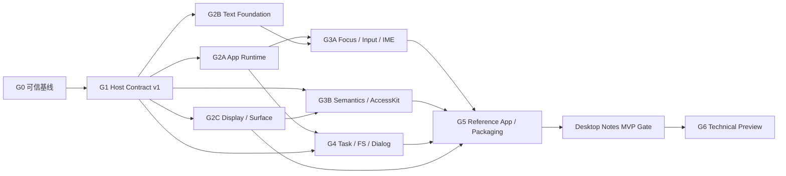

# Nexa UI 路线图

- 状态：Desktop Notes MVP 的 Windows UIA、双平台真实 picker/clean-runner 与供应链验收已完成；v1 性能证据在 run `31952821895` 暴露结构性采样边界后已升级为 v2 并等待 hosted activation，Technical Preview 另仍等待 clean-tag MVP promotion、registry clean-user、真实签名/公证、发布演练与独立审批
- 规划输入：`mvp@f3afbeb`
- 最新证据：[`BASELINE.md`](./BASELINE.md)
- 当前目标：[`Desktop Notes MVP`](./MVP.md)
- 后续目标：Desktop Technical Preview
- 详细设计：[`PROJECT-DESIGN.md`](./PROJECT-DESIGN.md)
- Dialog 合同：[`ADR-013`](./decisions/ADR-013-dialog-task-and-backend-v1.md)
- Clipboard 合同：[`ADR-014`](./decisions/ADR-014-clipboard-task-and-error-v1.md)
- 执行清单：[`../TODO.md`](../TODO.md)

## 1. 路线图规则

1. 里程碑按依赖和退出条件推进，不按功能数量或提交数量推进。
2. G0 是所有新功能的硬门禁；没有可信绿灯，不开始新的产品 Slice。
3. 每个里程碑必须留下可自动验证的垂直切片，不能只提交接口骨架。
4. Minimal TSX 是参考路径；Adapter 通过合同测试后再提升支持等级。
5. 现有 ADR 的 Slice 13–15 编号冲突，不再继续使用全局 Slice 数字；新工作使用本路线图 ID。
6. 日历排期在确认团队人数、Perry 支持和文本方案后另行制定。

## 2. 依赖图

G2A、G2B、G2C 可在 G1 合同冻结后并行。G3 输入必须等待 Runtime 与 Text 的共同接口；FS/Dialog 必须等待 Task/Dispatcher，不能沿用同步剪贴板捷径。

## 3. 优先级切线

### P0：Desktop Notes MVP 必需

- 可信 CI、可重复工具链、FFI/Perry 自动验证；
- 单一 Host/System Protocol、无损 handle、结构化错误；
- mutation commit、Dispatcher、Scheduler、生命周期与取消；
- 多语言段落、文本索引、焦点、选择、IME composition；
- Semantic Tree、AccessKit 最小桥；
- Display List 与 Surface suspend/resume；
- FS/Dialog、权限 manifest、参考应用与可打包独立程序。

### P1：Preview 稳定性与采用体验

- 组件 hover/pressed/focus/disabled 状态与基础主题；
- Adapter conformance 扩面、Inspector 最小诊断；
- 性能预算、缓存与增量布局/绘制；
- 完整安装教程、API 文档、迁移与兼容矩阵；
- Linux 可选构建与更多平台自动化。

### P2：Preview 后

- PlatformView 产品化、多窗口、路由/导航；
- 网络图片、HTTP、通知、托盘、菜单、快捷键；
- 动画系统、GPU backend、DevTools 完整版；
- Android/iOS、动态插件市场、自动更新。

## 4. 里程碑

### G0：可信基线

**目标**：让“绿灯”真正覆盖当前仓库，而不是只覆盖少量 Rust/TS happy path。

**范围**：

- 修复 pnpm setup 双版本冲突、Prettier、rustfmt、Clippy；
- 固定 Rust、pnpm、Perry CLI/FFI 的可重复版本策略；
- 修正 CI path filters、`changes` fail-open 与 native smoke 开关；
- 将 `packages/nui-host`、`packages/system-host` 的 Rust 构建纳入门禁；
- 为所有 workspace 项目声明真实的 build/typecheck/test/lint 状态；
- clean 编译 Minimal TSX 与框架 Counter，验证 ABI safe-integer 问题；
- 建立 branch protection 和 `CI / result` required check。

**退出条件**：

- clean checkout 上 format、lint、typecheck、unit、FFI check、Rust smoke 全绿；
- macOS/Windows 至少能构建 Rust offscreen smoke；
- Minimal TSX Perry 应用在固定版本工具链下 clean compile 并启动；
- CI 任何路径检测失败都会阻断，不会误绿；
- 当前 framework parity 状态由自动化结果生成或有明确证据链接。

**不包含**：新增控件、系统 API、框架或渲染功能。

### G1：Host Contract v1

**目标**：消除跨语言协议漂移，并为后续 Runtime/Text/A11y 提供稳定接缝。

**范围**：

- 编写 protocol manifest 与 code generator；
- 建立 Protocol/ABI/feature handshake；
- 决定双 `u32` 或 Perry 原生 `u64` 的无损 handle 表示；
- 统一 Node/Property/Event/Error/Command ID；
- 补齐 set/clear property、add/remove listener、insert/move/remove、reset session；
- 为非法 handle、环、跨树插入和属性类型返回结构化错误；
- Minimal TSX 和各 Adapter 复用统一 Host kit；
- 建立 Adapter conformance suite。

**垂直验收**：同一列表场景在 Minimal TSX 与至少一个 Adapter 中完成 create、reorder、style clear、listener replace、remove subtree、dispose，产生等价 mutation trace。

**退出条件**：

- Rust、TS、Perry manifest 的协议定义由同一源生成且 CI 无漂移；
- 不兼容 protocol major 在启动时明确失败；
- 所有旧属性和 listener 都可撤销；
- 删除子树不会保活 descendant callback/effect；
- 合同测试覆盖所有 Host command 的成功与错误路径。

### G2A：Application Runtime 与原子提交

**目标**：让 ADR-006 的 Tick 真正进入主调用链，去掉同步回调和即时 mutation。

**范围**：

- Dispatcher 队列与 winit wakeup；
- `MutationBatch` 验证、原子 commit、dirty flags；
- 十阶段 Scheduler 与阶段守卫；
- Callback registry、owner scope、deferred cleanup；
- Lifecycle 与 ErrorSupervisor；
- React 从事件内 `flushSync` 临时路径迁移到统一调度（已完成 G2A-10）；
- window close/reset 的资源失效和测试隔离。

**垂直验收**：Todo 一次用户事件引起多次 signal 更新，但只产生一个 commit、一次 layout 和一次 present；Native 事件通过队列回调 TS。

**退出条件**：

- `commit()` 是唯一 Tree mutation 生效点；
- Layout/Paint 阶段 mutation 被可诊断地拒绝；
- Native 不再同步调用 Perry closure；
- 迟到事件和已失效 callback 不被执行；
- 同一进程可 mount、close、reset、再次 mount。

**G2A-10 证据（2026-08-05）**：React conformance 12/12、adapter typecheck 与 Perry 0.5.1220 macOS arm64 clean AOT/link 均通过；事件 handler 不再使用 `flushSync`，微任务桥使用 Promise continuation。

### G2B：Text Foundation

**目标**：以共享段落结果替代字符数估算与 `draw_str`。

**范围**：

- ADR 选择 shaping/BiDi/line-break/font 依赖；
- `TextIndex` 单位与 UTF-16/UTF-8/grapheme 映射；
- Font database、fallback、script、BiDi 与 shaping；
- 断行、段落布局、line metrics、cluster/hit-test map；
- 段落缓存与 Taffy measure integration；
- GlyphRun Display command 与 Skia 执行；
- 多语言 fixture、golden 与 fuzz/property tests。

**垂直验收**：参考应用中的英文、中文、阿拉伯文、混排和 Emoji 在不同宽度/DPI 下正确换行、fallback 和命中。

**退出条件**：

- Production 路径不再调用近似 `measure_text`；
- TextNode 不再直接执行 `draw_str`；
- Layout 与 Paint 使用同一 paragraph snapshot；
- 五组 ADR-009 文本样例和扩展边界样例自动通过。

**G2B-04 证据（2026-08-05）**：script itemization、UAX #9 logical/visual runs、共享 FontSource、grapheme 级 fallback 与 rustybuzz shaping 已落地；固定 Latin/CJK/Arabic/Emoji/TTC fixture 和错误边界共 26 个 `nui-text` 测试通过，Clippy/rustdoc/rustfmt/diff-check 通过。Paragraph、layout measure 与 GlyphRun 随后由 G2B-05..08 完成。

**G2B-05 证据（2026-08-05）**：`unicode-linebreak =0.1.5` 的 typed UAX #14 opportunity 与不可变 `ParagraphSnapshot` 已落地。4 个 line-breaking 和 18 个 paragraph 合同覆盖 greedy/overflow、空行与全部 hard separator、CJK absolute UTF-8、逐行 mixed/RTL L1/L2、fallback line metrics、positioned run 合并、ligature caret、combining、Emoji ZWJ、default-ignorable zero-glyph cluster 与非有限几何错误；`cargo test -p nui-text` 共 48 个测试通过，workspace test/Clippy、rustdoc、rustfmt、TypeScript lint/typecheck/test/build、Prettier 与 diff-check 均通过。Taffy measure、GlyphRun display command 与 Skia 执行随后由 G2B-06..08 完成。

**G2B-06 证据（2026-08-05）**：`nui-layout-taffy::ParagraphCache` 与 `layout_tree_with_cache` 已接入全部 Host layout/paint/hit-test 路径；key 覆盖 source、node font style、width、font request/direction/revision，默认容量 256，Taffy `Definite/MinContent/MaxContent` 均使用 paragraph metrics。`nui-text` 有界发现 source-backed macOS/Windows/Linux 字体，Perry 默认会话与显式 `NuiHost::with_fonts` 共享同一数据库，reset 只清 snapshot。四条 typed layout failure 在 Host 锁外进入 ErrorSupervisor。`nui-text` 50/50、layout 10/10、Bridge 51/51、Host FFI 9/9，以及对应 Clippy/rustdoc/rustfmt/diff-check 均通过；生产路径已移除字符数近似 measure。GlyphRun 与 Skia 执行随后由 G2B-07..08 完成。

**G2B-07/08 证据（2026-08-05）**：Core 的 backend-neutral `DisplayGlyph/GlyphRun/TextBox` 保留 display-list traversal、scroll、clip 与 opacity 顺序；`display_list_with_cache` 把同一 paragraph snapshot 的 FontId 与 positioned glyphs 转为 immutable commands。Skia 从共享 `FontSource { Arc bytes, face_index }` 解析 face 并调用 `draw_glyphs_at`，production Host/window 不再用 `draw_str` 绘制 TextNode 内容。Core paint 5/5、layout 11/11、renderer 11/11、Bridge 52/52 及目标 Clippy/rustfmt 通过。

**G2B-09 证据（2026-08-05）**：固定 manifest 覆盖 Latin/CJK 窄换行、Arabic/Latin visual order、Emoji ZWJ zero-width overflow 的 1/64 logical-pixel geometry/glyph/run；固定 seed 的 256 个混合脚本案例验证重复布局、source coverage、grapheme boundary、有限 geometry 与 LTR/RTL/width invariants。`cargo test -p nui-text` 54/54，目标 Clippy、Rustfmt 与 diff-check 通过。

### G2C：Display List 与 Surface 生命周期

**目标**：把 Tree、Renderer 与窗口 Surface 解耦，并证明可恢复。

**范围**：

- `nui-core` 的不可变 Display List；
- CPU Resource/Backend Resource 分离；
- Skia 只消费 Display commands；
- winit suspend/resume/resize/scale 状态机；
- Surface 重建、资源重上传与 full repaint；
- 图片资源避免每帧全量像素复制；
- frame counters 与 trace spans。

**垂直验收**：窗口最小化/恢复或模拟 Surface loss 后，Todo/Notes 的状态保留，下一帧完整恢复且无 stale resource。

**退出条件**：

- Renderer 不直接遍历可变 Arena；
- Surface backend 对业务 Tree 不可见；
- suspend/resume 路径有可注入自动化测试；
- image pixels 不在每帧重复 clone/copy。

**G2C-05 证据（2026-08-05）**：`SurfaceLifecycle` 固定 Absent/Ready/Suspended/Recreating/Failed 状态，重复 recreate/suspend 幂等；winit `resumed`、`suspended` 与 create/configure/resize/acquire/present failure 已接入状态转换。初始状态机验证 `cargo test -p nui-platform-winit` 4/4 通过。

**G2C-03/04/06 证据（2026-08-05）**：Core `ResourceStore<T>` 已统一 Image/Font/Paragraph generation identity；reset/clear、stale ID、slot reuse、high-water mark 与 generation retirement 均有回归测试。图片只 decode 一次并共享 `Arc<[u32]>`，Skia Image/Typeface 按 `SurfaceGeneration` 缓存，同代复用、跨代重上传由独立 upload counter 测试证明。winit runtime loss 会释放 surface/context/window 并在 `about_to_wait` 重建；成功后 Bridge 切换 cache generation 并请求 full repaint，首个成功 present 清除 pending。注入测试覆盖 `Ready(g1) -> Failed -> Recreating -> Ready(g2)`、失败不递增、重复 Ready 幂等与应用状态保留。Core 32/32、Text 52/52、Layout 13/13、Renderer 17/17、Platform 7/7、Bridge 54/54，以及目标 Clippy、Rustfmt 与 diff-check 全部通过。

**G2C-07 证据（2026-08-05）**：Runtime 新增可注入 monotonic `FrameClock`、跨 tick/paint/present 的 recorder、有界 observer 与 lifetime totals。Bridge 只在 Dispatcher drain、framework callback、commit、layout、display-list、paint 和 platform present 真正执行时记录计数与耗时，Semantics 未执行时保持零；outcome 区分 Presented、Dropped(stage)、Coalesced 与 NoPresentRequested。集成测试覆盖同 tick 多次更新只 present 一次、精确节点/命令数、Layout/Paint/Acquire/Present drop、surface generation 和锁外可重入 sink。Runtime 23/23、Layout 14/14、Platform 8/8、Bridge 70/70，目标 Clippy、Rustfmt 与 diff-check 全部通过。

**G2C-08/09 证据（2026-08-05）**：pending redraw 单槽 coalesce、owner-scoped session identity、pre-run baseline、close/drop flush 均有 Runtime/Bridge 回归测试；suspend、acquire loss、present loss 共用 Bridge backend invalidation，Image/Typeface cache 在恢复前直接为空，CPU state 和 upload lifetime counters 保留。Renderer 17/17、Platform 8/8、Bridge 70/70，严格 Clippy、Rustfmt 与 diff-check 通过。

### G3A：Focus、EditableText 与 IME

**目标**：将当前 Input 特例升级为可用的桌面文本编辑基础。

**范围**：

- Normalized Pointer/Keyboard/TextInput/Composition/Focus event；
- FocusManager、Tab chain、pointer capture、capture/target/bubble；
- EditableText buffer、selection、caret、revision 与 composition range；
- 单行/多行编辑、换行、可见行、上下移动和内部滚动；
- 方向键、Backspace、Delete、Home/End、Shift selection；
- IME Start/Update/Commit/Cancel 与候选框 bounds；
- Button pressed/release、keyboard invoke、disabled；
- 复制、剪切、粘贴通过 typed clipboard API。

**垂直验收**：在 Notes 标题和正文编辑器中使用中文 IME 预编辑，跨行移动/选择 Emoji 与混合文本并复制粘贴，不发生索引错位。

**退出条件**：

- JS/Rust/paragraph 之间没有单位不明的文本 offset；
- 单行和多行控件复用同一 EditableText，并正确处理换行、行导航与滚动；
- composition preedit 可见且 commit/cancel 正确；
- Button 只在合法 release 或键盘默认动作时 Invoke；
- Input 的焦点和选择状态可由自动化稳定观察。

### G3B：Semantic Tree 与 AccessKit

**目标**：让自绘 UI 对屏幕阅读器和自动化工具可见、可操作。

**范围**：

- Host `SetSemantics/ClearSemantics` command；
- Visual -> Semantic 派生与增量 diff；
- Button、Text、Input、TextArea 的默认语义，以及 Image、Scroll 的显式角色映射；
- bounds、focus、value 与 action 同步；
- AccessKit desktop bridge；
- action 通过 Dispatcher 回到组件；
- 语义 snapshot 与平台 smoke。

**垂直验收**：macOS NSAccessibility 与 Windows UI Automation client 可读取 Notes 标题、保存按钮和编辑框，并经 AccessKit Adapter 聚焦 Input/TextArea、设置值与 Invoke 保存。

**退出条件**：

- 首帧/更新/恢复后的语义树一致；
- Button、Text、Input、TextArea 可读取且可执行适用 action；
- deterministic harness 与真实平台 client smoke 都通过语义定位，不硬编码坐标；
- NSAccessibility/UI Automation client 的查询与 action 实际穿过 AccessKit Adapter 并在 Dispatcher tick 落地。

### G4：Task、权限、FS 与 Dialog

**目标**：建立首条真正异步、可取消、错误不丢失的系统能力链。

**范围**：

- generation Task registry、cancellation token 与 completion queue；
- window/app owner scope 和迟到 completion 处理；
- 统一 `NexaError`、Task/Promise settle；
- app manifest 与 permission loader；
- `@nexa/fs` 本地文本读写；
- `@nexa/dialog` 打开/保存文件；
- Clipboard 迁移到同一错误/任务语义；
- 可注入 backend，避免测试修改用户剪贴板/文件。

**垂直验收**：Notes 打开文件、编辑、保存；取消 dialog 不报错，权限拒绝可诊断，关闭窗口会取消未完成任务。

**退出条件**：

- UI 线程不执行阻塞读盘/对话框工作；
- cancelled、denied、not found、invalid data、platform failure 可区分；
- 窗口关闭后没有 Promise 回调进入已销毁框架；
- manifest 未声明的敏感能力被一致拒绝。

**G4-01 证据（2026-08-06）**：System Runtime `HandleIdentityRegistry`/Task facade 已落地统一 kind-aware allocator、owner fence、terminal tombstone、close/finalize 分离与 completion reason counters；NativeResource 误传给 Task command 的 `INVALID_KIND` 原子失败和正确 kind 生命周期均有回归覆盖。累计 identity/owner budget 在创建时预留 tombstone，state/property model 序列共 3,125 条，Runtime `37/37` 与严格 Clippy 通过。下一切片为 G4-02 worker executor/completion queue；G4-03 才负责 System Host `NexaError` numeric mapping。

**G4-02 证据（2026-08-07）**：固定大小 worker pool 通过 bounded `sync_channel` 接收 UI 线程的 non-blocking `try_send`，worker completion 只进入 Dispatcher `System` queue，并只允许在 Scheduler `SystemCompletion` phase settle。cooperative cancellation、owner invalidation、runtime drop、worker panic、双 worker 并发、单 worker FIFO、queue saturation 与 completion/cancel 正反竞态都有确定性测试；cancel 后 panic 仍保留诊断 outcome，同队列 sequence 与 FIFO 入队共享线性化锁，失败提交会回收未公开 identity，不消耗 runtime lifetime budget。Runtime `49/49`、Rustfmt 与严格 Clippy 通过。下一切片为 G4-03 System `CommandResult/NexaError` Rust/TS/FFI 合同。

**G4-03 证据（2026-08-07）**：System Core typed error constructors 与 manifest 的十项 System error registry 对齐；TaskRegistry/worker failure mapper 保留 invalid-kind、wrong-owner、stale、state、cancelled、panic 的不同 numeric code。FFI result codec 对 error context 使用 primitive JSON，保留 platform code/cause，限制递归深度并在 command/serialization panic 时生成 `INTERNAL_FAILURE`；TS decoder 拒绝 sentinel、额外字段、tagged context、非法 uint32、domain/code 前缀错配和 known code metadata 漂移。Rust core `9/9`、System Host `6/6`、TS `6/6`、strict Clippy/typecheck/protocol drift 通过；workspace matrix 的 test count drift 也已修复。Legacy clipboard ABI 当时仍按 ADR-007 处于迁移阶段，迁移已在 G4-07 完成，详见后续证据。下一切片为 G4-04 app manifest 与 permission loader。

**G4-04 证据（2026-08-07，2026-08-08 集成补充）**：ADR-011 落地严格 `app-manifest-v1` JSON schema 与 development/release fixtures；schema 与 active System permission registry 做 exact drift 校验。`nui-system-core` 的 64 KiB 有界 loader 对显式文件和内嵌 bytes 共用 parser，拒绝未知字段、非法 app id/name/SemVer、schema/version/protocol 不兼容、未知/重复权限和超限输入；共享 raw JSON cases 对齐 Ajv/Rust 的 integer、Unicode scalar/whitespace 与 SemVer core 边界。`PermissionSet` 默认 deny-all，active ID/name 来自 canonical table，公开授权入口仅保留穷尽 command mapping。System Host 现由 `NEXA_APP_MANIFEST_PATH` 在 build time 读取 manifest 并嵌入 bytes；production owner bootstrap 只验证内嵌 release bytes 并 one-shot install，不在运行时读取路径。缺省无嵌入时继续 deny-all，TypeScript 无 grant/reload/path 入口。原 schema/Core/Host/protocol/Clippy 门禁保持通过；Notes wrapper 合同 3/3 进一步验证 manifest 传递、完整应用 startup marker 与漏嵌 fail-closed。

**G4-05 设计冻结（2026-08-07）**：ADR-012 将 `ReadTextFile`/`WriteTextFile` start、内部 `AwaitTask` Promise transport、winit wakeup、`SystemCompletion` settlement 和 atomic-write cancellation linearization 固定为本切片合同。实现按 protocol → FS core → composition hook → System Host → `@nexa/fs` 的依赖顺序推进。

**G4-05 证据（2026-08-07，2026-08-08 集成补充）**：`@nexa/fs` 已完成 typed `Task<T>`、UTF-8 read/write、atomic replace、cancel 和结构化错误映射；System Host 通过 `RuntimeWaker` 把 worker completion 唤醒到 UI tick，并只在 `SystemCompletion` resolve Promise，`FrameworkMicrotasks` 再由 `perry_poll()` 驱动 continuation。System Core 文件系统 contract `9/9`、System Host Rust `15/15`、Application Runtime `51/51`、winit `39/39`、Perry Bridge `128/128`、FS/System TS contract `12/12` 均通过；strict Clippy、locked install、workspace route checks、双 native-library AOT link 和 `/tmp/nexa-g4-05-native-link-smoke` 实际执行通过。G5 trusted manifest 嵌入与真实 Notes native FS Promise smoke 也已通过：Perry 进程在临时目录完成 UTF-8 写入/读回、SystemCompletion、Promise continuation 与磁盘 bytes 复核。Dialog 的 MVP 自动证据另由构建期注入 backend 的真实 Perry/native Task/Promise 应用旅程完成。

**G4-06 证据（2026-08-07）**：ADR-013 冻结 `OpenFileDialog`/`SaveFileDialog` 的 typed Task 合同。新增 `system.DialogOpen`/`system.DialogSave` deny-all permissions、严格 filters JSON parser、`nui-system-core::DialogBackend` 注入边界和 `rfd::FileDialog` native backend；selected path 以 `ok/value` 返回，用户取消为 `value: null`，显式 cancel/owner invalidation 终止结果交付并丢弃迟到结果。当前 `rfd` native backend 只提供 `Option<PathBuf>`，没有真实 `PLATFORM_FAILURE` 分支；worker 不使用 cancellation token，不能主动关闭已显示的 picker。协议 manifest/schema/generated artifacts、`pnpm test:protocol` `36/36`、`@nexa/dialog` TS contract `4/4`、System Core permission contract `6/6`、System Host Rust `19/19`（含 dialog parser/task tests）、offline strict Clippy 和 Cargo check 均通过。下一切片为 G4-07 Clipboard Task/Error 迁移。

**G4-07 证据（2026-08-07，2026-08-16 hosted 补充）**：ADR-014 将 Clipboard 迁移到与 FS/Dialog 相同的 typed Task/Error 链路。`SystemTaskRuntime` 新增注入式 `ClipboardBackend` worker，v1 FFI start symbols 返回严格 `HandleRef` envelope，`@nexa/clipboard` 只使用 v1 symbols并暴露单次 `result` Promise 与幂等 `cancel()`；旧 sentinel symbols 仅保留兼容导出。Core injected backend `2/2`、System Host Rust `22/22`、Clipboard TS contract `4/4` 和 runner `7/7` 通过。run `31902303937` 的 macOS/Windows package jobs 实际执行 read/write/read Promise 与 round-trip/restore proof，关闭 hosted runtime 缺口。G4-08 close-race 证据已追加如下。

**G4-08 证据（2026-08-07）**：`TaskRuntime` 暴露 shared System ledger 的外部句柄生命周期入口，供 Subscription/NativeResource 与 Task 共用 owner/generation/tombstone 规则。新增 close-race 集成测试：窗口 owner 失效时三类句柄均变为 `Invalidated`，awaiter 与 worker cancellation 同时被清理；worker 在 owner fence 之后发布的 completion 在 `SystemCompletion` 被丢弃，不产生 Framework resolution。Application Runtime 与 System Host focused tests 均通过，下一切片为 G5-01 参考 Notes PRD。

### G5：参考应用与开发者工作流

**目标**：证明 SDK 可以承载一个真实桌面应用，而不仅是 Counter。

**范围**：

- `examples/reference-notes` 贯穿式应用；
- CLI `new/dev/build/package/doctor` 最小闭环；
- 原生库、assets 与 manifest 打包；app icon 不属于本 Technical Preview 交付承诺；
- macOS app bundle 和 Windows 可分发目录；
- 开发/发布诊断信息；完整 Inspector/DevTools 留在 Preview 后 backlog；
- 从空目录开始的教程、API reference、兼容矩阵、已知限制；
- Minimal TSX 主路径与唯一 Tier-1 `@nexa/adapter-solid` 路径。

其中 Notes 应用、Minimal TSX 主路径和 unsigned 双平台产物属于 Desktop Notes MVP；完整 CLI onboarding、教程和 Tier-1 Adapter 属于 Technical Preview，不阻塞 MVP Gate。app icon 与完整 Inspector/DevTools 都是 Preview 后 backlog，不作为 G5 未列任务的隐含退出条件。

**退出条件**：

- clean 用户环境可按文档创建并运行项目；
- 产物不依赖开发机的 Node、Rust 或全局 Perry；
- `doctor` 能报告 Perry/ABI/platform 版本错配；
- Notes 在 macOS/Windows runner 生成可安装或可分发产物。

**G5-01..04 当前证据（2026-08-08，2026-08-16 hosted 补充）**：Notes controller 15/15 和实际 Notes TSX E2E 4/4 覆盖 open/save/cancel、typed error、稳定语义 action、suspend/resume、pending close 与 late completion；FS 与构建期注入 Dialog 的 deterministic runtime smoke 保持通过。run `31902303937` 的 Windows native job `95054897192` 完成 UI Automation runtime，macOS/Windows package jobs `95054897243` / `95054897272` 完成无 fixture `rfd` picker save/open/cancel。probe SHA-256 分别为 `f7cfab51cbaf4163bc82ae74854b07d5fcd8eb98219050fcb84e18e59c372172` / `e82079f1ee6b6afff7418b94a6299bb72835178f778918b036e80df8659e343a`，因此 G5-03/G5-04 已关闭。

**MVP-01 当前证据（2026-08-16）**：PR head `e56bb9e2c531e9cd3d97837465eca92d5e2c31dd` 触发 run `31902303937`，Actions 在 merge execution revision `991b28142783833c14be659125c4564d14219cc5` 上完成 macOS/Windows package jobs `95054897243` / `95054897272` 和 fresh download/validate/launch jobs `95059000291` / `95059000304`。平台 package artifact IDs `9251605446` / `9251849187` 的 GitHub digests 为 `sha256:483ab8a38b9debfa8b0dcbf3fb9562b1c1d37bc620b47b1c1e5d20d6b562bbaa` / `sha256:865954eae51ce7a8c2b93224bf8f2ac1d1ed05917649f31acac94c57482c2044`。这些直接平台 jobs 关闭 G5-09/MVP-01；`collect_mvp_proof=false` 跳过了 proof 上传，因此 MVP-02/N-10/N-11 仍必须走 clean-tag schema-v5 promotion。

**G5-05 证据（2026-08-08）**：`@nexa/ui` 提供 Window-scoped `Theme`、`createTheme`/`defaultTheme`/`rgba`、semantic token 与 typed numeric `Style`/`TextStyle`。Text/Card/Button/Input/TextArea 从同一 Theme 派生真实 Host style，组件显式 style 可覆盖且不经过 CSS parser；交互态复用 G3A-10 的 native additive resolver。UI 8/8、Theme Host trace 2/2、strict typecheck/format、System Host build-input 3/3 与 Notes Perry AOT/startup 通过。

**G5-06 证据（2026-08-08）**：`@nexa/cli` 已提供 `nexa new <directory>`、`nexa doctor [--json]`、命令级 help/version 与 Minimal TSX 模板。生成器默认 deny-all，不执行安装或网络操作，拒绝绝对路径、父级穿越、符号链接、非空目标和不安全项目名，并固定非 workspace 版本；README 不再把 private SDK 描述成当前可安装，渲染模板执行 TypeScript typecheck。doctor 只沿项目声明并实际安装的依赖边解析 Perry/Hosts，以当前 Node 执行解析包自己的 Perry bin，并拒绝 ancestor/`NODE_PATH`、PATH fallback 及 warning/多版本输出；它逐项诊断 Node、pnpm、Perry、UI/System Host runtime/ABI 和 Technical Preview target，JSON schema v1 不混入 human stderr。版本合同与根工具链、UI、Protocol 1.0.0、Host runtime 0.1.0/ABI 0.5 保持零漂移。CLI fixture/integration 22/22，并新增 Windows required job；workspace matrix 27 项目/108 checks、根聚合 198/198、workspace/CI route 28/28、format/lint/typecheck/diff-check 均通过。

**G5-07 证据（2026-08-08）**：`nexa dev`/`build` 固定读取 conventional Minimal TSX 项目的 `package.json`、`src/main.tsx` 与 schema-v1 `app.manifest.json`，从当前项目已声明并安装的依赖图解析精确 Perry，以当前 Node、无 shell/PATH fallback 执行 Perry 自带 watcher 或 compile。manifest 使用 64 KiB regular-file 上限与 exact-key/identity/SemVer/Protocol/permission 校验；child 环境只注入受信绝对 manifest path，并删除大小写任意形式的 Nexa Dialog fixture 与 Perry codegen bypass。build 仅接受 `dist/<package-basename>[.exe]` regular binary、精确内嵌 manifest bytes 且无 fixture canary，Windows 强制 GUI subsystem；失败返回 1、usage 返回 2。temp-project 合同 12/12、CLI 聚合 34/34、真实 `nexa new` 到 Perry AOT/link smoke 均通过，create-to-package smoke 已接入 macOS/Windows package matrix。

**G5-08 证据（2026-08-08）**：通用实现位于 `packages/cli/src/package.mjs`，`nexa package` 总是先运行受信 `nexa build`，为 `darwin/arm64`、`darwin/x64`、`win32/x64` 生成固定 unsigned layout。binary、manifest 与可选 assets 使用 regular-file identity 复核；assets 限制 4096 文件、64 MiB/文件、256 MiB 总量。packager 在 project root 构建 staging，并排他占位精确 destination；macOS 完整 `.app` 单次移入，Windows 逐项移入并以 `nexa-build.json` 最后提交，可捕获失败按 reservation identity 回滚。初始 8-case RED 在 G5-08 复审阶段扩展为 package 合同 19/19 GREEN、CLI 聚合 53/53，CI path/fail-closed 21/21；真实 create-to-package Perry AOT/link smoke 与 `npm pack ./packages/cli --dry-run --json` 均通过。Notes 专用 `tools/reference-notes-package.mjs` 保持独立。

**G5-09 证据（2026-08-08，2026-08-16 hosted 补充）**：create-to-package package 合同 23/23、CLI 聚合 57/57 与 workflow/route fail-closed 合同 22/22 通过；`reference-notes-package.yml` 已拆为双平台 build/archive/upload 与 fresh download/validate/launch。run `31902303937` 在两个平台实际完成这两阶段并通过两类 executable 的 5 秒启动，关闭 G5-09。

**G5-10 本地文档证据（2026-08-10）**：Quickstart、Public API Index、Packaging Guide、Compatibility/Known Limitations 与 G6 发布文档均从索引公开。`tools/docs-contract.test.mjs` 自动检查 Markdown 本地链接、生成项目命令、公开 API、工具链/target 真值，以及 unpublished/hosted fail-closed 边界，已进入根测试与 Docs workflow。九包 tarball consumer 已完成安装、typecheck、Node ESM import、doctor、Perry AOT、Host 链接、package 与 evidence verify；但尚无授权/public registry 的 external clean-user create-to-package 记录，因此 G5-10 主项保持未完成。

**G5-11 本地证据（2026-08-10）**：ADR-004 的优先顺序已落实为 Solid 是唯一 Tier-1 外部 Adapter。`@nexa/adapter-solid` 已进入九包公开 release train；`node --test tools/release-packages.test.mjs` 约束其 publishable manifest、`dist`/types/JSX exports 和九包依赖闭包，`node --test tools/solid-notes-e2e.test.mjs` 实际挂载 Solid Notes 核心切片并覆盖 Focus/SetValue/Invoke、保存状态、lifecycle suspend/resume 与 dispose 后订阅释放。`pnpm test:perry` 现为五入口 matrix，额外以 `solid-main.tsx -> reference-notes-solid` 执行可运行的 Solid Notes AOT。该本地证据关闭 G5-11，但本身不代表 registry publish 或签名。

以上平台缺口已由 run `31902303937` 的直接 jobs 关闭。该 PR run 不是 clean tag，且 native/clean-package proof 上传被跳过；因此 MVP-02 和 schema-v5 N-10/N-11 仍待 clean `refs/tags/v*` promotion，不能由这些直接 job 状态代替。

### Desktop Notes MVP Gate

**目标**：在公开 SDK 发布治理之前，先证明一个真实应用的编辑、A11y、系统能力、生命周期和交付链路。

**退出条件**：

- [`MVP.md`](./MVP.md) 的 Definition of Done 全部满足；
- Notes 的 IME/selection、semantic action、open/save、cancel/close、suspend/resume E2E 全绿；
- macOS/Windows clean runner 生成并启动 unsigned artifact；
- Minimal TSX 是 MVP 唯一必需产品路径；Solid 的 Tier-1 Notes 核心切片属于不阻塞 MVP 的 Technical Preview 证据；
- 当前 commit 的验证证据已记录，G0 `BASELINE.md` 不被工作树结果覆盖。

### G6：Desktop Technical Preview

**目标**：发布可被外部开发者评估的版本。

**范围**：

- 明确公开 npm/crate 集合、exports/dist 规范；
- SemVer、Changesets/CHANGELOG、release notes；
- MIT/Apache LICENSE、CONTRIBUTING、SECURITY、CODEOWNERS；
- checksum、SBOM、provenance、secret/license/dependency audit；
- macOS 签名/公证与 Windows 签名方案；
- cold start、内存、包体、tick/layout/paint 基线和回归阈值；
- framework support tiers 与升级政策。

**退出条件**：

- `PROJECT-DESIGN.md` 的 12 条成功标准全部有证据；
- required CI 和 branch protection 生效；
- release artifacts 可重复构建、验证和回滚；
- 用户可在无仓库源码的环境安装、运行 Notes 示例；
- 已知限制和非目标与实际实现一致。

**当前实现审计（2026-08-10）**：

- [x] G6-01：9 个 npm 候选包的公开/private 边界、真实 `dist` exports、Host Perry 条件导出与 native source closure 已冻结；`@nexa/adapter-solid` 的 manifest、dist/types/JSX exports、Solid Notes E2E 与 `solid-main.tsx` AOT 已通过，九包本地 clean consumer 完成安装、typecheck、Node ESM import、doctor、Perry AOT、双 Host archive 链接与 package。隔离发布构建已验证生成 `.js/.d.ts` 的相对 specifier 显式带 `.js`，且 workspace test 不依赖 `dist`。
- [x] G6-02：Changesets、CHANGELOG 与 npm/Rust/Protocol/Host ABI/Perry 独立版本策略已有 deterministic rehearsal。
- [x] G6-03：MIT/Apache 双许可、CONTRIBUTING、SECURITY 与 CODEOWNERS 已纳入合同。
- [x] G6-04：run `31902303937` 的 10 个 hosted security jobs 通过 npm registry audit、四份 Cargo lock advisory、四份 deny、license/Action SHA policy 和 secret scan。
- [x] G6-05：checksum、CycloneDX 1.6 dependency graph 和 SLSA provenance 的生成/离线 fresh verify 合同已覆盖当前 9 个 npm 根、2 个 Cargo Host 根与 Windows unified static closure 根。
- [ ] G6-06：policy/runbook 与 SHA-256-bound reviewed executor 已在本地实现并通过 fake-tool contracts；execution/credential activation 仍 disabled，owner/protected Environment/真实凭据未配置，双平台 hosted staging evidence pending。
- [ ] G6-07：v1 已由 runs `31895582357` / `31902303937` 完成 activation 与 required 复核；run `31952821895` 证明 first-present 混入 p95 会在未改运行时代码时产生结构性波动，v2 已分离 startup/steady-state，等待双平台 hosted activation 与复核。
- [ ] G6-08：本地 candidate 已完成 fresh verify、5 秒 native launch 与隔离篡改 rollback；双平台 clean-tag hosted staging 仍被 G6-06 签名前置条件和外部审批阻断。
- [ ] G6-09：首次 registry 循环已在本地拆成 one-time bootstrap staging 与 registry-gated final promotion；final-only 七资产 GitHub Release draft/reconcile/attest/npm 后公开/publication-record 合同已实现。真实 registry publication、双平台 signed artifact、GitHub Release 和 12 条最终成功标准仍未闭环。

Solid Tier-1 本地合同为 `node --test tools/solid-notes-e2e.test.mjs`、`node --test tools/release-packages.test.mjs`、`pnpm test:perry solid-notes` 与 `node tools/build-release-packages.mjs --check`；它们分别验证 Notes 核心交互、九包发布边界、可执行 `solid-main.tsx` AOT 和发布 manifest。`node tools/release-consumer.mjs --output <new-temp-directory>` 已完成九包安装、Node 原生 ESM import、双 Host archive 链接、`.app` package 与离线 evidence verify。G6-06 本地合同为 `node tools/signing-policy.mjs validate`、`node tools/signing-executor.mjs validate` 与 `node --test tools/signing-policy.test.mjs tools/signing-executor.test.mjs`；staging readiness 当前必须失败，且本地合同不替代 owner、protected Environment、真实凭据或双平台 hosted signed staging。Node ESM import 是本机 Node `v24.16.0` 的本地 tarball 证据，不替代 Node 22 hosted、registry、凭据、性能或签名/公证证据。

**G6-02 真实版本演练补充（2026-08-11）**：`pnpm version:rehearse` 不再只打印静态策略摘要。它在自动清理的隔离 workspace 中执行 Changesets `version`，验证固定九包 train `0.1.0 -> 0.1.1`、4 个 private candidate 不变、9 份生成 changelog 和 9 条 workspace 内部依赖；再实际 pack/解包九个生成 package，证明发布 manifest 将内部 range 精确固化为 `0.1.1`，且 consumer dependency/override 闭包为 9/9。集成合同先对旧实现 RED，现 GREEN `3/3`，并对源版本文件 hash 做前后比较。该 dry rehearsal 不改当前 `0.1.0` candidate、不构建 `0.1.1` 产物，也不触发 registry。

**G6-09A 本地发布门禁证据（2026-08-11）**：`release/readiness-policy.json` 现显式区分 `bootstrap` 与 `final`。bootstrap 只允许 `0.1.0`，只可缺少 registry gate，并只写 revision 专属 staging dist-tag；final 必须具备全部八个 gate，禁止创建缺失的 npm version，只可在九包 registry integrity 与本地 immutable tarball 全部一致后推广 `technical-preview`。`release-evidence.yml` 产出 phase-bound artifact，`registry-evidence.yml` 可分别验证 staging/final channel，`release.yml` 以 `bootstrap-publication` / `request-publication` 分离两次受保护操作。final-only 路径还准备并 attestation 精确七个公开 GitHub Release 资产，以 exact tag/full SHA/version-bound notes 创建或核对 draft prerelease，fresh-download 核对已有/最终远端 bytes且不 `--clobber`，待 npm 九包 channel 二次观测收敛后才公开，并生成绑定 Release/run/assets/npm integrity 的 publication record；bootstrap 不创建 Release。合同覆盖错 phase、错版本、registry pending、缺包、非前缀 partial、摘要替换、remote asset 漂移、npm 未收敛与 final `--resume`，但没有运行任何 hosted workflow、registry mutation 或 GitHub Release mutation，因此 G6-09 保持未完成。

**G6-04 供应链补充（2026-08-11，2026-08-16 hosted 补充）**：本地 audit 发现并移除了 `RUSTSEC-2026-0192` 废弃字体解析链，Windows unified static closure 的独立 lock 已纳入 audit、deny 和 Dependabot。run `31902303937` 在受信 runner 上完成 npm audit、四份 `cargo audit`、四份 `cargo deny` 和 gitleaks，因此 G6-04/G6-04P 已关闭。

**G6-04 npm audit 补充（2026-08-12，2026-08-16 hosted 补充）**：完整 `pnpm audit` 曾发现 `svelte@4.2.20` 的 6 个 moderate SSR/XSS advisory；`@nexa/compiler-svelte` 与 Svelte 示例已共同升级至 `^5.55.7`，当前锁定 `5.56.8`。本地复核无已知漏洞，run `31902303937` 的 policy/npm audit job `95054897276` 又在 hosted registry 边界成功执行。

**G6 外部 readiness 聚合预检（2026-08-11）**：`pnpm release:preflight` / `tools/release-preflight.mjs` 复用 canonical release、signing 与 performance validator，在不写 policy/evidence、不访问 registry 或凭据的前提下输出 schema v1。它要求 clean `refs/tags/v0.1.0`、phase-bound external gates 与受保护签名/发布证据；当前分支即使已通过平台、安全和性能 job，仍必须因签名、clean-tag rehearsal、registry 和 publication 门禁退出 blocked。

**G6 hosted 状态复核（2026-08-16）**：PR run `31902303937` 共 41/41 jobs 成功，source head 为 `e56bb9e2c531e9cd3d97837465eca92d5e2c31dd`，Actions merge execution revision 为 `991b28142783833c14be659125c4564d14219cc5`。它关闭 G3B-05、G5-03P/G5-04P、G5-09/MVP-01、G6-04P 和当时的 v1 G6-07P 门禁，`CI / result` job `95059146281` 成功；v2 采样语义变更要求重新取得 G6-07P。该 run 不是 clean tag，且 `collect_mvp_proof=false`，所以 N-10/N-11/MVP-02 以及 G6-06P/G6-08P/G6-09P 仍保持 pending；它没有激活凭据、签名/公证、发布 registry 或创建 GitHub Release。

## 5. 并行执行建议

| Lane       | G0/G1 后的主责                      | 可并行内容                           | 协调点                              |
| ---------- | ----------------------------------- | ------------------------------------ | ----------------------------------- |
| Runtime    | Protocol、mutation、Scheduler、Task | G2A 与 G2B/G2C 并行                  | command/error/handle 合同先冻结     |
| Text/Input | Paragraph、EditableText、IME        | Text foundation 与 Display List 并行 | `TextIndex`、GlyphRun、event schema |
| Platform   | winit、Surface、AccessKit、Dialog   | G2C 与 G3B 并行                      | Dispatcher 和 owner scope           |
| SDK/DX     | Minimal TSX、Adapter、CI、CLI、docs | conformance 与 Runtime 并行          | 不复制协议或组件语义                |

同一文件/合同的改动必须先合并协议任务，再由不同 Lane 消费。Perry manifest、generated TS/Rust、错误码和 handle representation 不适合并行自由修改。

## 6. 检查点

### Checkpoint A：G0 完成

- [x] 所有现有门禁可信全绿
- [x] clean Perry/FFI 链路可复现
- [x] branch protection 生效
- [x] 负责人批准详细设计与 G1 合同方向

### Checkpoint B：G1 完成

- [x] Protocol v1 与 handle/error 设计冻结
- [x] Adapter conformance 基线通过
- [x] G2A/G2B/G2C 可独立开工

### Checkpoint C：G2 完成

- [x] Scheduler、Paragraph、Display List、Surface 各有垂直证据
- [x] 没有同步 Native -> TS 回调或生产 `draw_str`
- [x] G2B-09 多语言 golden/property 集与 G2 生命周期审查补强完成
- [x] 评审 G3 输入/A11y 集成方案

评审证据：`PROJECT-DESIGN.md` 6.6/6.7/6.8 与 `MVP.md` 5.1-5.4 已冻结 normalized event -> focus/dispatch -> EditableText/IME -> Semantic Tree/AccessKit 的阶段边界；文本 offset 单位、Dispatcher action 路由、suspend/close 资源合同和 G3A/G3B 依赖顺序均已写入 TODO 验收项。G3A-01 normalized event contract、G3A-02 FocusManager/Tab chain、G3A-03 dispatch/capture 均已有实现证据；G3A-04..10 的当前证据与未完成项见下文审计。

G3A-02 evidence（2026-08-05）：

- `nui-core::FocusManager` 固定单窗口唯一焦点；正 `tab_index` 优先、同值按树顺序，零值按文档顺序，负值排除出 Tab 链但可显式聚焦。
- Focus chain 在树删除/禁用后通过上一条快照恢复：先取删除位置后的节点，再取前一个节点，最后清除。Host active/pending shadow、commit/reset、Input 注册与 pointer focus 使用同一状态模型。
- winit 记录 `ModifiersChanged`，将 Tab/Shift+Tab 接入 Host。Core focus tests 4/4、Bridge Tab integration 1/1、platform tests 8/8 通过。

G3A-03 evidence（2026-08-05）：

- Core `EventDispatcher` 固定 root→target 的 capture/target/bubble 顺序，并在未 `preventDefault` 时执行 target default action；`stopPropagation` 与 `stopImmediatePropagation` 有确定的路径截断语义。
- `PointerCapture` 以 pointer id 绑定 generation-bearing `NodeId`，stale 节点不会继续接收事件；Bridge 按下 capture、释放统一 dispatch，只有回到 pressed target 才生成 Click。
- Core dispatch tests 5/5、Bridge 72/72、Platform 8/8 与目标 Clippy 通过。

**G3A-04..07 evidence（2026-08-06）**：

- G3A-04 的 fixed-seed 512 步 reference-model 编辑序列覆盖 selection/caret、Latin/CJK/RTL/combining/ZWJ/Emoji 插入替换、前后删除和 stale revision；每步验证 value、selection、revision 与 UTF-8/UTF-16/scalar/grapheme 边界双向不变量，任务完成。
- G3A-05 的 winit keymap 明确区分 macOS Option/Command 与 Windows Ctrl，Home/End、word navigation/deletion、document/line edge、Shift extend 和不支持 chord 有纯命令矩阵。编辑核心只消费 `shift + word`；paragraph/Bridge 测试证明 mixed Arabic/LTR Left/Right 按视觉 caret/affinity 而非逻辑 grapheme 顺序移动，任务完成。
- G3A-06 已完成：`ActiveComposition` 保存精确 UTF-8 preedit bytes、相对 UTF-16 selection 与 cancel snapshot，combining/ZWJ update、commit/cancel 和错误/overflow 均保持原子。winit cursor byte range 显式转换为 UTF-16；三态路由延迟空 Preedit，标准提交不产生伪 Cancel，空 Commit 仍终止，活动 preedit 抑制文本、命令和 repeat。
- Composition Start/Update/Commit/Cancel 经 Core Dispatcher 按 FIFO 进入 Runtime，Commit 先于对应 Change，Tab/pointer/focus loss 对旧 target 发送 Cancel；Perry/TypeScript listener ABI 已接入 EventId 8 与 camelCase `Ui.CompositionEvent`。MVP 暂固定 `windowId = 1`、全 false modifier snapshot，异步 callback 不宣称同步 `preventDefault` 语义。
- G3A-07 的 selection rect 按视觉 cluster 分段，不再覆盖 mixed-BiDi 未选 gap；真实 Arabic/LTR 不连续 rect、全部 grapheme range 的 cluster coverage、caret point/hit/bounds round-trip 与 Bridge Scroll-aware paint 均有自动证据，任务完成。定向验证为 Text 80/80、Platform 19/19、Bridge 105/105 与三 crate 严格 Clippy。

G3A-06 收口验证：Text 86/86、Platform 22/22、Bridge 108/108、Perry Host Rust 12/12、Host props 8/8；四组严格 Clippy、Rustfmt 与目标 Prettier 通过。

**G3A-08/09 evidence（2026-08-06）**：`TextArea` 以 `Scroll + Text` 复用 EditableText，视觉行 Up/Down/Home/End、preferred-x、caret 自动滚动与 controlled contracts 已进入根测试；TextInputClient 三个 v1 extern、IME 三态候选框和 Perry AOT surrogate-pair replace (`A😀B -> A中B`) 已验证真实 Input/TextArea 链路。G3A-09 完成时的 workspace Rust/Node/Perry、Clippy/Rustdoc/Rustfmt/protocol/Prettier/diff gates 已通过。

**G3A-10 evidence（2026-08-06）**：

- winit 已转发 CursorMoved/CursorLeft 和 key repeat；Bridge 更新 Hovered/Idle，pointer press 聚焦 Button，capture 移出取消 pressed、移回重新 armed，只有合法 release 才 Click。首次 Enter/Space 可 Invoke，repeated Enter/Space 不重复 Click，Input 编辑键仍允许 repeat。
- disabled property、pointer/keyboard 阻断、focus recovery 和 opacity 已接入；最后一个 immediate/queued Click listener 移除后，分别在立即路径/commit 边界清理 clickable、InteractionModel、FocusManager 与 focus mirror。
- Core 的 public `InteractionStateToken` 可组合 hovered/pressed/focused/disabled；style resolver 保留组合状态并解析 pressed/hover background、独立 focus outline 与 disabled opacity。state-aware Display List/paragraph cache、`StrokeRect`、Skia 执行和 Bridge paint 形成同一路径；pointer release 与 keyboard keydown/keyup 的视觉 revision/redraw 均有回归测试，first-party Button 默认样式有 Host 合同断言。
- Core 53/53、Layout 15/15、Renderer 20/20、Platform 17/17、Bridge 104/104 与五 crate 严格 Clippy 通过，G3A-10 完成。

**G3A-11 / M2 evidence（2026-08-06）**：

- Minimal TSX `examples/input-e2e`、Node 合同与 Rust `HostWindowApp` harness 共用版本化 `scenario.json`，固定 macOS Meta/Windows Control、Input/TextArea CJK/Emoji/combining composition、UTF-16 range、候选 bounds、自动滚动、FIFO、跨行选择和 clipboard round-trip。native smoke 的 macOS/Windows matrix 均执行 `g3a11_` harness。
- typed Copy/Cut/Paste 已贯穿 winit -> Bridge -> 可注入 `ClipboardBackend`；失败先于编辑提交并进入 `ErrorSupervisor`，因此 read/write 错误不会改变 value、selection 或事件队列。单行 Input 对普通输入、paste、IME 与 TextInputClient replace 统一删除 CR/LF并重映射 UTF-16 preedit selection，TextArea 保留原文。
- 收口门禁为 Text 87/87、Platform 24/24、System 3/3、Bridge 113/113、Perry Host Rust 12/12、Node scenario/CI contracts 17/17；fixture typecheck、Perry AOT/link、四目标 crate 与独立 Host 严格 Clippy、Rustfmt、目标 Prettier、diff-check 全部通过。Perry duplicate-symbol warning 保留为当前工具链已知限制，构建退出码为 0 并生成 24.3 MB fixture。G3A 与 MVP M2 完成，后续进入 G3B Semantic Tree。

**G3B-01 evidence（2026-08-06）**：`SetSemantics=14` / ABI 27 保持稳定，`ClearSemantics=19` / ABI 32 仅追加；协议以字符串 enum 和 typed list 生成完整七字段 Semantics。Set/Clear 从 TypeScript Host prop、Perry FFI、Bridge shadow batch 到 Core mutation 全链路接通，提交前不可见且 dirty 精确为 `SEMANTICS`；非法 JSON、未知 role/action/字段与 stale handle 结构化失败并整批回滚。Protocol 30/30、Core 56/56、Bridge 115/115、Perry Host 14/14、Node workspace 94/94、22-project typecheck、Clippy、Rustfmt、Prettier、protocol drift、diff-check 与 Solid Perry AOT/link 全部通过。Perry 已知 duplicate-symbol warning 不影响退出码，生成约 24.6 MB 可执行文件。下一切片为 G3B-02 Semantic Tree snapshot/diff。

**G3B-02 evidence（2026-08-06）**：Core 新增 `SemanticTreeSnapshot` / `SemanticTreeDiff`，显式 semantics 按 visual preorder 派生；非语义视觉祖先被折叠，语义后代连接到最近语义祖先，Scroll 子树应用滚动偏移并将 bounds 裁剪到可见 viewport，focused/disabled/checked/actions 进入独立 state/action 字段。Diff 顺序稳定：Add 父先子后、Remove 子先父后、Update 仅包含字段实际变化的节点。Bridge 新增 committed `semantic_snapshot` / `semantic_diff`，pending shadow mutation 不参与派生；Window 在 Layout 后执行 Semantics 阶段并记录 semantic attempts/diffs，首帧 full-add 与增量 label update 均有测试。验证：Core 60/60、Bridge 117/117、目标 Clippy、Rustfmt、diff-check 全部通过。下一切片为 G3B-03 Button/Text/Input 默认语义。

**G3B-03 evidence（2026-08-06）**：Button 以 `View + Text` 复合组件导出，`RegisterButton=20` / ABI 33 与 Core `Node.is_button` marker 精确传递组件身份；任意 clickable View 不再误报 Button，内部 Text 抑制、空 label fallback、Input/TextArea registry、standalone Text、显式 Set/Clear 优先级和 disabled/focus/value 动态同步均有测试。验证：Core `63/63`、Bridge `123/123`、Node workspace `95/95`、typecheck、协议/Perry Host、Clippy、Rustfmt、Prettier、protocol drift、diff-check 与 Minimal Perry AOT/link 均通过。下一切片为 G3B-04 AccessKit desktop bridge。

**G3B-04 evidence（2026-08-06）**：`accesskit 0.24.1` / `accesskit_winit 0.33.2` 接入 `nui-platform-winit`，converter 提供合成 Window root、稳定 generation-bearing NodeId、完整角色/字段/状态/边界/action/focus 映射，以及增量父 children、root fallback、viewport/scale 和 reset full-tree 语义。winit 先隐藏窗口创建 adapter，先交给 `process_event` 再处理普通事件；suspend/recreate 重置 adapter/converter。Click/Focus/SetValue action 归一化后进入独立 Dispatcher，只在 PlatformEvents tick 变更 Host，并复用现有 Click/focus/Change 路径；stale/disabled/unsupported 请求 no-op。验证：Platform `36/36`、Bridge `125/125`（含 G3B-04 action `2/2`）、Platform/Bridge strict Clippy 与 locked Host `15/15` 通过。

**G3B-05 deterministic harness evidence（2026-08-06）**：Minimal TSX `examples/semantic-e2e`、Node 合同和 Bridge harness 共用版本化 `scenario.json`，以 role/name 定位 Title、Body、Save，不含像素坐标。AccessKit converter harness 检查 role/name/action 映射；Bridge harness 使用 scenario 查询结果，在后续 PlatformEvents tick 完成 Focus、SetValue 与 Invoke。native-smoke 的 macOS/Windows matrix 已配置运行同一组 `g3b05_` deterministic tests。验证：Platform `37/37`、Bridge `127/127`、workspace Node `96/96`、23-project matrix、22-project typecheck 与目标 formatting/lint/Clippy 通过。

**G3B-05 native client smoke 证据（2026-08-06，2026-08-16 hosted 补充）**：`semantic-accessibility-smoke` 以小型原生 fixture 证明平台 client action 经 production Adapter、winit user event 与 Runtime Dispatcher 落地；它和 Minimal TSX/Bridge deterministic harness 是分层证据，不把两条路径伪装成一次端到端运行。run `31902303937` 的 macOS/Windows native jobs `95054897228` / `95054897192` 均在真实 hosted runner 通过，关闭 G3B-05。macOS 当前证据不覆盖跨进程 `AXUIElement`/TCC 兼容矩阵，该事项继续作为平台兼容风险跟踪。

### Checkpoint D：G3/G4 完成

- [x] IME、A11y、FS/Dialog 在参考应用闭环
- [x] close/cancel/resume 生命周期自动化通过
- [x] 冻结 Preview 公共 API 候选

### Checkpoint E：Desktop Notes MVP 完成

- [x] Notes 编辑/A11y/文件/恢复/关闭旅程通过
- [x] unsigned macOS/Windows 产物在 clean runner 启动
- [x] MVP 文档、已知限制和当前证据一致

### Checkpoint F：G5/G6 Technical Preview 完成

- [ ] clean create-to-package 用户旅程通过
- [ ] 发布、安全、许可、签名和性能门禁通过
- [ ] Technical Preview 可发布

## 7. 风险与缓解

| 风险                              | 影响                                  | 缓解                                                             |
| --------------------------------- | ------------------------------------- | ---------------------------------------------------------------- |
| Perry CLI/FFI 持续变动            | ABI、构建和框架运行可能同时回归       | 固定 commit/version、handshake、clean AOT matrix、Bridge 隔离    |
| `u64` 与 JS safe integer 不一致   | stale/wrong handle 或应用直接启动失败 | G1 前置 spike；双 `u32` fallback；边界 round-trip 测试           |
| 每行 BiDi/断行与 shaping 数据脱节 | RTL 换行、命中与绘制顺序错误          | ADR-009 共享 FontSource；逐行 L1/L2 reorder 与 paragraph fixture |
| Scheduler 迁移破坏 React/Vue 更新 | Adapter 行为回归                      | Mock Host trace、双路径迁移、conformance suite                   |
| A11y 平台差异                     | macOS/Windows 行为不一致              | 共享 Semantic Tree + 薄 AccessKit backend + 平台 smoke           |
| 继续扩大组件/框架范围             | P0 基础长期不闭环                     | P0 切线和 G0/G1 硬门禁；新功能需对应里程碑                       |
| 全量布局/绘制性能不足             | 复杂应用掉帧                          | 先观测 dirty/count；以 profile 驱动增量优化                      |
| 打包签名过晚                      | 技术完成但不可交付                    | G5 之前做 unsigned bundle spike，G6 明确 owner                   |
| 文档状态与代码漂移                | 用户误判支持等级                      | 自动生成兼容矩阵；ADR/roadmap 状态检查                           |

## 8. 候选决策

以下事项尚未批准，不应阻塞 G0，但必须在对应里程碑前决定：

- AccessKit 最低平台版本与真实 NSAccessibility/UI Automation client 兼容矩阵（依赖版本已固定）；
- 官方基础主题与组件状态范围；
- Linux Preview 支持等级；
- 性能预算、发布渠道、签名与自动更新 owner。
