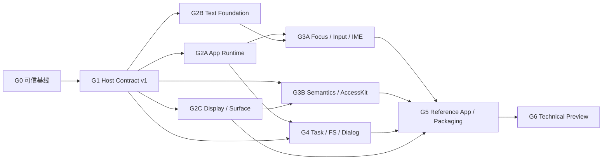

# Nexa UI 路线图

- 状态：MVP 实施中
- 规划输入：`mvp@f3afbeb`
- 最新证据：[`BASELINE.md`](./BASELINE.md)
- 目标：Desktop Technical Preview
- 详细设计：[`PROJECT-DESIGN.md`](./PROJECT-DESIGN.md)
- 执行清单：[`../TODO.md`](../TODO.md)

## 1. 路线图规则

1. 里程碑按依赖和退出条件推进，不按功能数量或提交数量推进。
2. G0 是所有新功能的硬门禁；没有可信绿灯，不开始新的产品 Slice。
3. 每个里程碑必须留下可自动验证的垂直切片，不能只提交接口骨架。
4. Minimal TSX 是参考路径；Adapter 通过合同测试后再提升支持等级。
5. 现有 ADR 的 Slice 13–15 编号冲突，不再继续使用全局 Slice 数字；新工作使用本路线图 ID。
6. 日历排期在确认团队人数、Perry 支持和文本方案后另行制定。

## 2. 依赖图

G2A、G2B、G2C 可在 G1 合同冻结后并行。G3 输入必须等待 Runtime 与 Text 的共同接口；FS/Dialog 必须等待 Task/Dispatcher，不能沿用同步剪贴板捷径。

## 3. 优先级切线

### P0：Technical Preview 必需

- 可信 CI、可重复工具链、FFI/Perry 自动验证；
- 单一 Host/System Protocol、无损 handle、结构化错误；
- mutation commit、Dispatcher、Scheduler、生命周期与取消；
- 多语言段落、文本索引、焦点、选择、IME composition；
- Semantic Tree、AccessKit 最小桥；
- Display List 与 Surface suspend/resume；
- FS/Dialog、权限 manifest、参考应用与可打包独立程序。

### P1：Preview 稳定性与采用体验

- 组件 hover/pressed/focus/disabled 状态与基础主题；
- Adapter conformance 扩面、Inspector 最小诊断；
- 性能预算、缓存与增量布局/绘制；
- 完整安装教程、API 文档、迁移与兼容矩阵；
- Linux 可选构建与更多平台自动化。

### P2：Preview 后

- PlatformView 产品化、多窗口、路由/导航；
- 网络图片、HTTP、通知、托盘、菜单、快捷键；
- 动画系统、GPU backend、DevTools 完整版；
- Android/iOS、动态插件市场、自动更新。

## 4. 里程碑

### G0：可信基线

**目标**：让“绿灯”真正覆盖当前仓库，而不是只覆盖少量 Rust/TS happy path。

**范围**：

- 修复 pnpm setup 双版本冲突、Prettier、rustfmt、Clippy；
- 固定 Rust、pnpm、Perry CLI/FFI 的可重复版本策略；
- 修正 CI path filters、`changes` fail-open 与 native smoke 开关；
- 将 `packages/nui-host`、`packages/system-host` 的 Rust 构建纳入门禁；
- 为所有 workspace 项目声明真实的 build/typecheck/test/lint 状态；
- clean 编译 Minimal TSX 与框架 Counter，验证 ABI safe-integer 问题；
- 建立 branch protection 和 `CI / result` required check。

**退出条件**：

- clean checkout 上 format、lint、typecheck、unit、FFI check、Rust smoke 全绿；
- macOS/Windows 至少能构建 Rust offscreen smoke；
- Minimal TSX Perry 应用在固定版本工具链下 clean compile 并启动；
- CI 任何路径检测失败都会阻断，不会误绿；
- 当前 framework parity 状态由自动化结果生成或有明确证据链接。

**不包含**：新增控件、系统 API、框架或渲染功能。

### G1：Host Contract v1

**目标**：消除跨语言协议漂移，并为后续 Runtime/Text/A11y 提供稳定接缝。

**范围**：

- 编写 protocol manifest 与 code generator；
- 建立 Protocol/ABI/feature handshake；
- 决定双 `u32` 或 Perry 原生 `u64` 的无损 handle 表示；
- 统一 Node/Property/Event/Error/Command ID；
- 补齐 set/clear property、add/remove listener、insert/move/remove、reset session；
- 为非法 handle、环、跨树插入和属性类型返回结构化错误；
- Minimal TSX 和各 Adapter 复用统一 Host kit；
- 建立 Adapter conformance suite。

**垂直验收**：同一列表场景在 Minimal TSX 与至少一个 Adapter 中完成 create、reorder、style clear、listener replace、remove subtree、dispose，产生等价 mutation trace。

**退出条件**：

- Rust、TS、Perry manifest 的协议定义由同一源生成且 CI 无漂移；
- 不兼容 protocol major 在启动时明确失败；
- 所有旧属性和 listener 都可撤销；
- 删除子树不会保活 descendant callback/effect；
- 合同测试覆盖所有 Host command 的成功与错误路径。

### G2A：Application Runtime 与原子提交

**目标**：让 ADR-006 的 Tick 真正进入主调用链，去掉同步回调和即时 mutation。

**范围**：

- Dispatcher 队列与 winit wakeup；
- `MutationBatch` 验证、原子 commit、dirty flags；
- 十阶段 Scheduler 与阶段守卫；
- Callback registry、owner scope、deferred cleanup；
- Lifecycle 与 ErrorSupervisor；
- React 从事件内 `flushSync` 临时路径迁移到统一调度；
- window close/reset 的资源失效和测试隔离。

**垂直验收**：Todo 一次用户事件引起多次 signal 更新，但只产生一个 commit、一次 layout 和一次 present；Native 事件通过队列回调 TS。

**退出条件**：

- `commit()` 是唯一 Tree mutation 生效点；
- Layout/Paint 阶段 mutation 被可诊断地拒绝；
- Native 不再同步调用 Perry closure；
- 迟到事件和已失效 callback 不被执行；
- 同一进程可 mount、close、reset、再次 mount。

### G2B：Text Foundation

**目标**：以共享段落结果替代字符数估算与 `draw_str`。

**范围**：

- ADR 选择 shaping/BiDi/line-break/font 依赖；
- `TextIndex` 单位与 UTF-16/UTF-8/grapheme 映射；
- Font database、fallback、script、BiDi 与 shaping；
- 断行、段落布局、line metrics、cluster/hit-test map；
- 段落缓存与 Taffy measure integration；
- GlyphRun Display command 与 Skia 执行；
- 多语言 fixture、golden 与 fuzz/property tests。

**垂直验收**：参考应用中的英文、中文、阿拉伯文、混排和 Emoji 在不同宽度/DPI 下正确换行、fallback 和命中。

**退出条件**：

- Production 路径不再调用近似 `measure_text`；
- TextNode 不再直接执行 `draw_str`；
- Layout 与 Paint 使用同一 paragraph snapshot；
- 五组 ADR-006 样例和扩展边界样例自动通过。

### G2C：Display List 与 Surface 生命周期

**目标**：把 Tree、Renderer 与窗口 Surface 解耦，并证明可恢复。

**范围**：

- `nui-core` 的不可变 Display List；
- CPU Resource/Backend Resource 分离；
- Skia 只消费 Display commands；
- winit suspend/resume/resize/scale 状态机；
- Surface 重建、资源重上传与 full repaint；
- 图片资源避免每帧全量像素复制；
- frame counters 与 trace spans。

**垂直验收**：窗口最小化/恢复或模拟 Surface loss 后，Todo/Notes 的状态保留，下一帧完整恢复且无 stale resource。

**退出条件**：

- Renderer 不直接遍历可变 Arena；
- Surface backend 对业务 Tree 不可见；
- suspend/resume 路径有可注入自动化测试；
- image pixels 不在每帧重复 clone/copy。

### G3A：Focus、EditableText 与 IME

**目标**：将当前 Input 特例升级为可用的桌面文本编辑基础。

**范围**：

- Normalized Pointer/Keyboard/TextInput/Composition/Focus event；
- FocusManager、Tab chain、pointer capture、capture/target/bubble；
- EditableText buffer、selection、caret、revision 与 composition range；
- 单行/多行编辑、换行、可见行、上下移动和内部滚动；
- 方向键、Backspace、Delete、Home/End、Shift selection；
- IME Start/Update/Commit/Cancel 与候选框 bounds；
- Button pressed/release、keyboard invoke、disabled；
- 复制、剪切、粘贴通过 typed clipboard API。

**垂直验收**：在 Notes 标题和正文编辑器中使用中文 IME 预编辑，跨行移动/选择 Emoji 与混合文本并复制粘贴，不发生索引错位。

**退出条件**：

- JS/Rust/paragraph 之间没有单位不明的文本 offset；
- 单行和多行控件复用同一 EditableText，并正确处理换行、行导航与滚动；
- composition preedit 可见且 commit/cancel 正确；
- Button 只在合法 release 或键盘默认动作时 Invoke；
- Input 的焦点和选择状态可由自动化稳定观察。

### G3B：Semantic Tree 与 AccessKit

**目标**：让自绘 UI 对屏幕阅读器和自动化工具可见、可操作。

**范围**：

- Host `SetSemantics/ClearSemantics` command；
- Visual -> Semantic 派生与增量 diff；
- Button、Text、Input、Image、Scroll 的默认语义；
- bounds、focus、value 与 action 同步；
- AccessKit desktop bridge；
- action 通过 Dispatcher 回到组件；
- 语义 snapshot 与平台 smoke。

**垂直验收**：辅助技术可读取 Notes 标题、保存按钮和编辑框，可聚焦 Input、设置值并 Invoke 保存。

**退出条件**：

- 首帧/更新/恢复后的语义树一致；
- Button、Text、Input 可读取且可执行适用 action；
- UI E2E 优先通过语义定位，而不是硬编码坐标。

### G4：Task、权限、FS 与 Dialog

**目标**：建立首条真正异步、可取消、错误不丢失的系统能力链。

**范围**：

- generation Task registry、cancellation token 与 completion queue；
- window/app owner scope 和迟到 completion 处理；
- 统一 `NexaError`、Task/Promise settle；
- app manifest 与 permission loader；
- `@nexa/fs` 本地文本读写；
- `@nexa/dialog` 打开/保存文件；
- Clipboard 迁移到同一错误/任务语义；
- 可注入 backend，避免测试修改用户剪贴板/文件。

**垂直验收**：Notes 打开文件、编辑、保存；取消 dialog 不报错，权限拒绝可诊断，关闭窗口会取消未完成任务。

**退出条件**：

- UI 线程不执行阻塞读盘/对话框工作；
- cancelled、denied、not found、invalid data、platform failure 可区分；
- 窗口关闭后没有 Promise 回调进入已销毁框架；
- manifest 未声明的敏感能力被一致拒绝。

### G5：参考应用与开发者工作流

**目标**：证明 SDK 可以承载一个真实桌面应用，而不仅是 Counter。

**范围**：

- `examples/reference-notes` 贯穿式应用；
- CLI `new/dev/build/package/doctor` 最小闭环；
- 原生库、assets、manifest 与 app icon 打包；
- macOS app bundle 和 Windows 可分发目录；
- 开发/发布诊断信息与最小 Inspector trace；
- 从空目录开始的教程、API reference、兼容矩阵、已知限制；
- Minimal TSX 主路径与一个 Tier-1 Adapter 路径。

**退出条件**：

- clean 用户环境可按文档创建并运行项目；
- 产物不依赖开发机的 Node、Rust 或全局 Perry；
- `doctor` 能报告 Perry/ABI/platform 版本错配；
- Notes 在 macOS/Windows runner 生成可安装或可分发产物。

### G6：Desktop Technical Preview

**目标**：发布可被外部开发者评估的版本。

**范围**：

- 明确公开 npm/crate 集合、exports/dist 规范；
- SemVer、Changesets/CHANGELOG、release notes；
- MIT/Apache LICENSE、CONTRIBUTING、SECURITY、CODEOWNERS；
- checksum、SBOM、provenance、secret/license/dependency audit；
- macOS 签名/公证与 Windows 签名方案；
- cold start、内存、包体、tick/layout/paint 基线和回归阈值；
- framework support tiers 与升级政策。

**退出条件**：

- `PROJECT-DESIGN.md` 的 12 条成功标准全部有证据；
- required CI 和 branch protection 生效；
- release artifacts 可重复构建、验证和回滚；
- 用户可在无仓库源码的环境安装、运行 Notes 示例；
- 已知限制和非目标与实际实现一致。

## 5. 并行执行建议

| Lane       | G0/G1 后的主责                      | 可并行内容                           | 协调点                              |
| ---------- | ----------------------------------- | ------------------------------------ | ----------------------------------- |
| Runtime    | Protocol、mutation、Scheduler、Task | G2A 与 G2B/G2C 并行                  | command/error/handle 合同先冻结     |
| Text/Input | Paragraph、EditableText、IME        | Text foundation 与 Display List 并行 | `TextIndex`、GlyphRun、event schema |
| Platform   | winit、Surface、AccessKit、Dialog   | G2C 与 G3B 并行                      | Dispatcher 和 owner scope           |
| SDK/DX     | Minimal TSX、Adapter、CI、CLI、docs | conformance 与 Runtime 并行          | 不复制协议或组件语义                |

同一文件/合同的改动必须先合并协议任务，再由不同 Lane 消费。Perry manifest、generated TS/Rust、错误码和 handle representation 不适合并行自由修改。

## 6. 检查点

### Checkpoint A：G0 完成

- [x] 所有现有门禁可信全绿
- [x] clean Perry/FFI 链路可复现
- [x] branch protection 生效
- [x] 负责人批准详细设计与 G1 合同方向

### Checkpoint B：G1 完成

- [ ] Protocol v1 与 handle/error 设计冻结
- [ ] Adapter conformance 基线通过
- [ ] G2A/G2B/G2C 可独立开工

### Checkpoint C：G2 完成

- [ ] Scheduler、Paragraph、Display List、Surface 各有垂直证据
- [ ] 没有同步 Native -> TS 回调或生产 `draw_str`
- [ ] 评审 G3 输入/A11y 集成方案

### Checkpoint D：G3/G4 完成

- [ ] IME、A11y、FS/Dialog 在参考应用闭环
- [ ] close/cancel/resume 生命周期自动化通过
- [ ] 冻结 Preview 公共 API 候选

### Checkpoint E：G5/G6 完成

- [ ] clean create-to-package 用户旅程通过
- [ ] 发布、安全、许可、签名和性能门禁通过
- [ ] Technical Preview 可发布

## 7. 风险与缓解

| 风险                              | 影响                                  | 缓解                                                          |
| --------------------------------- | ------------------------------------- | ------------------------------------------------------------- |
| Perry CLI/FFI 持续变动            | ABI、构建和框架运行可能同时回归       | 固定 commit/version、handshake、clean AOT matrix、Bridge 隔离 |
| `u64` 与 JS safe integer 不一致   | stale/wrong handle 或应用直接启动失败 | G1 前置 spike；双 `u32` fallback；边界 round-trip 测试        |
| 文本依赖选型错误                  | 包体、跨平台字体、IME 返工            | 独立 ADR + fixture spike；先验收 paragraph 数据模型           |
| Scheduler 迁移破坏 React/Vue 更新 | Adapter 行为回归                      | Mock Host trace、双路径迁移、conformance suite                |
| A11y 平台差异                     | macOS/Windows 行为不一致              | 共享 Semantic Tree + 薄 AccessKit backend + 平台 smoke        |
| 继续扩大组件/框架范围             | P0 基础长期不闭环                     | P0 切线和 G0/G1 硬门禁；新功能需对应里程碑                    |
| 全量布局/绘制性能不足             | 复杂应用掉帧                          | 先观测 dirty/count；以 profile 驱动增量优化                   |
| 打包签名过晚                      | 技术完成但不可交付                    | G5 之前做 unsigned bundle spike，G6 明确 owner                |
| 文档状态与代码漂移                | 用户误判支持等级                      | 自动生成兼容矩阵；ADR/roadmap 状态检查                        |

## 8. 候选决策

以下事项尚未批准，不应阻塞 G0，但必须在对应里程碑前决定：

- Tier-1 外部框架选择；
- Paragraph/shaping 技术组合；
- AccessKit 依赖和平台最低版本；
- Notes 参考应用题材；
- 官方基础主题与组件状态范围；
- Linux Preview 支持等级；
- 性能预算、发布渠道、签名与自动更新 owner。
